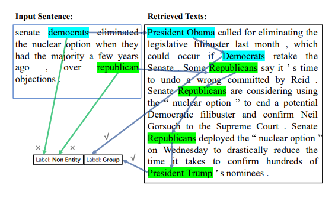

# Improving Named Entity Recognition by External Context Retrieving and Cooperative Learning
- Paper: https://aclanthology.org/2021.acl-long.142/
- Code: https://github.com/Alibaba-NLP/CLNER
- Organization: School of Information Science and Technology, ShanghaiTech University, China

## どんなもの?
- document-lebelのcontextsがNERのパフォーマンスを向上させることが報告されているが, 実世界の多くの場合においては, そのようなcontextsを利用できない状況にある
  - 
- 本研究では, 検索エンジンを使用して外部から関連するcontextsを検索して選択することで, 手元にリソースがない場合においてもcontextsの活用を実現するNERのフレームワークを提案する

## 先行研究と比べてどこがすごい?
- 外部のリソースからcontextsを持って生きているところ?
  - LUKEは学習データからcontextsを持ってきている?

## 技術や手法の肝は?
- contextsを検索エンジンから引っ張てくる際に, 意味的関連性に基づいてrank付けを行っているところ
- Cooperative Learning(CL)を導入し, 入力にcontextsがない場合においても, contextsがある場合と同じtoken embeddingあるいはCRFの出力が得られるようにLossを設計しているところ

## どうやって有効だと検証した?
- 8つのデータセットを用いて, 5つのドメインでF1 scoreをstate-of-the-artと比較する実証実験を行った
  - Social Media
    - WNUT-16
    - WNUT-17
  - News
    - CoNLL-03 Englith
    - CoNLL++
  - Biomedical
    - BC5CDR
    - NCBI-disease
  - Science and Technology
    - CBS SciTech News
  - E-commerce
    - 独自で構築したもの? 共著者にアリババの人がいるからなんかやってるっぽい.

## 結果は?
- いずれのデータセットにおいてもSOTAを上回っている

## 議論はある?
- none

## 次に読むべき論文は?
- CoNLL-03のSOTA
  - [LUKE](https://aclanthology.org/2020.emnlp-main.523/)

## 不明な単語
- none

## 感想
- Transofer-Encoderの入力において, 元の入力tokenと外部のcontextsを結合して(SEPで区切って)入力するため, もともとの512tokenという入力系列長の制限がネックになりそう
- CLにより, 外部contextsがない場合においても出力が一定になるような仕組みは面白いし, 実用的だと思う
- 提案手法のbaseline(外部contextsを使用しない)がすでに, SOTAを上回っているのが気になった. どこに上回る要素があるのだろうか. ablation Studyをじっくり読みたい.
- 外部contextsの活用は, 強い教師情報がほとんどないという問題設定とも親和性がありそう
