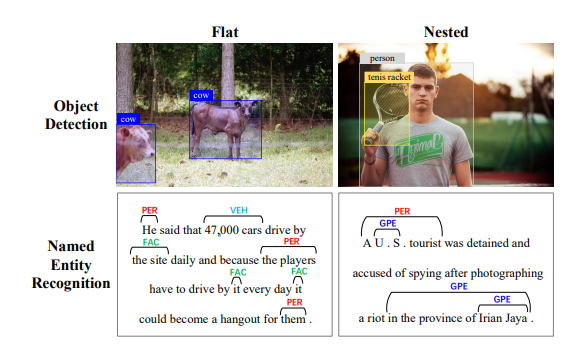

# Locate and Label: A Two-stage Identifier for Nested Named Entity Recognition
- Paper: https://aclanthology.org/2021.acl-long.216/
- Code: https://github.com/tricktreat/locate-and-label
- Organization: College of Computer Science and Technology, Zhejiang University, China

## どんなもの?
- 従来のNERの枠組みでは固有表現のネスト構造を考慮できない
  - 
- ネスト構造に対応したアーキテクチャを提案した

## 先行研究と比べてどこがすごい?
- 計算コストが小さい
  - span proposalで候補spanをfilteringしている
- span長が長いenitityの識別にも有効である
  - span長に対する制約がない
- span境界情報をフル活用している
  - よくわからなかったが, 境界情報をクラス分類に活用しているわけではないようだ(自分の予想)
  - span regressorで求めたあとに再度微調整する仕組みがあるようで, そのことを指してるっぽい
- 部分的に一致するentityを効率的に活用している
  - 部分一致したspanを単純にnegativeとして扱うのではなく, IoUに基づいたLoss計算により, 部分的にtrue positiveなspanを有効に学習できる?

## 技術や手法の肝は?
- 画像のobject detectionからinspireされて, タスクを①boundary regression②span classification という2ステージに分解し, これに基づいたアーキテクチャを提案している

## どうやって有効だと検証した?
- 以下4つのnested NERデータセットを用いてF1 scoreを比較する実証実験を行った
  - ACE04
  - ACE05
  - KBP17
  - GENIA

## 結果は?
- すべてのデータセットにおいて80%を上回っており, また比較対象よりも上回っている
- とくにKBP17では, +3.08%であった
- span長 >= 7でF1 score 80%を上回っている

## 議論はある?
- none

## 次に読むべき論文は?
- none

## 不明な単語
- ner donwstream task
  - relation extraction

## 感想
- F1 80%程度なので, ある程度実用的かなと思った.
- 日本語文献を探してみたい
- Nested NERの研究自体は昔からされていたみたいだ. 古いものだと2007. span-basedなapproachは2018くらいから盛り上がっているっぽい.
- span長が長くなるほど, 精度が落ちるのは同じ
  - これはサンプルサイズが小さくなるのが原因? span長とサンプルサイズは相関している.
