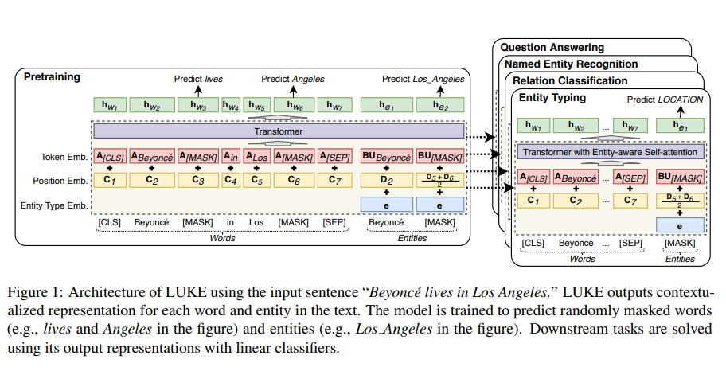
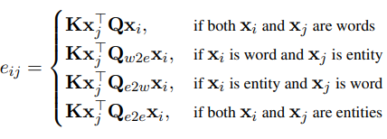

# LUKE: Deep Contextualized Entity Representations with Entity-aware Self-attention
- Paper: https://aclanthology.org/2020.emnlp-main.523/
- Code: https://github.com/studio-ousia/luke
- Organization: ousia, Japan

## どんなもの?
- 単語およびエンティティ表現を獲得するtransfomer-basedの事前学習モデル(LUKE, Language Understanding with Knowledge-based Embeddings)を提案する.
- 
  - NERでエンティティを予測するときは, LUKEのアーキテクチャに沿った予測を行うように特殊な方法を用いている.

### NLP tasks involving entities
- relation classification
- entity typing
- NER
- cloze-style QA
- extactive QA

### 文脈表現embeddings models
- RoBERTa
- XLNet
- Span-BERT
- ALBERT
- BART
- T5

## 先行研究と比べてどこがすごい?
- エンティティのスパンレベルの文脈化された表現を獲得できる
  - 通常, subtokenレベルの表現しか獲得できない
- self-attention層において, エンティティの関係性を考慮できる
  - 通常, subtokenの関係性しか考慮できない

## 技術や手法の肝は?
- エンティティをtokenとして扱う
  - そのためエンティティの関係性を直接モデリングすることができる
- エンティティがアノテーションされたデータセットで事前学習を行っている
- self-attentionを拡張したentity-aware self-attentionを提案
  - ４種類のクエリ行列を準備している(クエリの計算方法は同じ)
  - tokenのタイプ(word or entity)によってクエリ行列を分けている
  - 
- Wikipediaのハイパーリンクをエンティティアノテーションとして利用

## どうやって有効だと検証した?
- NERを含む5つのタスクで実証実験を行った. NERの評価にはCoNLL 2003を使用.

## 結果は?
- 5つのすべてのタスクにおいて, SOTAを達成した.
- NERにおいては, baevski et el 2019: 93.5 -> 94.3 (0.8 up)
  - baevski et el 2019: bidirectinoal LSTM with CRF, transformer embedding.

## 次に読むべき論文は?
- none

## 不明な単語
- layer normalization

## 感想
- knowledge baseを活用したpretrainモデルもあるらしい.
- tokenのスパン長さをエンティティレベルに変更しているところが面白い. Wikipediaのハイパーリンクをエンティティアノテーションとして利用ところも面白い.
- LUKEのKnowledge-basedの部分がどこのことをいっているのかわからなかった.
