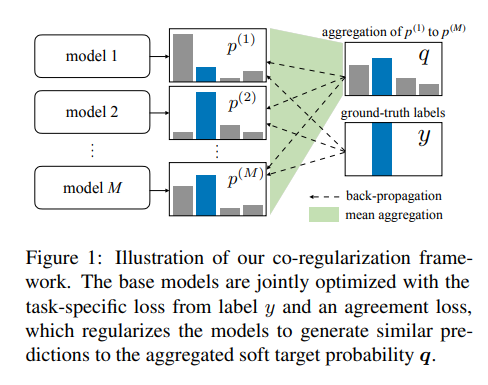
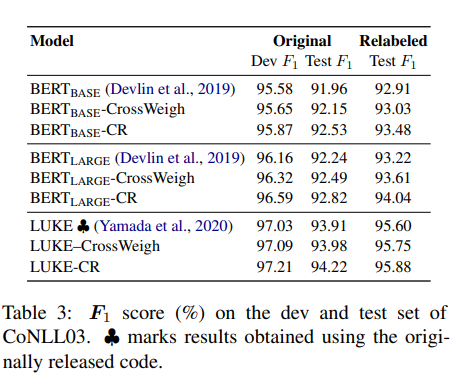

# Learning from Noisy Labels for Entity-Centric Information Extraction
- Paper: https://aclanthology.org/2021.emnlp-main.437/
- Code: https://github.com/wzhouad/NLL-IE
- Organization: University of Southern California, USA

## どんなもの?
- ラベルノイズへの過学習を解決したい.
- ノイジーなラベルはクリーンなラベルに比べて記憶されるのに多くの学習ステップが必要で、忘れられる頻度も高く、したがって学習で識別可能であることが示されている.
- 上記をモチベーションとし, 本研究では, co-regularizationフレームワークを提案する.
  - 
  - モデル1~Mは同じアーキテクチャで異なる初期値をもつ

## 先行研究と比べてどこがすごい?
- CrossWeigh
  - 複数のモデルを異なるサブデータで学習し, モデルの予測の一致度合いからサンプルウェイトを調整する
    - モデルの合意がとれないサンプルの重みを下げる
    - 複数のモデルを個別に学習する必要があり計算コストが大きい
- 本提案手法は, 学習は1回で済むため, CrossWeighよりも計算コストが小さい

## 技術や手法の肝は?
- モデルの予測分布の一致度合いを評価するKL距離に基づくagreement lossの提案
  - agreement lossにより, ノイジーラベルではなくその他モデルの予測に合うようモデルの予測を強制する.
  - ノイジーラベルへのフィッティングにはクリーンなラベルに比べて時間がかかる(delayed learning curve), という報告に基づいている
  - 学習において, モデルの予測はクリーンなラベルと一致しる可能性が高いが, 異なる学習エポックにおいてノイジーラベルに対する予測は一致していない
  - クリーンなラベルに対して一貫性をもつモデルの予測を平均して, agreement lossで平均化された予測に一致するようにすべてのモデルの予測を調整することでノイジーラベルへの過剰適合を防止する

## どうやって有効だと検証した?
- NERとRelation Extraction(RE)という2つのタスクで実証実験を行った. NERではCoNLL 2003を使用.

## 結果は?
- 
- NERに関して, CrossWeighを上回る結果を示した.
- BERT-largeに関して, モデルの数を増やすにつれてパフォーマンスが向上することがわかった. BERT-baseではパフォーマンスの向上は見られなかった.

## 次に読むべき論文は?
- 実験結果の部分をもう少し読みたい
- 画像処理分野におけるノイジーラベルへのテクニック

## 不明な単語
- Distant supervision
  - 弱教師あり学習?
- C-GCN
  - graph-bsaed model for RE.

## 感想
- GPUメモリーに余裕がないとM個のモデルを同時に学習できなくない?
