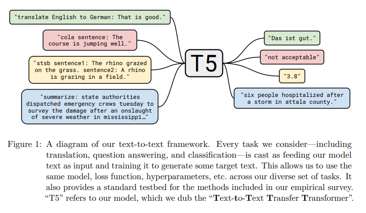

# Summary
- https://arxiv.org/abs/1910.10683

- どんなもの?
  - 転移学習すげえから, 展望を探りたい.
  - 事前学習の目的関数等の有効性を比較検証し, 転移学習の限界を探っていく(state-of-the-artを目指す).
  - そのために
    - 分類, 翻訳, 要約などの複数のタスクを統一することを目的としたTransformer-baseのフレームワークを提案.
      - 
    - "Colossal Clean Crawled Corpus" (C4)と呼ばれる数百GBのクリーンな英語テキストからなるデータセットを構築.
- 先行研究と比べてどこがすごい?
- 技術や手法の肝は?
  - 複数の異なる言語処理のタスクを統一するために, "text-to-text"というフォーマットを採用(過去の研究からインスパイアされている). このフォーマットにより, 1つのモデルで複数の異なるタスクに対応することが可能.
- どうやって有効だと検証した?
  - GLUE, CNNDM, SQuADなど7つのデータセットを用いて, 事前学習の目的関数, 学習データの有効性を比較検証した.
  - 上記の結果から有効な手法を組み合わせた結果, state-of-the-artを実現した.
- 議論はある?
- 次に読むべき論文は?
  - relative position embedding
    - https://arxiv.org/pdf/1803.02155.pdf
