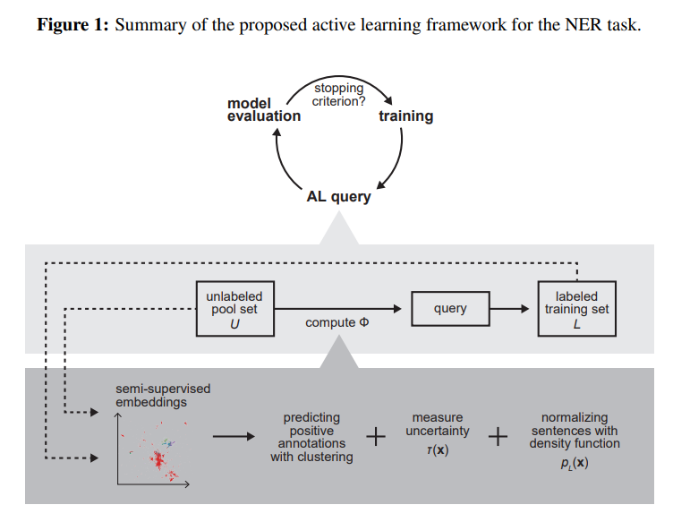
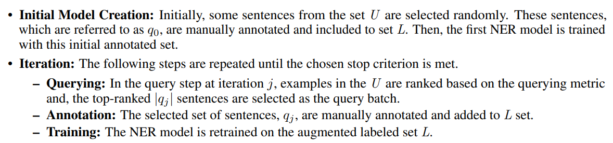
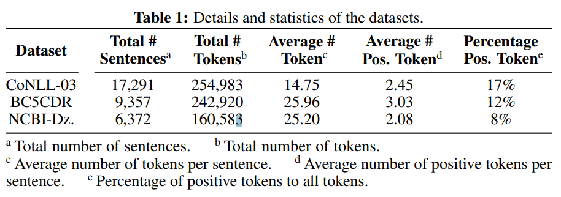
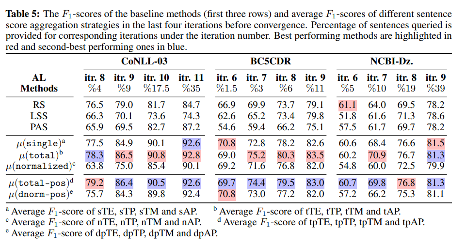

# Focusing on Possible Named Entities in Active Named Entity Label Acquisition
- Paper: https://arxiv.org/pdf/2111.03837v1.pdf
- Code: https://github.com/bo1929/anelfop
- Organization: Sabancı University, Istanbul
- Author: Spaci et el
- Year: 2021

## どんなもの?
- NERのアノテーションコストを削減するアプローチとして, active learning(AL)は有効である.
- tokenのクラスが不均衡であり, ALのqueryがうまく機能しない.
- クラス不均衡問題に対応するALの手法を提案. 
  - 

### NERにおけるALのquery選択困難問題
- negative tokenが多い
- sentence-wiseのquery metricを計算するときに, 文が長いとnegative tokenが支配的になり, positive tokenが無視されてしまう.

### bool-based AL
- the pool consists of unlabeled sentences, and at each iteration, the AL strategy aims to identify the most useful examples to be annotated.
  - 

### query metric
- One of the most common general frameworks for measuring informativeness is uncertainty sampling.
  - uncertainly, つまりモデルの予測が一様なインスタンスを選ぶ.

## 先行研究と比べてどこがすごい?
- negative tokenの支配問題を解消するために, BERT embeddingを取り入れている.

## 技術や手法の肝は?
- query stepにおいて, 半教師ありクラスタリングのアプローチでpositive tokensを推定し, positive tokenに大きな重み?を加えることで, query metricの計算時におけるnegative tokensの支配問題を解決している.

## どうやって有効だと検証した?
- 3つのNERベンチマークで実証実験を行った.
  - CoNLL 2003
  - BC5CDR
  - NCBI-Dz
    - 

## 結果は?
- 

## 次に読むべき論文は?
- none

## 不明な単語
- none

## 感想
- ようやくquery選択困難問題が理解できてきたところ@2022-4-19
  - もう少し読みたい.
- ALは効率的に学習データを増やす枠組みとしても効果的っぽい.
- query stepで選択されたインスタンスは, なにかヒントがありそう.
- BERTのembeddingって動的なものだと思うけど問題ないのだろうか.
