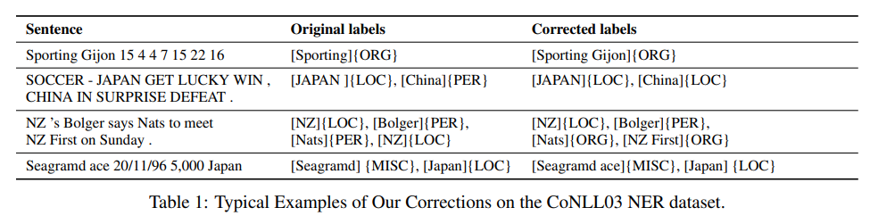
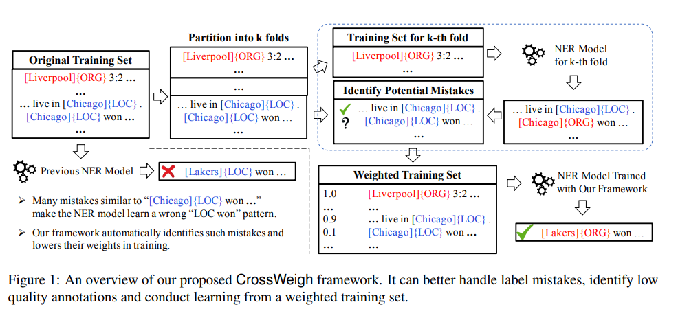
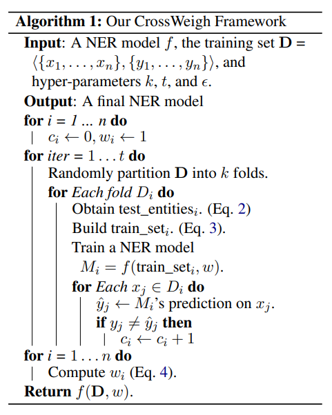
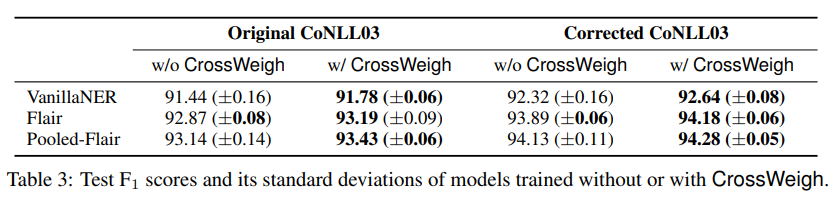
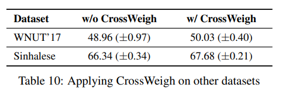
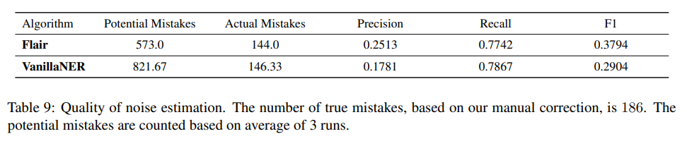

# CrossWeigh: Training Named Entity Tagger from Imperfect Annotations
- Paper: https://paperswithcode.com/paper/crossweigh-training-named-entity-tagger-from
- Code: https://github.com/ZihanWangKi/CrossWeigh
- Organization: University of Illinois at Urbana-Champaign, Urbana, IL, USA
- Author: Wang et el
- Year: 2019

## どんなもの?
- CoNLL03のラベルミスを修正した.
  - test setでは5.38%ものラベルミスがあることがわかった.
  - 
- ラベルミスに対応するためのフレームワーク, CrossWeighを提案する.
  - 
  - 

### test setのラベル修正
- Therefore, in this paper, we conduct empirical studies to understand these mistakes, correct the mistakes in the test set to form a cleaner benchmark, and develop a novel framework to handle the mistakes in the training set.

## 先行研究と比べてどこがすごい?
- NERにおけるラベルミス問題を初めて提起, ソリューションを提案した.

## 技術や手法の肝は?
- 実装がシンプルであり, 適用先が広くインスタンスの重みを考慮して学習ができるモデルであれば適用することが可能.
- Entity Disjoint: ラベルミスを正確に予測するための手法. train setを構築する際に, train setのある文が任意のtest setに含まれるentityと一致した場合, その文を削除する. 感覚的には, カンニングの防止によるミスラベルへの過学習を防ぐようなもの. Ablation studyで効果が示された.

## どうやって有効だと検証した?
- 3つのデータセットで実証実験.
  - CoNLL03
  - WNUT'17
  - Sinhalese

## 結果は?
- F1 scores:
  - 
  - 
- noise estimationの評価
  - 
  - 再現性の高さが示された.

## 次に読むべき論文は?
- none

## 不明な単語
- none

## 感想
- 読みやすかった.
- CrossWeighによりノイズを抑制した結果, 0.3程精度があがっている. 学習データのラベルを完全にクリーンにしたときに, 精度がどのくらいまで上がるのか実験して欲しかった.
  - CoNULL03において, 2019で93, 2021で94.6である.
  - だいたい, 0.8/year上がっている.
  - これと比較すると, 0.3の上昇はまずまず?
