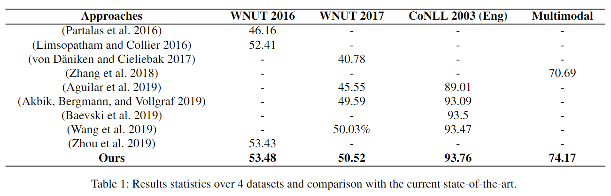
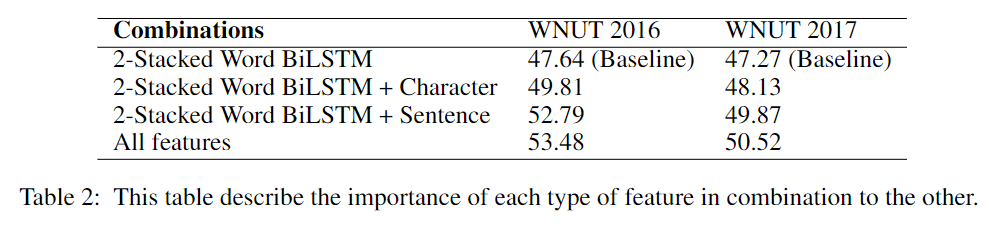

# InferNER: an attentive model leveraging the sentence-level information for Named Entity Recognition in Microblogs
- Paper: https://paperswithcode.com/paper/inferner-an-attentive-model-leveraging-the
- Code: none
- Organization: Universit ̈at Paderborn, German
- Author: Shahzad
- Year: 2021

## どんなもの?
- twitterのような, データ長が制限され, 文法的な一貫性がないという特性をもつソーシャルメディアに着目.
- 従来モデルは外部情報源を活用する場合が多いが, 本論文では外部情報源に依存しないニューラルネットモデル(InferNER)を提案する.
  - 
  - textだけでなく, imageも使用するmulti mordalなアーキテクチャ.
  - CRFは使用しない
  - 単語, 文字, 文レベルの文脈ベクトルを使用.

### マイクロブログでのNERの困難性
- 非正統的な大文字
- 感情アイコン
- 略語の頻繁な使用
- 不完全なフレーズ
- スペル/文法エラー
- ハッシュタグ
- 曖昧性
  - 例："manchester nailed it... #UCL "
  - manchesterは都市であると同時に、サッカーリーグのチームでもある
  - 文脈が簡潔であり, 解釈するのが難しい
- マイクロブログのNERは非自明なタスクである

### ユーザーが生成したテキストに対するNERの先行研究
- 外部情報源の利用
- テキストnormalization

## 先行研究と比べてどこがすごい?
- 外部情報源を使用しないし, normalizationのような前処理も必要ない

## 技術や手法の肝は?
- 単語, 文字, 文レベルと異なる３つの文脈ベクトルを統合する枠組み
- segregated-contextual-attention-moduleというmulti mordalなattentionの枠組みを提案.
  - ただしこれは単に別々にattentionしているだけのように見えるが, 最終的にそれぞれのattentionの出力を足し合わせている. 
  - attentionそれぞれの出力の要素が何であって, どのような対応付けを意味するか, 精査していきたい.
  - 異なる３つの文脈ベクトルを統合するところも同様.

## どうやって有効だと検証した?
- 4つのNER datasetを使用して実証実験をおこなった.
  - WNUT 2016
    - Twitter
  - WNUT 2017
    - Twitter
    - Redit
    - YouTube
    - StackExchange
  - CoNLL 2003(Eng)
  - Multimodal

## 結果は?
- 
  - WNUT 2016/2017でSOTA達成.
  - CRFなしのほうが精度がよかった.
  - CoNLL 2003でもSOTAを達成し, 汎化性能を示した(マイクロブログだけでなくスタンダードなNERでも使えることを示した).
- 
  - ３つの文脈ベクトルを統合することによる効果が示された.

## 次に読むべき論文は?
- [Universal Sentence Encoder](https://arxiv.org/pdf/1803.11175.pdf)
- [Universal Sentence Encoder Visually Explained](https://amitness.com/2020/06/universal-sentence-encoder/)

## 不明な単語
- gazetteer
- lookup table

## 感想
- 異なるレベルの文脈ベクトルを結合することの効果が示されているが, 他にもこんな報告があったような気がする.
- どうやって結合しているのか気になった.
