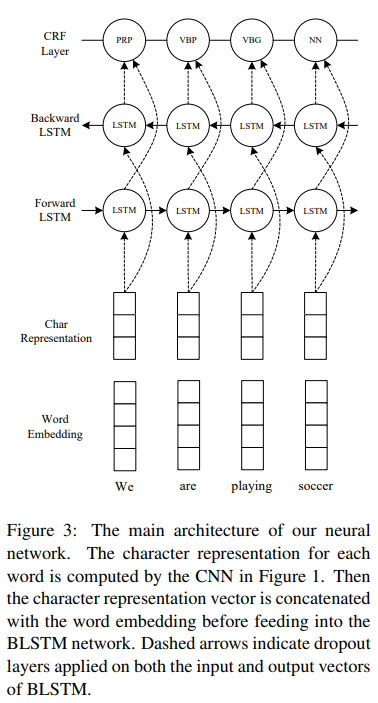
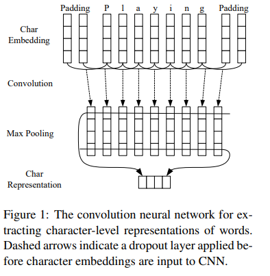
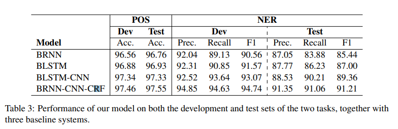
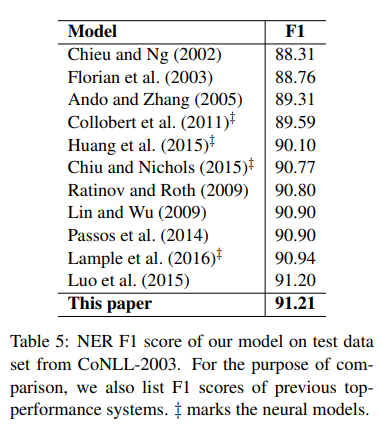
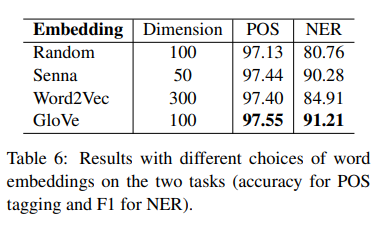
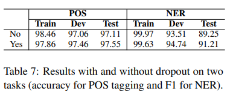

# End-to-end Sequence Labeling via Bi-directional LSTM-CNNs-CRF
- Paper: https://paperswithcode.com/paper/end-to-end-sequence-labeling-via-bi
- Code: https://github.com/guillaumegenthial/sequence_tagging
- Organization: Language Technologies Institute Carnegie Mellon University, USA
- Author: Ma et el
- Year: 2016

## どんなもの?
- LSTM, CNN, CRFを利用してword, character-lebelの特徴量をend-to-endで自動的に学習するニューラルネットモデルを提案.
  - 
    - word-levelとcharacter-levelのembeddingを組み合わせて, bi-lstmに入力.
    - bi-lstmの出力にCRFを適用.
    - bi-lstmの入力と出力にdrop outを適用.
    - two hidden states are concatenated to form the final output.
  - 
    - character-lebelのembeddingを獲得するためにCNNを使用.
    - CNNの前にdrop outを採用.
    - CNNは形態素情報(prefix, suffix)を抽出することができると報告されている.

### word embedding
- GloVe 100-dimensional embeddings1 trained on 6 billion words from Wikipedia and web text (Pennington et al., 2014).
- Senna 50-dimensional embeddings2 trained on Wikipedia and Reuters RCV-1 corpus (Collobert et al., 2011)
- Google’s Word2Vec 300-dimensional embeddings trained on 100 billion words from Google News (Mikolov et al., 2013).

### character embedding
- Character embeddings are initialized with uniform distribution, dim = 30.
- 事前学習モデルを使用していない?

## 先行研究と比べてどこがすごい?
- feature engineeringに依存しない
- 外部リソースに依存しない
- end-to-endの構造

## 技術や手法の肝は?
- character-levelとword-levelのrepresentationを組み合わせているところ.
- BLSTMのヘッドにCRFを採用しているところ.
- BLSTMの入出力とCNNの入力にdrop outを採用しているところ.

## どうやって有効だと検証した?
- POS taggingとNERで実証実験を行った.
  - POS tagging
    - Penn Treebank WSJ
  - NER
    - CoNLL03
    - We use the BIOES tagging scheme instead of standard BIO2, as previous studies have reported meaningful improvement with this scheme (Ratinov and Roth, 2009; Dai et al., 2015; Lample et al., 2016).

## 結果は?
- 
  - 91.21%のF1-scoreを達成.
  - character-lebel representation(CNN), CRFが有効に機能していることが示された.
- 
  - SOTA達成 !
- 
  - GloVeが一番はまったようだ.
  - NERだけでなく, POS taggingでも同じ結果が得られたことから, 汎化性が期待できる.
  - Word2vecが低い原因は, Word2vecは事前学習時にcommon symbols(punctuations, digits)とrare wordsに対して前処理を実施しているが, 本実験では何も前処理していないため.
- 
  - dropoutの有効性が示された.

## 次に読むべき論文は?
- none

## 不明な単語
- none

## 感想
- 読みやすかった
- Table.9のOOV比較はよくわからなかった.
- BLSTM-CRF, LSTM-CNNがあって, いいところどりをしてBLSTM-CNN-CRFを提案って感じかな
