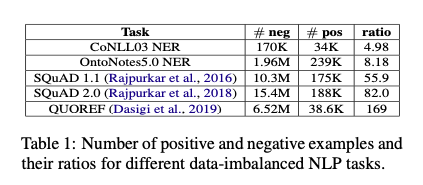
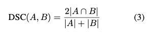
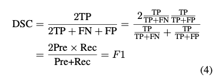
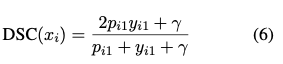
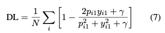
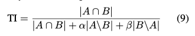
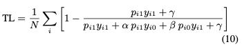
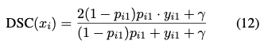
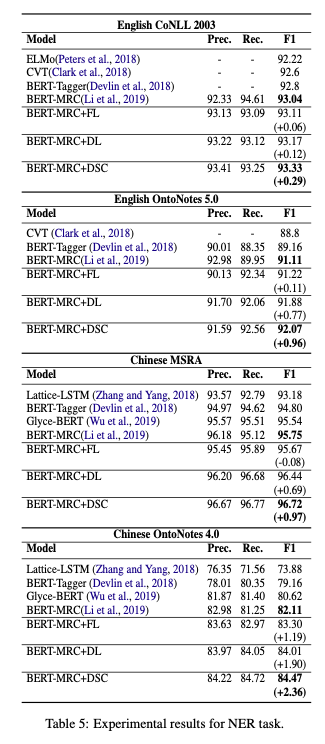

# Dice Loss for Data-imbalanced NLP Tasks
- Paper: https://paperswithcode.com/paper/dice-loss-for-data-imbalanced-nlp-tasks
- Code: https://github.com/ShannonAI/dice_loss_for_NLP
- Organization: 
- Author: Li et el
- Year: 2020

## どんなもの?
-  NLPのタスクで起こりがちなクラス不均衡問題, 特にnegative sampleが圧倒的に多い問題に対して有効な損失関数(dice coeficient, Tversky index)を提案.
   -  
   -  Dice coeficient: F1-score like.
      -  false negativeとfalse positiveを対等に扱う.
      -  
      -  
      -  
         -  インスタンス単位のダイス係数
      -  
   -  Tversky index: F1-scoreの拡張, Fbeta-score like.
      -  
         -  FPとFNのバランスを調整できる
      -  
-  さらに, sample weightingの手法を提案, 学習時にeasy negative samplesに支配されてしまう問題を解決する.
   -  easy-negative examples can easily dominate training since their probabilities can be pushed to 0 fairly easily.
   -  dynamic weight adjusting strategy
      -  inspired by focal loss in computer vision
      -  
         -  The intuition of changing pi1 to (1 − pi1)pi1 is to push down the weight of easy examples.

### クラス不均衡が引き起こす問題
- train test discrepancy
  - 学習の目的はlossを下げることであり, 学習データの大多数であるnegative sampleの予測に支配されてしまう
  - とりあえずnegativeと予測するれば, lossは下がる
  - negativeなsampleをnegativeと予測するようにパラメータが更新される
  - 一方で, testの評価positive sampleに対して実施される.
- overwhelming effect of easy-negative examples
  - easy-negativeな特徴を学習し, positiveとhard-negativeを区別する特徴量が学習されない.
  - easy-negativeかそれ以外か, を分類するモデルの誕生.

## 先行研究と比べてどこがすごい?
- none

## 技術や手法の肝は?
- none

## どうやって有効だと検証した?
- ４つのNLPタスクで実証実験を行った.
  - pos tagging
  - NER
    - OntoNotes4.0 (Chinese)
    - OntoNotes5.0 (English)
    - CoNLL 03 (English)
    - MSRA (Chinese)
  - machine reading comprehension
  - paraphrase identification

## 結果は?
- 

## 次に読むべき論文は?
- none

## 不明な単語
- machine reading comprehension, MRC
  - 定められた文章を読んで定められた選択肢から回答を選ぶタスク

## 感想
- まあま読みやすかった
- object detection/segmentationからNLPのクラス不均衡問題のヒントを得ている, 面白い.
- 3.2でリサンプリングによるアプローチがあまり有効でない的なことが書かれているが, よくわからなかった.
- figure1の見方がわからん
