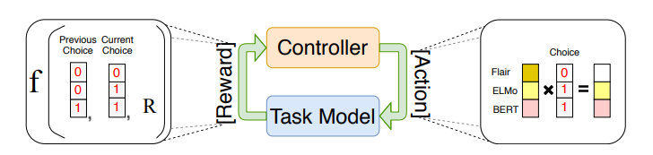

# Automated Concatenation of Embeddings for Structured Prediction
- Paper: https://aclanthology.org/2021.acl-long.206.pdf
- Code: https://github.com/Alibaba-NLP/ACE
- Organization: School of Information Science and Technology, ShanghaiTech University, China
- Author: Wang et el.
- Year: 2021

## どんなもの?
- 構造学習(structure learning, structure prediction)において, ことなるタイプのembedding(contextualized like ELMo, BERT, and non-contextualized like word2vec, GloVe, fastText, character embeddingなど)を結合することにより, より良い単語表現が獲得されることが報告されている.
- しかし, あらゆるタイプのembeddingが候補となりえるため, かつタスク依存であるため, ベストなembeddingを選択することは困難な問題である.
- 本研究では, 構造学習においてembeddingの結合対象の選択を自動化する手法(Automated Concatenation of Embedding)を提案した.
  - 
- Named Entity Recognition on CoNLL 2003 (English)でのSOTA(@2022.4.7)

## 先行研究と比べてどこがすごい?
- 構造学習の結合embedding選択問題に, NASのアプローチを適用しているところ?
  - 従来の構造学習におけるembedding選択問題を初めて提起している?
- 計算コストが小さい?
  - 単体のGPUかつ, 数時間で学習が完了する
  - 通常のアーキテクチャ探索に使用されるNASは, 数千時間ほどかかる(2018年の報告)

## 技術や手法の肝は?
- NASの問題設定からヒントを得てACEの問題を定式化し, 強化学習の枠組みでそれを解いている.
  - NASの研究では, 強化学習を使用することが一般的になっている
- 結合embeddingの有効性を評価するために新しい報酬関数を提案した.

## どうやって有効だと検証した?
- 6つのタスクと21のデータセットにおいて, 実証実験を行った.
  - NER
    - CoNLL 2002
    - CoNLL 2003
    - 4 languages in each
  - POS tagging
  - chunking
  - aspect extraction
  - syntactic dependency parsing
  - semantic dependency parsing

## 結果は?
- すべてのタスク, データセットにおいてSOTAを達成した

## 次に読むべき論文は?
- [Structured Prediction in NLP -- A survey](https://arxiv.org/abs/2110.02057)

## 不明な単語
- 構造学習(structured prediction)
  - 構造化された対象を予測する教師あり機械学習手法の総称である
    - https://en.wikipedia.org/wiki/Structured_prediction
- NAS
- embedding venders
  - GloVe
  - fastText
  - Character embedding
  - ELMo
  - Flair
  - RoBERTa
  - M-BERT
  - XLM-R

## 感想
- embeddingの歴史が簡単に書いてあった面白かった
- 構造学習がそもそもどんなものなのかよくわからず
- NERにおいて, 劇的に変化しているわけではない
  - 例えば, CoNLL 2002/2003 englishにおいては XLM-R+Fine-tuning(94.1) -> ACE+Fine-tuning(94.6)
  - esにおいてはXLM-R+Fine-tuning(89.3) -> ACE+Fine-tuning(95.9)と大きく上昇している場合もある
  - 全体的に, 1%未満の上昇
- 全部結合した場合と比較しても, 1%未満の違い
  - 全部結合するのが手っ取り早くて良いかもしれない
