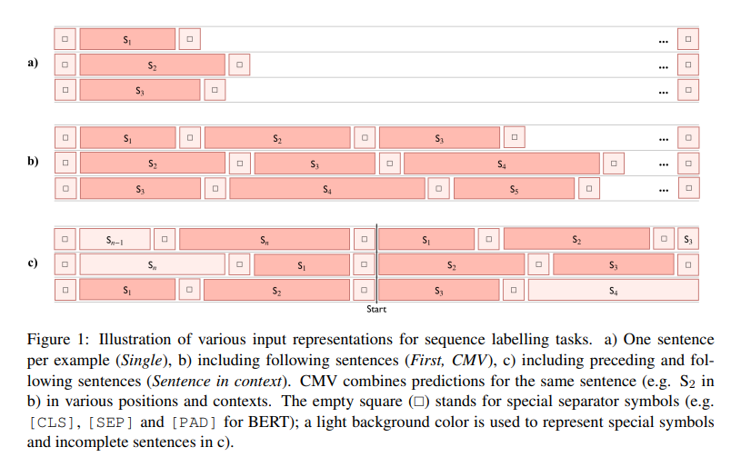
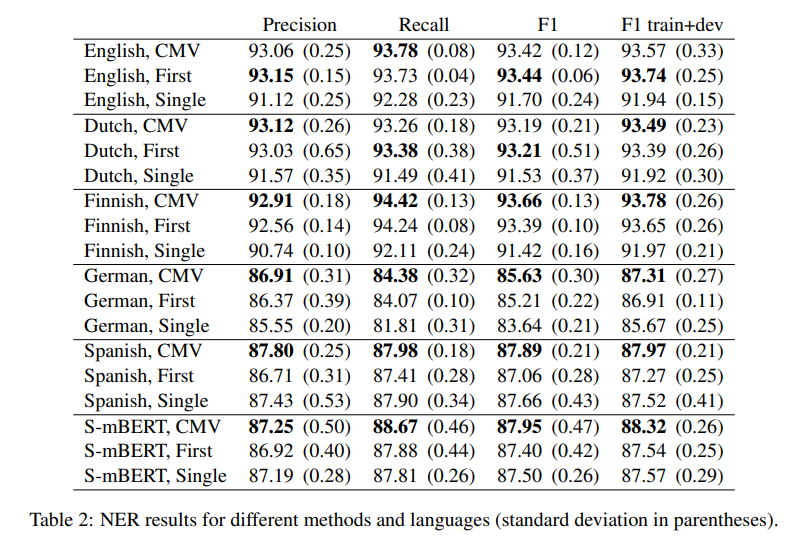

# Exploring Cross-sentence Contexts for Named Entity Recognition with BERT
- Paper: https://paperswithcode.com/paper/exploring-cross-sentence-contexts-for-named
- Code: https://github.com/jouniluoma/bert-ner-cmv
- Organization: University of Turku, Finland
- Author: Luoma et el
- Year: 2020

## どんなもの?
- 入力が1文単位であるのにも関わらず, 実際NERに有用な情報は入力以外の文書にある場合があり, そのような有用な情報を捨ててしまっている.
- 本件では, BERTを用いたNERにおいて1文だけでなく複数文(cross-sentence)を扱う枠組みを模索する.
  - 

## 先行研究と比べてどこがすごい?
- BERT以前に常態化していた横断情報の活用アプローチを取り上げ, 現在のtransformer-basedなアプローチにおいて横断情報が使用されていないことについて疑問を呈し, BERTにおいても有効なアプローチであることを評価している点.
- 文脈内の文の開始位置に応じて予測の品質に一貫した効果があるかどうかを確認するため、異なる文脈での予測結果を調査している.

## 技術や手法の肝は?
- ある文にたいして, 前後にどのような文脈を追加するかによって, 予測に多様性が生じるが, これをensemble的に捉えてマージするContextual Majority Voting(CMV)を提案.
  - 実装はシンプルである.
  - 異なる文脈の文の予測を組み合わせる.

## どうやって有効だと検証した?
- CoNLL 2002/2003(5 languages)で実証実験を行った.
  - 言語固有のモデルが多言語モデルを上回ることを示唆しているため、単言語BERTモデルを使用する
  - training sets: fine tuning
  - development sets: hyper parameter tuning or fine tuning
  - test sets: evaluation
- NER labelling scheme was converted to IOB2.
- The last layer of the pre-trained BERT model is followed by a single time-distributed dense layer which is fine-tuned together with the pre-trained BERT model weights to produce the softmax probabilities of NER tags for input tokens.
- CRFは使用せず.

## 結果は?
- 

## 次に読むべき論文は?
- none

## 不明な単語
- none

## 感想
- ことなる文脈を加えてensembleするアプローチは面白い思う.
- 言語によって横断情報追加の効果はまちまちであるが, 単文よりかは精度は上がっているようである.
  - 直近前後の文を追加しているようであるが, 追加する文を選択する枠組みがあると面白いと思う.
