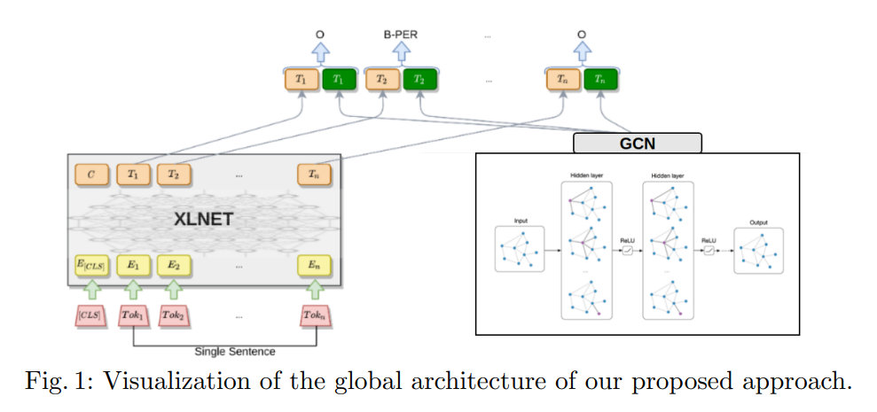
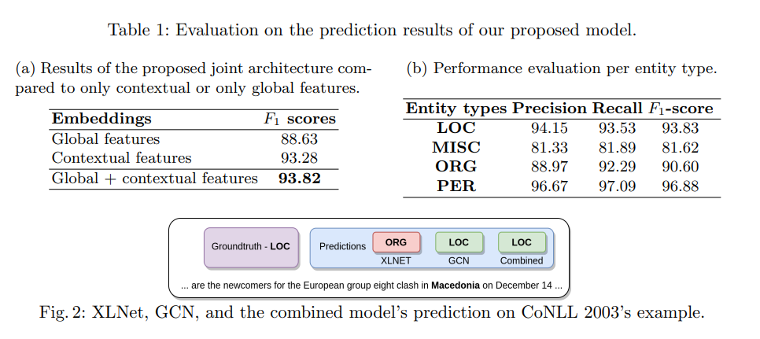

# Named entity recognition architecture combining contextual and global features
- Paper: https://paperswithcode.com/paper/named-entity-recognition-architecture
- Code: https://github.com/honghanhh/ner-combining-contextual-and-global-features
- Organization: University of Science and Technology in Hanoi, Vietnam
- Author: Hanh et el.
- Year: 2021

## どんなもの?
- transfomer-basedなモデルによりcontextな情報は埋め込まれているが, グローバルな関係までは考慮できていない.
- XLNetからのcontext特徴量と, Graph Convolution Networkからのglobalな特徴量を組み合わせたNERモデルを提案する.
  - 
  - CRFを用いずLinear Layerのみ使用.

### global feature
- static, 文脈に依存しない.
- 文単位の表現が, global featuresをよく捉えており, sequence labeling taskでの有効性が報告されている?
- 依存構造やグローバルな構造を, Graph Neural Networkのgraph embeddingにより捉えることができるという点で注目されている?
- e.g.:
  - word2vec, GloVe, FastText

### contextual feature
- dynamic, 文脈に依存して変化する.
- e.g.:
  - ELMo, BERT, XLNet

## 先行研究と比べてどこがすごい?
- GCNで得られたembeddingをcontext featureと結合しているところ?

## 技術や手法の肝は?
- none

## どうやって有効だと検証した?
- CoNLL 2003で実証実験を行った.

## 結果は?
- 
- global featureを追加することで, 93.28 -> 93.82(0.53up)

## 次に読むべき論文は?
- none

## 不明な単語
- lookup feature

## 感想
- 異なるモデルのembeddingを結合すると精度が上がるという報告があったなあ(Wang et el., 2021).
  - GCNでなくても単に, embeddingを結合するという部分に効果がありそうだ.
  - GCNではなくword2vecと結合した場合との比較が欲しかった.
