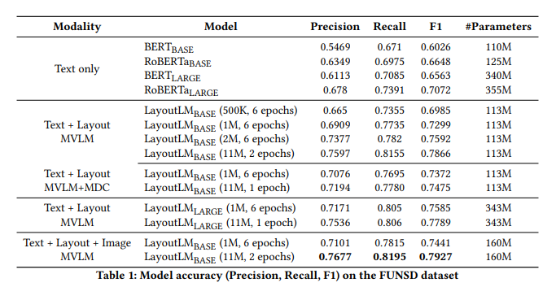

# LayoutLM: Pre-training of Text and Layout for Document Image Understanding
- Paper: https://arxiv.org/abs/1912.13318
- Code: https://github.com/microsoft/unilm/tree/master/layoutlm
- Organization:
  - Harbin institude of Technology
  - Microsoft Research Asis
- Author: Xu et al
- Year: Dec 31, 2019

## どんなもの?
- Despite the widespread use of pre-training models for NLP applications, they almost exclusively focus on text-level manipulation, while **neglecting layout and style information** that is vital for document image understanding.
- In this paper, we propose the **LayoutLM** to jointly model **interactions between text and layout information** across scanned document images, which is beneficial for a great number of real-world document image understanding tasks such as information extraction from scanned documents.
- Furthermore, we also leverage image features to incorporate words’ visual information into LayoutLM.
- To the best of our knowledge, this is the **first time** that text and layout are jointly learned in a single framework for documentlevel pre-training.

- Nowadays, many companies extract data from business documents through manual efforts that are time-consuming and expensive, meanwhile requiring manual customization or configuration.
- Rules and workflows for each type of document often need to be hard-coded and updated with changes to the specific format or when dealing with multiple formats.

## Architecture

- Basically, there are two types of features which substantially improve the language representation in a visually rich document, which are:
  - **Document Layout Information.**
    - It is evident that the **relative positions** of words in a document contribute a lot to the semantic representation.
    - Taking form understanding as an example, given a key in a form (e.g., “Passport ID:”), its corresponding value is much more likely on its right or below instead of on the left or above.
    - Therefore, we can embed these relative positions information as 2-D position representation. Based on the self-attention mechanism within the Transformer, embedding 2-D position features into the language representation will better align the layout information with the semantic representation.
  - **Visual Information.**
    - Compared with the text information, the visual information is another significantly important feature in document representations.
    - Typically, documents contain some visual signals to show the importance and priority of document segments. 
    - The visual information can be represented by image features and effectively utilized in document representations.
    - For document-level visual features, the whole image can indicate the document layout, which is an essential feature for document image classification.
    - For word-level visual features, styles such as bold, underline, and italic, are also significant hints for the sequence labeling tasks.
    - Therefore, **we believe** that combining the image features with traditional text representations can bring richer semantic representations to documents.
- To take advantage of existing pre-trained models and adapt to document image understanding tasks, we use the **BERT architecture** as the backbone and add two new input embeddings: a 2-D position embedding and an image embedding.
  - **2-D Position Embedding**.
    - Unlike the position embedding that models the word position in a sequence, 2-D position embedding aims to model the relative spatial position in a document.
    - To represent the spatial position of elements in scanned document images, we consider a document page as a coordinate system with the **topleft origin**.
    - In this setting, the bounding box can be precisely defined by (x0, y0, x1, y1), where (x0, y0) corresponds to the position of the upper left in the bounding box, and (x1, y1) represents the position of the lower right. We add four position embedding layers with two embedding tables, where the embedding layers representing the same dimension share the same embedding table.
    - This means that we look up the position embedding of x0 and x1 in the embedding table X and lookup y0 and y1 in table Y.
  - **Image Embedding**.
    - To utilize the image feature of a document and **align the image feature with the text**, we add an image embedding layer to represent image features in language representation.
    - In more detail, with the bounding box of each word from OCR results, **we split the image into several pieces**, and **they have a one-to-one correspondence with the words**.
    - We generate the image region features with these pieces of images from the Faster R-CNN [19] model as the token image embeddings. For the [CLS] token, we also use the Faster R-CNN model to produce embeddings using the **whole scanned document image** as the Region of Interest (ROI) to benefit the downstream tasks which need the representation of the [CLS] token.

## 目的関数
### Task #1: Masked Visual-Language Model.
- Inspired by the masked language model, we propose the Masked Visual-language Model (MVLM) to learn the language representation with the clues of 2-D position embeddings and text embeddings.
- During the pre-training, we randomly mask some of the input tokens **but keep the corresponding 2-D position embeddings**, and then the model is trained to predict the masked tokens given the contexts.
  - ここでは画像は使わない?
    - => 使っていない. image emebeddingはtest embedding + positional embeddingから独立しており, Faster-RCNNから獲得している.
- In this way, the LayoutLM model not only understands the language contexts but also utilizes the corresponding 2-D position information, thereby bridging the gap between the visual and language modalities.
  - 画像を使わないと思ったら"bridging the gap between the visual and language modalities"って書いてある..
### Task #2: Multi-label Document Classification
- For document image understanding, many tasks require the model to generate highquality document-level representations.
- As the **IIT-CDIP Test Collection includes multiple tags for each document image**, we also use a Multi-label Document Classification (MDC) loss during the pre-training phase.
- Given a set of scanned documents, we use the document tags to **supervise** the pre-training process so that the model can cluster the knowledge from different domains and generate better document-level representation. 
- Since the MDC loss needs the label for each document image that may not exist for larger datasets, it is **optional** during the pre-training and may not be used for pre-training larger models in the future. We will compare the performance of MVLM and MVLM+MDC in Section 3.

## 先行研究と比べてどこがすごい?
### For the first time, textual and layout information from scanned document images is pre-trained in a single framework
- Contemporary approaches for document AI are usually built upon deep neural networks from a computer vision perspective or a natural language processing perspective, or a combination of them. Early attempts usually focused on detecting and analyzing **certain parts of a document, such as tabular areas**.
- [7] were the **first to propose a table detection** method for PDF documents based on Convolutional Neural Networks (CNN). After that, [21, 24, 29] also leveraged more advanced **Faster R-CNN model** [19] or **Mask R-CNN model** [9] to further improve the accuracy of document layout analysis.
- In addition, [28] presented an end-to-end, **multimodal**, fully convolutional network for extracting semantic structures from document images, taking advantage of **text embeddings from pre-trained NLP models**.
- More recently, [15] introduced a **Graph Convolutional Networks (GCN)** based model **to combine textual and visual information** for information extraction from business documents
- Although these models have made significant progress in the document AI area with deep neural networks, most of these methods confront two limitations:
  - (1) They rely on a few human-labeled training samples **without fully exploring the possibility of using large-scale unlabeled training samples**.
  - (2) They usually leverage either pre-trained CV models or NLP models, **but do not consider a joint training of textual and layout information**. Therefore, it is important to investigate how self-supervised pre-training of text and layout may help in the document AI area.

## 技術や手法の肝は?
### textual and layout information from scanned document images is pre-trained
- Inspired by the BERT model [4], where input textual information is mainly represented by text embeddings and position embeddings, LayoutLM further adds two types of input embeddings:
  - (1) a 2-D position embedding that denotes the relative position of a token within a document;
    - 2-D position embedding can capture the relationship among tokens within a document
  - (2) an image embedding for scanned token images within a document
    - the image embedding can capture some appearance features such as font directions, types, and colors
- In addition, we adopt a multi-task learning objective for LayoutLM, including:
  - a Masked Visual-Language Model (MVLM) loss and
  - a Multi-label Document Classification (MDC) loss,
- which further enforces joint pre-training for text and layout.

## どうやって有効だと検証した?
- We select three benchmark datasets as the downstream tasks to evaluate the performance of the pre-trained LayoutLM model.
  - The first is the FUNSD dataset3 [10] that is used for spatial layout analysis and form understanding.
  - The second is the SROIE dataset4 for Scanned Receipts Information Extraction.
  - The third is the RVL-CDIP dataset5 [8] for document image classification, which consists of 400,000 grayscale images in 16 classes.

 

- Our model is pre-trained on the IIT-CDIP Test Collection 1.0, which contains more than **6 million documents**, with more than **11 million scanned document images**.
- Thanks to **Tesseract** , an open-source OCR engine, we can easily obtain the recognition as well as the 2-D positions
- We initialize the weight of LayoutLM model **with the pre-trained BERT base model**. Specifically, our BASE model has the same architecture: a 12-layer Transformer with 768 hidden sizes, and 12 attention heads, which contains about 113M parameters.
- Considering that the document layout may vary in different page size, **we scale the actual coordinate to a “virtual” coordinate**: the actual coordinate is scaled to have a value **from 0 to 1,000**.
- Furthermore, we also use the ResNet-101 model as the backbone network in the Faster R-CNN model, which is pre-trained on the Visual Genome dataset [12].
- The BASE model takes 80 hours to finish one epoch on 11M documents, while the LARGE model takes nearly 170 hours to finish one epoch.

## 結果は?
- Experiments illustrate that the pre-trained LayoutLM model significantly outperforms several SOTA pre-trained models on these benchmark datasets, demonstrating the enormous advantage for pre-training of text and layout information in document image understanding tasks.

## 次に読むべき論文は?
- none

## 不明な単語
- none

## 感想
### 2022/7/12
- 画像をテキストの各文字に割り当てる部分がよくわからんかった.
- まさかの事前学習で教師あり（オプションとしているが..）
- 入力方法に対して言及しておらず, 1文書のテキストがすべて最大入力系列長に収まるという前提?
