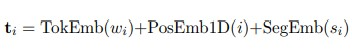
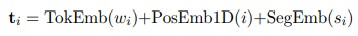
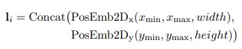
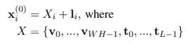
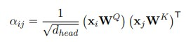
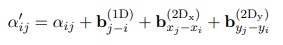

# LayoutLMv2: Multi-modal Pre-training for Visually-Rich Document Understanding
- Paper: https://arxiv.org/abs/2012.14740
- Code: https://github.com/microsoft/unilm/tree/master/layoutlmv2
- Organization:
  - Microsoft Research Asia
  - Microsoft Azure AI
- Author: Xu et al
- Year: Dec, 2020

## どんなもの?
- We propose LayoutLMv2 architecture with new pre-training tasks to model the interaction among text, layout, and image in a single multi-modal framework.
- 目的関数を変えた
  - Specifically, with a two-stream multi-modal Transformer encoder, LayoutLMv2 uses not only the existing masked visual-language modeling task but also the **new text-image alignment and text-image matching tasks**, which make it better capture the cross-modality interaction in the pre-training stage.
- self-attentionを変えた
  - Meanwhile, it also integrates a **spatial-aware self-attention mechanism** into the Transformer architecture so that the model can fully understand the relative positional relationship among different text blocks.
- SOTA!
  - Experiment results show that LayoutLMv2 outperforms LayoutLM by a large margin and achieves new state-ofthe-art results on a wide variety of downstream visually-rich document understanding tasks, including:
    - FUNSD (0.7895 → 0.8420),
    - CORD (0.9493 → 0.9601),
    - SROIE (0.9524 → 0.9781),
    - Kleister-NDA (0.8340 → 0.8520),
    - RVL-CDIP (0.9443 → 0.9564),
    - DocVQA (0.7295 → 0.8672).

## 従来研究アプローチ
1. The first direction is usually built on the shallow fusion between textual and visual/layout/style information (Yang et al., 2017; Liu et al., 2019; Sarkhel and Nandi, 2019; Yu et al., 2020; Majumder et al., 2020; Wei et al., 2020; Zhang et al., 2020).
  - These approaches leverage the pre-trained NLP and CV models individually and combine the information from multiple modalities for supervised learning.
  - Although good performance has been achieved, the domain knowledge of one document type cannot be easily transferred into another, so that these **models often need to be re-trained once the document type is changed**.
  - Thereby the **local invariance** in general document layout (key-value pairs in a left-right layout, tables in a grid layout, etc.) **cannot be fully exploited**.
2. the second direction relies on the deep fusion among textual, visual, and layout information from a great number of unlabeled documents in different domains, where pre-training techniques play an important role in learning the cross-modality interaction in an end-to-end fashion (Lockard et al., 2020; Xu et al., 2020).
  - the proposed model in this paper follows the second direction, and we explore how to further improve the pre-training strategies for the VrDU tasks

## 先行研究と比べてどこがすごい?
### マルチモーダルな事前学習
- Different from the vanilla LayoutLM model where visual embeddings are combined in the fine-tuning stage, **we integrate the visual information in the pre-training stage** in LayoutLMv2 by taking advantage of the Transformer architecture to learn the cross-modality interaction between visual and textual information

## 技術や手法の肝は?
### 2-D relative position by spatial-aware self-attention mechanism
- In addition, inspired by the 1-D relative position representations (Shaw et al., 2018; Raffel et al., 2020; Bao et al., 2020), we propose the **spatial-aware self-attention mechanism** for LayoutLMv2, which involves a 2-D relative position representation for token pairs.
### 新しい目的関数, text-image alignment strategy and text-image matching strategy
- we use two new training objectives for LayoutLMv2 in addition to the masked visual-language modeling.
1. The first is the proposed **text-image alignment strategy**, which aligns the text lines and the corresponding image regions.
2. The second is the **text-image matching strategy** popular in previous vision-language pre-training models (Tan and Bansal, 2019; Lu et al., 2019; Su et al., 2020; Chen et al., 2020; Sun et al., 2019), where the model learns whether the document image and textual content are correlated.

## Model Architecture
### Text Embedding
- Following the common practice, we use **WordPiece** (Wu et al., 2016) to tokenize the OCR text sequence and assign each token to a certain segment si ∈ {[A], [B]}.
- Then, we add [CLS] at the beginning of the sequence and [SEP] at the end of each text segment. 
- Extra [PAD] tokens are appended to the end so that the final sequence’s length is exactly the maximum sequence length L.
- **The final text embedding is the sum of three embeddings**.
  - Token embedding represents the token itself
  - 1D positional embedding represents the token index, and
  - segment embedding is used to distinguish different text segments.
- Formally, we have the i-th (0 ≤ i < L) text embedding
  - 

### Visual Embedding
- Although all information we need is contained in the page image, the model has difficulty capturing detailed features in a single information-rich representation of the entire page. Therefore, **we leverage the output feature map** of a CNN-based visual encoder, which converts the page image to a fixed-length sequence.
- We use **ResNeXt-FPN** (Xie et al., 2017; Lin et al., 2017) architecture as the backbone of the visual encoder, **whose parameters can be updated through backpropagation**.
- Given a document page image I, it is resized to 224 × 224 then fed into the visual backbone. After that, the output feature map is average-pooled to a fixed size with the width being W and height being H.
- Next, it is **flattened** into a visual embedding sequence of length W ×H. The sequence is named VisTokEmb(I). **A linear projection layer is then applied** to each visual token embedding to unify the dimensionality with the text embeddings.
  - average-pooledされたfeature mapがチャンネル数cを持っているとすれば, flattenedされたsequenceの各embeddingはc次元のベクトルになっていると予想.
  - c次元のベクトルがlinear projectionされる感じかな.
- Since the CNN-based visual backbone cannot capture the positional information, **we also add a 1D positional embedding to these visual token embeddings**.
  - The 1D positional embedding is shared with the text embedding layer.
- For the segment embedding, we attach all visual tokens to the visual segment [C]. 
- The i-th (0 ≤ i < W H) visual embedding can be represented as
  - 
- Note that CNNs perform local transformation, thus the visual token embeddings can be mapped back to image regions one by one with neither overlap nor omission. When calculating bounding boxes, the visual tokens can be treated as evenly divided grids.

### Layout Embedding
- 

### Multi-modal Encoder with Spatial-Aware SelfAttention Mechanis
- The encoder concatenates visual embeddings {v0, ..., vW H−1} and text embeddings {t0, ..., tL−1} to a unified sequence and fuses spatial information by adding the layout embeddings to get the i-th (0 ≤ i < W H + L) first layer input
  - 
- Following the architecture of Transformer, we build our multi-modal encoder with a stack of multi-head self-attention layers followed by a feedforward network. However, **the original self-attention mechanism can only implicitly capture the relationship between the input tokens with the absolute position hints**.
- In order to efficiently model local invariance in the document layout, it is necessary to insert relative position information explicitly.
  - 直接的に相対位置情報をself-attentionに取り込み, 局所不変性をモデル化する.
- Therefore, we introduce the spatial-aware self-attention mechanism into the self-attention layer.
- The original self-attention mechanis
  - 
- Let b (1D) , b (2Dx) and b (2Dy) denote the learnable 1D and 2D relative position biases respectively. The biases are different among attention heads but shared in all encoder layers. Assuming (xi , yi) anchors the top left corner coordinates of the i-th bounding box, we obtain the spatial-aware attention score
  - 
  - 学習パラメータのバイアス項を入れることで, 局所的に関係のあるtoken_i, token_jに高いattention scoreを割り当てることが可能になる
  - この学習パラメータが実際どのような値をとっているのか, 評価してほしい.

## 目的関数
### Masked Visual-Language Modeling
- Similar to the vanilla LayoutLM, we use the Masked Visual Language Modeling (MVLM) to make the model learn better in the language side with the crossmodality clues.
- We randomly mask some text tokens and ask the model to recover the masked tokens.
- Meanwhile, **the layout information remains unchanged**, which means the model knows each masked token’s location on the page.
  - MLMで位置情報を手がかりとすることができる.
- The output representations of masked tokens from the encoder are fed into a classifier over the whole vocabulary, driven by a cross-entropy loss.
- To avoid visual clue leakage, we mask image regions corresponding to masked tokens on the raw page image input before feeding it into the visual encoder.
### Text-Image Alignment
- To help the model learn the spatial location correspondence between image and coordinates of bounding boxes, we propose the Text-Image Alignment (TIA) as a fine-grained cross-modality alignment task.
- In the TIA task, some tokens lines are randomly selected, and their image regions are covered on the document image.
- During pretraining, a classification layer is built above the encoder outputs.
- This layer predicts a label for each text token depending on whether it is covered, i.e., [Covered] or [Not Covered], and computes the binary cross-entropy loss.
- Considering the input image’s resolution is limited, and some document elements like signs and bars in a figure may look like covered text regions, the task of finding a word-sized covered image region can be noisy. 
- Thus, **the covering operation is performed at the line-level**.
- When MVLM and TIA are performed simultaneously, TIA losses of the tokens masked in MVLM are not taken into account.
  - This prevents the model from learning the useless but straightforward correspondence from [MASK] to [Covered].
  - 2つのタスクが競合しないようにしている?
- 位置情報とテキストから, それが画像のどの部分なのか, その対応関係をとろうとしている?
- 画像の解像度の問題が気になる. 同じgridで異なるテキストがcoveredされた場合, attentionはどうなるんだろうか.
  - gridのチャンネル情報に, 異なるテキスト情報が保存されていればいける?
  - これもattentionを評価してほしい. 画像中でそのテキストがある部分にattentionがつくのだろうか? 対応していないとすると, このタスクはそこまでしなくても解けるということ? なぜ解ける?

### Text-Image Matching
- Furthermore, a coarsegrained cross-modality alignment task, Text-Image Matching (TIM) is applied to help the model learn the correspondence between document image and textual content.
- We feed the output representation at [CLS] into a classifier to predict whether the image and text are from the same document page.
- Regular inputs are positive samples.
- To construct a negative sample, an image is either replaced by a page image from another document or dropped.
  - To prevent the model from cheating by finding task features, we perform the same masking and covering operations to images in negative samples.
  - The TIA target labels are all set to [Covered] in negative samples.
- We apply the binary cross-entropy loss in the optimization process.
- 画像とレイアウトの対応がとれて, 明らかにそこにテキストがない場合は解けそう. 画像から文字を読み取ってテキストと整合性をとるのは難しそうなので, たぶんモデルは前述の通りにこのタスクを解く. レイアウトがまったく同じでテキストだけ異なるnegative sampleを分類できるか? だとするとこの[CLS]tokenは何に使える? [CLS]には画像, テキスト, レイアウトどの情報が入る? 全部? ざっくりレイアウト情報と解釈していい? 

## どうやって有効だと検証した?
- We select six publicly available benchmark datasets as the downstream tasks to evaluate the performance of the pre-trained LayoutLMv2 model, which are the
  - FUNSD dataset (Jaume et al., 2019) for form understanding,
  - the CORD dataset (Park et al., 2019) and the SROIE dataset (Huang et al., 2019) for receipt understanding,
  - the Kleister-NDA dataset (Gralinski et al. ´ , 2020) for long document understanding with a complex layout,
  - the RVL-CDIP dataset (Harley et al., 2015) for document image classification
  - the DocVQA dataset (Mathew et al., 2021) for visual question answering on document images.

## 結果は?
- Experiment results show that the LayoutLMv2 model significantly outperforms strong baselines, including the vanilla LayoutLM, and achieves new state-of-the-art results in all of these tasks.

## 次に読むべき論文は?
- none

## 不明な単語
- none

## 感想
### 2022/8/1
- 各セグメントの終わりに感想を書いた.
