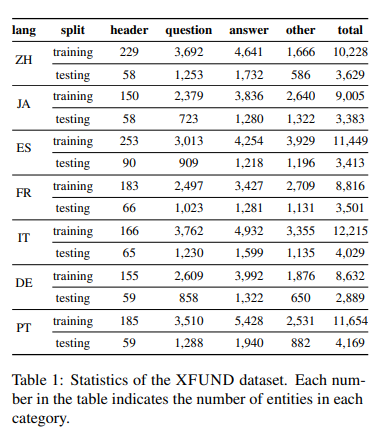

# LayoutXLM: Multimodal Pre-training for Multilingual Visually-rich Document Understanding
- Paper: https://arxiv.org/abs/2104.08836?amp=1
- Code: https://github.com/microsoft/unilm/tree/master/layoutxlm
- Organization: Microsoft Research Asia
- Author: Xu et al
- Year: Apr 2021

## どんなもの?
- layoutv2の直後(Dec, 2020), layoutLMv3の前(Apr, 2022)
- In this paper, we present **LayoutXLM**, a multimodal pre-trained model for multilingual document understanding, which aims to bridge the language barriers for visually-rich document understanding.
- To accurately evaluate LayoutXLM, we also introduce a multilingual form understanding benchmark dataset named **XFUND**, which includes form understanding samples in 7 languages (Chinese, Japanese, Spanish, French, Italian, German, Portuguese), and key-value pairs are manually labeled for each language.

 

- Meanwhile, we are well aware of the demand from the non-English world since nearly 40% of digital documents on the web are in non-English languages.
  - せやな
- To this end, we present a multimodal pre-trained model for multilingual VrDU tasks in this paper, aka LayoutXLM, which is a multilingual extension of the recent LayoutLMv2 model (Xu et al., 2020a).
  - LayoutLMv2を多言語に拡張!
- Inspired by the LayoutLMv2 model, LayoutXLM adopts the **same architecture** for the multimodal pre-training initialized by a SOTA multilingual pre-trained **InfoXLM** model (Chi et al., 2020).
- In addition, we pre-train the model with the **IIT-CDIP** dataset (Lewis et al., 2006) as well as a great number of **publicly available digital-born multilingual PDF files from the internet**, which helps the LayoutXLM model to learn from realworld documents.

## Approach

### Architecture

- LayoutLMv2と同じ.

### 事前学習 / 目的関数
- Following the idea of cross-modal alignment, our pre-training framework for document understanding contains three pre-training objectives, which are:
  - Multilingual Masked VisualLanguage Modeling (text-layout alignment),
  - TextImage Alignment (fine-grained text-image alignment), and
  - Text-Image Matching (coarse-grained text-image alignment).
- **Multilingual Masked VisualLanguage Modeling**
  - LayoutLM/LayoutLMv2と同じ.
  - the model is required to predict the masked text token based on its remaining text context and whole layout clues.
  - In LayoutLM/LayoutLMv2, an English word is treated as the basic unit, and its layout information is obtained by extracting the bounding box of each word with OCR tools, then subtokens of each word **share the same layout information**.
  - However, for LayoutXLM, this strategy is **not applicable** because the definition of the linguistic unit is different from language to language. To prevent the languagespecific pre-processing, **we decide to obtain the character-level bounding boxes**.
    - 入力に文字単位のbboxが必要ということ?
  - After the tokenization using SentencePiece with a unigram language model, we calculate the bounding box of each token by merging the bounding boxes of all characters it contains. In this way, we can efficiently unify the multilingual multimodal inputs.
- **Text-Image Alignment**
  - We randomly select some text lines and then cover their corresponding image regions on the document image.
  - The model needs to predict a binary label for each token based on whether it is covered or not.
- **Text-Image Matching**
  - To this end, we require the model to predict whether the text and image come from the same document page.

### 事前学習 / Data
- The LayoutXLM model is pre-trained with documents in 53 languages.
  - 
  - 日本語比較的多い
- **Data Collection**
  - To collect a large-scale multilingual visually-rich document collection, we download and process publicly available multilingual digital-born PDF documents following the principles and policies of Common Crawl.
  - 集めたの?
    - =>集めてるらしい. 多言語のPDFオープンデータセットがあるのかと思ったが違った.
- **Pre-processing**
  - We use an open-source PDF parser called PyMuPDF2 to extract text, layout, and document images from PDF documents. After PDF parsing, **we discard the documents with less than 200 characters**.
  - We use the language detector from the BlingFire library and split data per language. Following CCNet (Wenzek et al., 2019), we classify the document as the corresponding language if the language score is higher than 0.5. Otherwise, unclear PDF files with a language score of less than 0.5 are discarded.
    - "BlingFire library and split data per language"がわからん.
- **Data Samplling**
  - After splitting the data per language, we use the same sampling probability pl ∝ (nl/n) α as XLM (Lample and Conneau, 2019) to sample the batches from different languages. Following InfoXLM (Chi et al., 2020), we use alpha = 0.7 for LayoutXLM to make a reasonable compromise between performance on high- and lowresource languages.
    - "reasonable compromise"がわからん.
    - 言語ごとにサンプルサイズを揃えているということ?
  - Finally, we follow this distribution and sample a multilingual document dataset with **22 million** visually rich documents. In addition, we also sample **8 million scanned English documents from the IIT-CDIP dataset** so that we totally use **30 million documents** to pre-train the LayoutXLM, where the model can benefit from the visual information of both scanned and digital-born document images.

## 先行研究と比べてどこがすごい?
- none

## 技術や手法の肝は?
- 文書構造理解言語事前学習モデルを多言語に拡張した.

## どうやって有効だと検証した?
- Furthermore, to facilitate the evaluation of the pre-trained LayoutXLM model, we employ **human annotators** to label a multilingual form understanding dataset, which contains **7 languages**, including Chinese, **Japanese**, Spanish, French, Italian, German, Portuguese, and introduces a multilingual benchmark dataset named **XFUND** for each language where key-value pairs are annotated.

 

- To this end, **we introduce a new benchmark** for multilingual Form Understanding, or **XFUND**, **by extending the FUNSD dataset to 7 other languages**, including Chinese, Japanese, Spanish, French, Italian, German, and Portuguese, where sampled documents are shown in Figure 3.
  - 
  - In order to avoid the **sensitive information leak** with the **real-world documents**, we collect the documents publicly available on the internet and **remove the content within the documents while only keeping the templates to manually fill in synthetic information**.
  - We collect form templates in 7 languages from the internet. After that, **the human annotators manually fill synthetic information into these form templates** following corresponding requirements. Each template is allowed to be used **only once**, which means each form is different from the others.
    - プライバシー情報などは置き換えている.
    - "Each template is allowed to be used **only once**"とあるが, "templates"というのがどんなものかわからないが, フォーマットに合わせているものであるならば, このデータセットには物凄い大きな多様性がある.
    - "templates"ってどうやって集めたん? 低コスト? これ使えばよくね?
  - Besides, since the original FUNSD documents contain both digitally filled-out forms and handwritten forms, we also ask annotators to fill in the forms by **typing or handwriting**.
- The XFUND benchmark includes 7 languages with **1,393 fully annotated forms**. Each language includes **199 forms**, where the training set includes **149 forms**, and the test set includes **50 forms**.
  - 

## 結果は?
- Experiment results show that the LayoutXLM model has significantly outperformed the existing SOTA crosslingual pre-trained models on the XFUND dataset.

## 次に読むべき論文は?
- Dataset
  - In recent years, many evaluation datasets for document understanding tasks have been proposed, such as PublayNet (Zhong et al., 2019), FUNSD (Jaume et al., 2019), SROIE4 , TableBank (Li et al., 2020a), DocBank (Li et al., 2020b), DocVQA (Mathew et al., 2020) etc.

## 不明な単語
- visually-rich Document Understanding (VrDU)
- These models have successfully bridged the language barriers in a number of cross-lingual transfer benchmarks such as XNLI (Conneau et al., 2018) and XTREME (Hu et al., 2020).

## 感想
### 2022/7/14
- templatesとかformとか単語の意味が読み取りずらい.
- 入力に文字単位のbboxが必要なのかどうか詳しく調べる.
