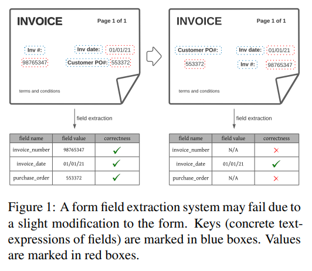
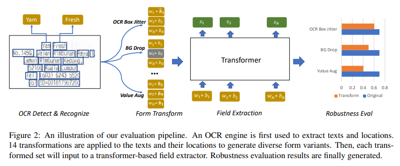
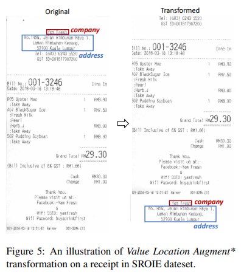

# Robustness Evaluation of Transformer-based Form Field Extractors via Form Attacks
- Paper: https://arxiv.org/abs/2110.04413v1
- Code: 
- Organization: Salesforce Research
- Author: Xue et al
- Year: Oct, 2021

## どんなもの?

- We propose a novel framework to **evaluate the robustness of transformer-based form field extraction methods** via **form attacks**.
- We introduce **14 novel form transformations** to evaluate the vulnerability of the state-of-the-art field extractors against form attacks from both OCR level and form level, including:
  - OCR location/order rearrangement,
  - form background manipulation and
  - form field-value augmentation.
- We conduct robustness evaluation using **real invoices and receipts**, and perform comprehensive research analysis.
- Experimental results suggest that the evaluated models are very **susceptible** to form perturbations such as 
  - the variation of field-values (∼ 15% drop in F1 score),
  - the disarrangement of input text order(∼ 15% drop in F1 score) and
  - the disruption of the neighboring words of fieldvalues(∼ 10% drop in F1 score).
- Guided by the analysis, we make recommendations to improve the design of field extractors and the process of data collection

### Motivation
- Existing works (Chiticariu et al., 2013; Schuster et al., 2013; Palm et al., 2019; Majumder et al., 2020; Xu et al., 2020) focus on improving the modeling of field extractors and have made great progress.
- However, their evaluation paradigms are **limited**.
- First, most of the methods are evaluated using **internal datasets**.
  - Internal datasets usually have very **limited variations** and are often **biased** towards certain data distributions due to the constraints of the data collection process.
    - For example, the forms might be collected from just a few vendors in a relatively short time which leads to similar semantics and layouts across the forms.
- Second, public datasets **lack for diversity in terms of both textual expression and form layouts**.
  - Take the most frequently used dataset, **SROIE** (Huang et al., 2019), as an example.
    - The fields, company and address, are always on the very top in all receipts.
    - Although the existing models achieve decent performance on these datasets, it is difficult to know whether they can generalize well.
    - This issue can be solved by collecting large-scale diverse forms for evaluation, but it is very challenging since real forms usually contain customers’ private information, thus are not publicly accessible.
- To tackle this dilemma, we propose a novel framework to evaluate the robustness of form field extractors by attacking the models using form **transformations**.

### Contributions
- First, we introduce a framework to measure the robustness of form field extractors by attacking the models using the proposed form transformations. To the best of our knowledge, **this is the first work** studying form attacks to field extraction methods.
- Second, we identify the susceptibilities of the SOTA methods by comprehensive robustness analysis on two form types using the proposed framework and make insightful recommendations.

### Evaluation Pipeline

## 先行研究と比べてどこがすごい?
- To the best of our knowledge, this work is the first one focusing on robustness evaluation of form field extraction systems.

## 技術や手法の肝は?
### OCR Location and Order Rearrangement
- Center Shift and Box Stretch
  - In Center Shift, we keep the box size and randomly shift the center of a box.
  - The shifting is in proportional to the width (horizontally) and height (vertically) of the box, and the ratio is a random number drawn from a normal distribution, N (0, δcent).
  - Box Stretch randomly changes the four coordinates of a box in a similar way using N (0, δxy).
- Margin Padding
- Global Shuffle
  - transformerのinputの順番をシャッフルする
- Neighbor Shuffle and Non-neighbor Shuffle
  - 近傍の単語だけor以外をシャッフルする?
### Form Background Manipulation
ここでいうBackgroundはOCRのことかな
- BG Drop
- Neighbor BG Drop
- Key Drop
- BG Typo
- BG Synonyms
- BG Adversarial
### Form Field-Value Augmentations
- Value Text Augment
- Value Location Augment
  - 

## どうやって有効だと検証した?
- none

## 結果は?
- none

## 次に読むべき論文は?
### Information extraction from forms
- SROIE (Huang et al., 2019)
  - dateset
- we use LayoutLM (Xu et al., 2020) as the feature backbone.
- Katti et al. (2018) and Denk and Reisswig (2019) encode each page of a form as a two-dimensional grid and extract header and line items from it using fully convolutional networks.
- DocStruct (Wang et al., 2020) conducts document structure inference by encoding the form structure as a graph-like hierarchy of text fragments.
- Earlier methods (Chiticariu et al., 2013; Schuster et al., 2013) relied on pre-registered templates in the system for information extraction.
- Palm et al. (2019) extract field-values of invoices via an Attend, Copy, Parse architecture.
- Recent methods formulate the field extraction problem as **field-value pairing** (Majumder et al., 2020) and **field tagging** (Xu et al., 2020) tasks, where transformer (Vaswani et al., 2017) based structures are used to extract informative form representation via modeling interactions among text tokens.
  - We focus on evaluating transformer-based field extraction methods given their great predictive capability for the task.
  - We are focusing on the robustness evaluation of transformer-based form field extractors due to their undisputedly outstanding performance.
### Robustness evaluation
- Errudite (Wu et al., 2019) introduces model and task agnostic principles for informative error analysis of NLP models.
- Ma (2019) propose NLPAug, which contains simple textual augmentations to improve model robustness.
- Some works aim at robustness of text attacks (Morris et al., 2020; Zeng et al., 2020; Kiela et al., 2021)
- A recent work, Robustness Gym (Goel et al., 2021), presents a simple and extensible evaluation toolkit that unifies standard evaluation paradigms.

## 不明な単語
- document understanding
- information extraction from forms
- field extractors

## 感想
### 2022/7/7
- 読みやすかった
- 5章の冒頭まで読んだ.
- この分野に関するキーワードや関連研究を見ていきたい.
- とりあえずLayoutLMは注目!
- 提案されているAugmentation手法はそのまま学習に使えそう.
- Salesforceってこの分野でちょいちょい見る.
