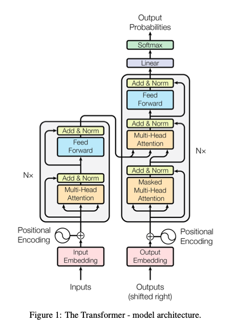
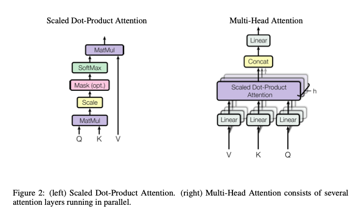
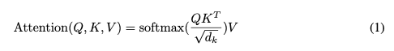
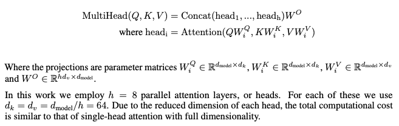

# Attention is All You Need
- Paper: https://arxiv.org/abs/1706.03762v5
- Code: https://github.com/tensorflow/tensor2tensor
- Organization: Google Brain
- Author: Vaswani et el
- Year: 2007

## どんなもの?
- RNN, CNNに取って代わるattention mechanisimをベースとした新しいencoder-decoderアーキテクチャを提案.

## 先行研究と比べてどこがすごい?
- RNNの逐次性を指摘
  - 計算コストが大きい？
  - 並列化できない
    - factorization trick
    - conditional computation
  - 従来はRNNとattention mechanismを組み合わせて使用. 完全にattention mechanisだけに依存したアーキテクチャは存在しない.
- 逐次性をなくす試み
  - ByteNet [18], ConvS2S [9]
    - 離れた位置間の依存関係を学習することは困難[12]
    - なぜか？位置間の距離に応じて計算コストが増大するため？
  - Transformerでは、注意で重み付けされた平均化により有効解像度が低下する代償として、これは一定の演算数に減少する.
  - この効果はmulti-head attentionで打ち消すことができる.

### Architecture

#### Encoder and Decoder stacks
- Encoder
  - To facilitate these residual connections, all sub-layers in the model, as well as the embedding layers, produce outputs of dimension dmodel = 512.
- Decoder
  - auto-regressive style
    - 位置が後続の位置にアテンションしないようにしている
    - このマスキングは、出力埋め込みが1ポジション分オフセットされていることと合わせて、ポジションiの予測はiより小さいポジションの既知の出力にのみ依存することができることを保証する

#### Attention
- 
- The output is computed as a weighted sum of the values, where the weight assigned to each value is computed by a compatibility function of the query with the corresponding key.
- AttentionはEncoder, Decoderに３つ配置しており, 微妙に使い方を分けている(key, value, queryのinputが違ったり, maskしたりしている).

#### Scaled Dot-Product Attention
- The input consists of queries and keys of dimension d_k, and values of dimension d_v.
- 従来法
  - additive attention
    - computes the compatibility function using a feed-forward network with a single hidden layer.
  - dot-product attention
    - scaledしていない点をのぞき同じ
    - d_kが大きいときにdot-productは大きな値を取るので, softmaxの勾配が小さくなる問題が生じる.
- 行列演算で実装できる！
  - 

#### Multi-head attention
- Attentionの計算コストを抑えるために, d_model(=512)を小さい次元に落としてからAttentionに入力する.
- それぞれのtokenが異なるh個のd_k, d_v次元(< d_model)ベクトルをもつことになる.
  - 平均化による有効解像度が低下することを軽減
  - h回平均をとることによって多様性を保障しようとしている?
- 
- 参考: https://zenn.dev/attentionplease/articles/5510331c45e16a

#### Position-wise FFN
- input/outputの次元はd_model(=512)
- 中間層は2048.
- 

#### Embeddings and Softmax
- input tokenからd_model次元のベクトルを得るために学習ずみの線形コンバーター(d_token_vocabsize to d_model)を使用.
- またd_modelからtokenを予想する関数にも線形コンバーター(d_model to d_token_vocabsize)を使用
- ２つの処理で線形コンバーターは同じ重みを共有

#### Positional Encoding
- モデルにtokenの位置情報を考慮させるために使用.

## 技術や手法の肝は?
- 行列演算により実装が可能であり, 効率的な計算が可能
- Dot-Productをscaleすることによって購買消失問題を回避
- Multi-headにすることで, 多様性を保障し有効解像度の低下問題を回避

## どうやって有効だと検証した?
- 翻訳タスクで実証実験を行った
  - WMT 2014 English-to-German
  - WMT 2014 English-to-French

## 結果は?
- SOTA
- ensemblesを上回った

## 次に読むべき論文は?
- none

## 不明な単語
- none

## 感想
- 3.5まで読んだ@2022-04-28 15:30 ~ 17:00
