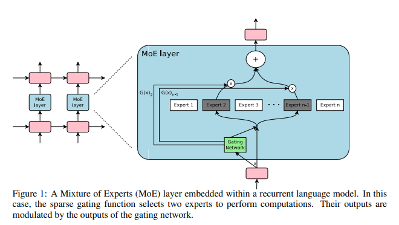
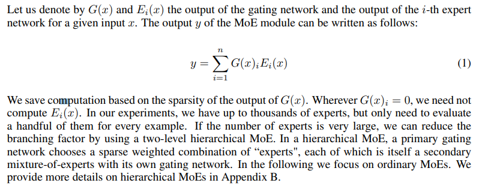
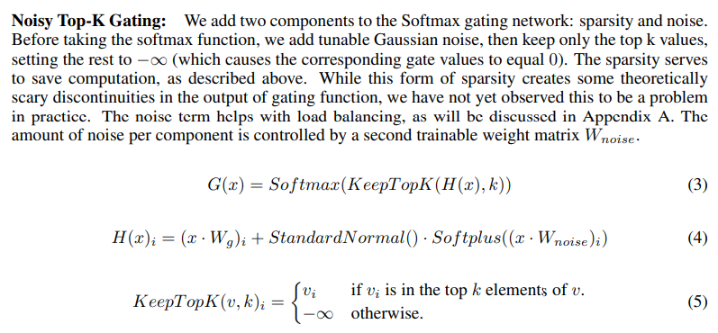

# Outrageously Large Neural Networks: The Sparsely-Gated Mixture-of-Experts Layer
- Paper: https://arxiv.org/abs/1701.06538
- Code: 
- Organization: Google Brain
- Author: Shazeer et al
- Year: Jan 2017

## どんなもの?
- Attention is all you needよりも前(Jan < Jun)
- The capacity of a neural network to absorb information is limited by its number of parameters.
  - **Conditional computation**, where **parts of the network are active** on a per-example basis, has been proposed in theory as a way of dramatically increasing model capacity without a proportional increase in computation.
  - In practice, however, there are significant algorithmic and performance challenges.
- In this work, we address these challenges and finally realize the promise of conditional computation, achieving greater than **1000x improvements in model capacity** **with only minor losses in computational efficiency** on modern GPU clusters.
- We introduce a **Sparsely-Gated Mixture-of-Experts layer (MoE)**, consisting of **up to thousands of feed-forward sub-networks**.
  - **A trainable gating network determines a sparse combination of these experts** to use for each example.
  - We apply the MoE to the tasks of **language modeling** and **machine translation**, where model capacity is critical for absorbing the vast quantities of knowledge available in the training corpora.
- We present model architectures in which a MoE with up to **137 billion parameters** is applied convolutionally between **stacked LSTM layers**.
- On large language modeling and machine translation benchmarks, these models achieve significantly better results than state-of-the-art at lower computational cost.

### Conditional computation
- Various forms of conditional computation have been proposed as a way to increase model capacity without a proportional increase in computational costs (Davis & Arel, 2013; Bengio et al., 2013; Eigen et al., 2013; Ludovic Denoyer, 2014; Cho & Bengio, 2014; Bengio et al., 2015; Almahairi et al., 2015).
- In these schemes, large parts of a network are active or inactive on a per-example basis. The gating decisions may be binary or sparse and continuous, stochastic or deterministic.
- Various forms of reinforcement learning and back-propagation are proposed for trarining the gating decisions.
- While these ideas are promising in theory, **no work to date has yet demonstrated massive improvements in model capacity, training time, or model quality**. We blame this on a combination of the following challenges:
  - Modern computing devices, especially GPUs, are much faster at arithmetic than at branching. Most of the works above recognize this and propose turning on/off large chunks of the network with each gating decision.
    - どういうこと?
    - GPUでごりごり行列演算する方が, 条件分岐するよりも早いってことかな?
  - Large batch sizes are critical for performance, as they amortize the costs of parameter transfers and updates. Conditional computation reduces the batch sizes for the conditionally active chunks of the network.
    - どういうこと?
  - **Network bandwidth can be a bottleneck**. A cluster of GPUs may have computational power thousands of times greater than the aggregate inter-device network bandwidth. To be computationally efficient, the relative computational versus network demands of an algorithm must exceed this ratio. **Embedding layers, which can be seen as a form of conditional computation, are handicapped by this very problem**. Since the embeddings generally need to be sent across the network, the number of (example, parameter) interactions is limited by network bandwidth instead of computational capacity.
    - 並列分散学習の話かな...
    - ネットワークのバンドワイズがボトルネックになるらしい...
  - Depending on the scheme, **loss terms** may be necessary to achieve the desired level of sparsity per-chunk and/or per example. Bengio et al. (2015) use three such terms. These issues can affect both model quality and load-balancing.
    - Lossをなんかいじる必要がある?
  - Model capacity is most critical for very large data sets. The existing literature on conditional computation deals with **relatively small image recognition data sets** consisting of up to 600,000 images. It is hard to imagine that **the labels of these images provide a sufficient signal to adequately train a model with millions, let alone billions of parameters**.
    - 先行研究では比較的小さなサンプルサイズのデータセットを扱っているが, 巨大なパラメータをもつモデルを学習するには十分といえないだろう.
- In this work, we for the **first time** address all of the above challenges and finally realize the promise of conditional computation. We obtain greater than 1000x improvements in model capacity with only minor losses in computational efficiency and significantly advance the state-of-the-art results on public language modeling and translation data sets.

### Architecture
- The MoE consists of a number of experts, **each a simple feed-forward neural network**, and a trainable gating network which selects a sparse combination of the experts to process each input.
- The MoE is called once for each position in the text, selecting a potentially different combination of experts at each position. **The different experts tend to become highly specialized based on syntax and semantics** (see Appendix E Table 9). On both language modeling and machine translation benchmarks, we improve on best published results at a fraction of the computational cost.
  - 各expertsは構文, 意味的に異なった特徴を持つようになるらしい.

### Mixture-of-Experts Layer
- 
- The Mixture-of-Experts (MoE) layer consists of a set of n “expert networks" E1, · · · , En, and a “gating network" G whose **output is a sparse n-dimensional vector**.
- Although in principle we only require that the experts accept the same sized inputs and produce the same-sized outputs, in our initial investigations in this paper, **we restrict ourselves to the case where the models are feed-forward networks with identical architectures, but with separate parameters**.
- 

## 先行研究と比べてどこがすごい?
### convolutional application of the MoE
- While Eigen et al. (2013) uses two stacked MoEs allowing for two sets of gating decisions, **our convolutional application of the MoE allows for different gating decisions at each position** in the text. We also realize sparse gating and demonstrate its use as a practical way to massively increase model capacity.
  - **The mixture of experts is the whole model**. Eigen et al. (2013) introduce the idea of using multiple MoEs with their own gating networks as parts of a deep model. It is intuitive that the latter approach is more powerful, since **complex problems may contain many sub-problems each requiring different experts**. They also allude in their conclusion to the potential to introduce sparsity, turning MoEs into a vehicle for computational computation.
  - MoEを大量に導入したらなんかよくなったって感じかな.

## 技術や手法の肝は?
### Noisy Top-K Gating, スパース性を確立する肝!
- 
- ノイズが"load balancing"という役割を果たすらしい...
- "The different experts tend to become highly specialized based on syntax and semantics"と関連している感じかな?
- "While this form of sparsity creates some theoretically scary discontinuities in the output of gating function"はよくわからなかった. 実際問題ないらしいが...
### Training the Gating Network, Gating NetworkをBPで学習している!
- We train the gating network **by simple back-propagation**, along with the rest of the model.
- If we choose k > 1, the gate values for the top k experts have nonzero derivatives with respect to the weights of the gating network.
- This type of occasionally-sensitive behavior is described in (Bengio et al., 2013) with respect to noisy rectifiers.
  - "occasionally-sensitive behavior"ってなに?
- Gradients also backpropagate through the gating network to its inputs.
- Our method differs here from (Bengio et al., 2015) who use boolean gates and a REINFORCE-style approach to train the gating network.

## どうやって有効だと検証した?
- none

## 結果は?
- none

## 次に読むべき論文は?
- Exploiting scale in both training data and model size has been central to the success of deep learning. When datasets are sufficiently large, increasing the capacity (number of parameters) of neural networks can give much better prediction accuracy. This has been shown in domains such as: 
  - text (Sutskever et al., 2014; Bahdanau et al., 2014; Jozefowicz et al., 2016; Wu et al., 2016),
  - images (Krizhevsky et al., 2012; Le et al., 2012), and
  - audio (Hinton et al., 2012; Amodei et al., 2015).
- Various forms of conditional computation have been proposed as a way to increase model capacity without a proportional increase in computational costs (Davis & Arel, 2013; Bengio et al., 2013; Eigen et al., 2013; Ludovic Denoyer, 2014; Cho & Bengio, 2014; Bengio et al., 2015; Almahairi et al., 2015).

## 不明な単語
- none

## 感想
### 2022/6/28
- 2.1まで読んだ.
- まあまあ読みやすかった. 1章のConditional computationで手間取った.
- appendixが読み応えありそう.
