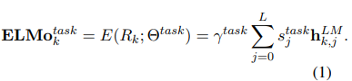
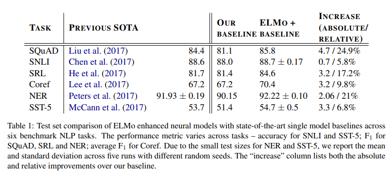

# Deep contextualized word representations
- Paper: https://arxiv.org/abs/1802.05365
- Code: https://allenai.org/allennlp/software/elmo
- Organization: Allen Institute for Artificial Intelligence
- Author: Peters el el
- Year: 2018

## どんなもの?
- ELMo(Embeddings from Language Models) that models both
  1. complex characteristics of word use (e.g., syntax and semantics)
  2. how these uses vary across linguistic contexts (i.e., to model polysemy(多義性)).
- We use vectors derived from a bidirectional LSTM that is trained with a coupled language model (LM) objective on a large text corpus. 

### ELMo
- 

## 先行研究と比べてどこがすごい?
### 文脈依存のベクトルをモデリングすることができるよ
- Our representations differ from traditional word type embeddings in that each token is assigned a representation that is **a function of the entire input sentence**.
  - They are computed on top of **two-layer biLMs** with **character convolutions** (Sec. 3.1), as a **linear function of the internal network states** (Sec. 3.2).
  -  traditional approaches for learning word vectors only allow a single **context-independent** representation for each word.
### 低レベルと高レベルのレイヤーには異なる情報が埋め込まれている
- we show that the **higher-level LSTM states** capture
  - **context-dependent** aspects of word meaning (e.g., they can be used without modification to perform well on supervised word sense disambiguation tasks)
  - while **lower-level states** model aspects of syntax (e.g., they can be used to do part-of-speech tagging). 
### ディープだよね
- Unlike previous approaches for learning contextualized word vectors (Peters et al., 2017; McCann et al., 2017), ELMo representations are **deep**, in the sense that they are **a function of all of the internal layers** of the biLM.
  - we learn a **linear combination** of the vectors stacked above each input word for each end task
  - Combining the internal states in this manner **allows for very rich word representations**.
### 後段のタスクにシームレスに適用できるよ
- Previously proposed methods overcome some of the shortcomings of traditional word vectors by either
  - enriching them with subword information (e.g., Wieting et al., 2016; Bojanowski et al., 2017)
  - or learning separate vectors for each word sense (e.g., Neelakantan et al., 2014).
- Our approach also benefits from subword units through the use of **character convolutions**, and we seamlessly incorporate multi-sense information into downstream tasks **without explicitly training to predict predefined sense classes**.
  - after pretraining the biLM with unlabeled data, we **fix the weights** and **add additional task specific model** capacity, allowing us to leverage large, rich and universal biLM representations for cases where downstream training data size dictates a smaller supervised model.
### アクセス可能な大規模データセットを使うよ
- Other recent work has also focused on learning context-dependent representations.
- context2vec (Melamud et al., 2016) uses a bidirectional Long Short Term Memory (LSTM; Hochreiter and Schmidhuber, 1997) to encode the context around a **pivot word**.
- Other approaches for learning contextual embeddings include the pivot word itself in the representation and are computed with the encoder of either
  - a supervised **neural machine translation (MT) system** (CoVe; McCann et al., 2017)
  - or an unsupervised language model (Peters et al., 2017).
- Both of these approaches benefit from large datasets, although the MT approach is **limited** by the size of parallel corpora.
- In this paper, **we take full advantage of access to plentiful monolingual data**, and train our biLM on a corpus with approximately 30 million sentences (Chelba et al., 2014).

## 技術や手法の肝は?
- leaern linear combination of the vectors stacked above each input word.
  - 低レベルと高レベルのレイヤーには異なる情報が埋め込まれており, それらをまぜまぜすることで後段のタスクに有効であることを示す.
  - まぜまぜする部分の係数はどうやって求めているのかわからんかった.
    - fine-tuningのときに学習? でもシームレスとかいってたよな?

## どうやって有効だと検証した?
- across six challenging NLP problems で実証実験.
  - including:
    - question answering
    - textual entailment
    - sentiment analysis
- ablations and other controlled experiments
  - to confirme that the biLM layers efficiently encode different types of syntactic and semantic information about words-in-context

## 結果は?
- 
  - SOTA!
  - ただし, Textual entailment は同等の結果となった.
    - やはり, 長期依存関係をモデリングするのは苦手?

## 次に読むべき論文は?
- TagLM (Peters et al., 2017)
- CoVe (McCann et al., 2017)

## 不明な単語
- pivot word
- perplexities

## 感想
### 2022/6/8
- まあまあ読みやすかった
- 4章まで読んだ
  - ただし４章は流し読み
- pretraining -> fine-tuning を半教師ありと呼ぶのはやめてほしい.
- モデルの全体図がないのでわかりずらい.
  - The pre-trained biLMs in this paper are similar to the architectures in Jozefowicz et al. (2016) and Kim et al. (2015), but **modified to support joint training of both directions** and **add a residual connection between LSTM layers.**
- 気になった文:
  - 3.3:: Finally, we found it beneficial to add a moderate amount of **dropout** to ELMo (Srivastava et al., 2014) and in some cases to **regularize the ELMo weights** by adding λkwk 2 2 to the loss. This imposes an inductive bias on the ELMo weights to **stay close to an average of all biLM layers**.
  - 3.4:: In some cases, **fine tuning the biLM on domain specific data leads to significant drops in perplexity and an increase in downstream task performance**.
