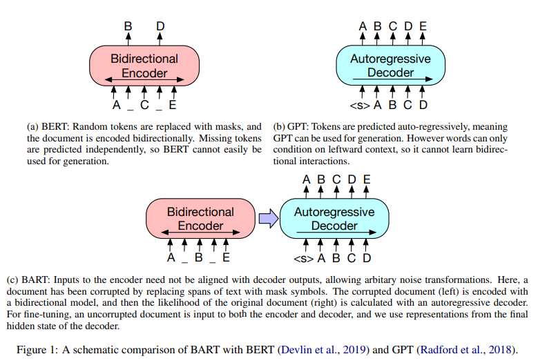
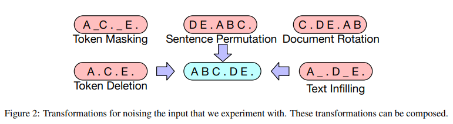
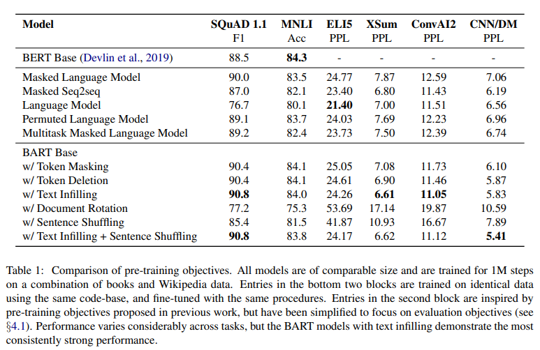

# BART: Denoising Sequence-to-Sequence Pre-training for Natural Language Generation, Translation, and Comprehension
- Paper: https://arxiv.org/pdf/1910.13461.pdf
- Code: 
- Organization: Facebook AI
- Author: Lewis et el
- Year: Oct, 2019

## どんなもの?
- BERTの１年後に発表
- We present BART, **a denoising autoencoder for pretraining sequence-to-sequence models**.
- BART is trained by
  - (1) corrupting text with an arbitrary noising function
  - (2) learning a model to reconstruct the original text
-  It uses a **standard Tranformer-based neural machine translation architecture**
- We evaluate a number of noising approaches, finding the best performance by both
  - **randomly shuffling the order of the original sentences**
  - and using **a novel in-filling scheme**, where spans of text are replaced with a single mask token.
- BART is particularly effective when fine tuned for **text generation** but also works well for comprehension tasks.
- It matches the performance of RoBERTa with comparable training resources on GLUE and SQuAD, achieves new stateof-the-art results on a range of
  - abstractive dialogue,
  - question answering,
  - and summarization tasks with gains of up to 6 ROUGE
- BART also provides a 1.1 BLEU increase over a back-translation system for machine translation, with only target language pretraining.

### アーキテクチャ

- The architecture is closely related to that used in BERT, with the following differences:
  - (1) **each layer of the decoder additionally performs cross-attention over the final hidden layer of the encoder** (as in the transformer sequence-to-sequence model)
  - (2) BERT uses an additional feed-forward network before wordprediction, **which BART does not**.
- In total, BART contains roughly **10% more parameters than the equivalently sized BERT model**.

### 事前学習
- BART is trained by corrupting documents and then optimizing a **reconstruction loss**—the cross-entropy between the decoder’s output and the original document.
- Unlike existing denoising autoencoders, which are tailored to specific noising schemes, BART allows us to **apply any type of document corruption**.

### The transformations

- Token Masking
  - Following BERT (Devlin et al.,2019)
- Token Deletion
  - Random tokens are deleted from the input. In contrast to token masking, the model must decide which positions are missing inputs.
- Text Infilling
  - A number of text spans are sampled, with span lengths drawn from a Poisson distribution (λ = 3).
  - Each span is replaced with a single [MASK] token.
  - 0-length spans correspond to the insertion of [MASK] tokens.
  - Text infilling is inspired by SpanBERT (Joshi et al., 2019), but SpanBERT samples span lengths from a different (clamped geometric) distribution, and replaces each span with a sequence of [MASK] tokens of exactly the same length.
  - Text infilling teaches the model to predict how many tokens are missing from a span.
- Sentence Permutation
- Document Rotation
  - A token is chosen uniformly at random, and the document is rotated so that it begins with that token. 
  - This task trains the model to identify the start of the document.

## 先行研究と比べてどこがすごい?
- none

## 技術や手法の肝は?
### Bidirectional encoder over corrupted text and a left-to-right autoregressive decoder
### The MLM transformations

## どうやって有効だと検証した?
### 事前学習の目的関数の比較実験を実施
#### 設定
- We compare a range of options using base-size models (6 encoder and 6 decoder layers, with a hidden size of 768)
- We **re-implement** strong pre-training approaches recently proposed for discriminative and generation tasks.
- We aim, as much as possible, **to control for differences unrelated to the pre-training objective**.
- However, we do make minor changes to the learning rate and usage of layer normalisation in order to improve performance (tuning these separately for each objective).
- For reference, we compare our implementations with published numbers from BERT, which was also trained for 1M steps on a combination of books and Wikipedia data
#### 結果

- BART achieves the most consistently strong performance. With the exception of ELI5, BART models using text-infilling perform well on all tasks.
- ELI5:: BART is less effective when the output is only loosely constrained by the input.
  - loosely constrainedってどういうこと?

## 次に読むべき論文は?
- none

## 不明な単語
- GeLUs (Hendrycks & Gimpel, 2016)

## 感想
### 2022/6/15
- 集中できなかった
  - 眠い
- 様々なMLM手法を適用可能でフレキシブルなアーキテクチャを提案して, MLM手法を比較検討した, という流れ.
  - フレキシブルであることが, Bidirectional Encoder - Autoregressive Decoderというアーキテクチャでなぜ達成できるのか, わからなかった.
    - Bidirectional EncoderとAutoregressive Decoderのいいとこどりをした結果, フレキシブルになった!ということだと思うので, もう一回, そのあたりを見直そう.
  - 逆に既存アーキテクチャはフレキシブルではないといえるのか?適用できるMLMが限られている?とは思えないので, 私の解釈が間違っているのだと思う.
- 気になった文:
  - 1:: However, these methods(spanBERT, XLNet, etc) typically **focus on particular types of end tasks** (e.g. span prediction, generation, etc.), **limiting their applicability**. BART is a denoising autoencoder built with a sequence-to-sequence model that is applicable to a very wide range of end tasks.
    - applicableの意味がよくわからない. BERTはいろんなタスクにfine-tuningできるのでapplicableなのでは?
  - 2.2:: Unlike existing denoising autoencoders, which are tailored to specific noising schemes, BART allows us to apply any type of document corruption. In the extreme case, where all information about the source is lost, BART is equivalent to a language model.
    - 言語モデルと等価とはどういう意味?
