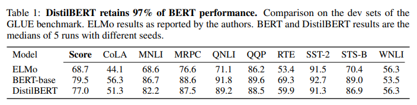
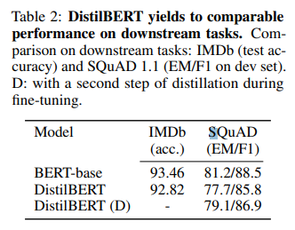

# DistilBERT, a distilled version of BERT: smaller, faster, cheaper and lighter
- Paper: https://arxiv.org/abs/1910.01108
- Code: none
- Organization: Hugging Face
- Author: SANH et el
- Year: 2019

## どんなもの?
- より小さな言語モデル(DistilBERT, a general-purpose pre-trained version of BERT)を提案.
- 3つの損失関数を組み合わせたknowledge distillationを事前学習に適用.
- モデルサイズを40%削減, パフォーマンスの低減を97%に抑えつつ, さらに推論スピードを60%向上させた.
- edge deviceでも機能する.

### Knowledge distillation
- Knowledge distillation [Bucila et al., 2006, Hinton et al., 2015] is a compression technique
  - compact model - the student - is trained to reproduce the behaviour of a larger model - the teacher - or an ensemble of models.

### Training loss
- softmax-temperature
  - Following Hinton et al. [2015] we used a softmax-temperature:
    - pi = P exp(zi/T) j exp(zj /T)
  - where T controls the smoothness of the output distribution
  - zi is the model score for the class i.
  - The same temperature T is applied to the student and the teacher at training time
  - while at inference, T is set to 1 to recover a standard softmax.
- The final training objective is a linear combination of the distillation loss Lce with the supervised
training loss, in our case the masked language modeling loss Lmlm [Devlin et al., 2018].
- We found it beneficial to add a cosine embedding loss (Lcos) which will tend to align the directions of the student and teacher hidden states vectors.

### DistilBERT
#### Student architecture
- In the present work, the student - DistilBERT - has the same general architecture as BERT.
- The token-type embeddings and the pooler are removed while the number of layers is reduced by a factor of 2.
- we focus on reducing the number of layers.
  - Most of the operations used in the Transformer architecture (linear layer and layer normalisation) are highly optimized in modern linear algebra frameworks and our investigations showed that variations on the last dimension of the tensor (hidden size dimension) have a smaller impact on computation efficiency (for a fixed parameters budget) than variations on other factors like the number of layers.
#### Student initialization
- we initialize the student from the teacher by taking one layer out of two.
  - to take advantage of the common dimensionality between teacher and student networks
#### Distillation
- We applied best practices for training BERT model recently proposed in Liu et al. [2019](RoBERTa).
- As such, DistilBERT is distilled
  - on very large batches leveraging gradient accumulation (up to 4K examples per batch)
  - using dynamic masking
  - without the next sentence prediction objective.
#### Data and compute power
- We train DistilBERT on the same corpus as the original BERT model: a concatenation of English Wikipedia and Toronto Book Corpus [Zhu et al., 2015].
- DistilBERT was trained on 8 16GB V100 GPUs for approximately 90 hours.
- For the sake of comparison, the RoBERTa model [Liu et al., 2019] required 1 day of training on 1024 32GB V100.

## 先行研究と比べてどこがすごい?
- none

## 技術や手法の肝は?
- none

## どうやって有効だと検証した?
- GLUE benchmarkでnatural language understandingのパフォーマンスを検証.
- 以下の２つでDownstream taskのパフォーマンスを検証
  - IMDb, sentiment classification
  - SQuAD V1.1, question answering

## 結果は?
- GLUE
  - 
  - macro score, BERT-base: 79.5, DistilBERT: 77.0
- IMDb and SQuAD
  - 
  - donwstream taskでfine-tuningするときにknowlegde distillationを適用した結果, F1: 85.8 -> 86.9.

## 次に読むべき論文は?
- none

## 不明な単語
- none

## 感想
- 読みやすかった
- 2章のこの文がよくわからなかった.
  - But some of these "near-zero" probabilities are larger than others and reflect, in part, the generalization capabilities of the model and how well it will perform on the test set3.
  - "near-zero" probabilitiesが汎化性能と関係している?
- 4.1まで読んだ@2022-05-30
