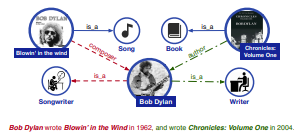
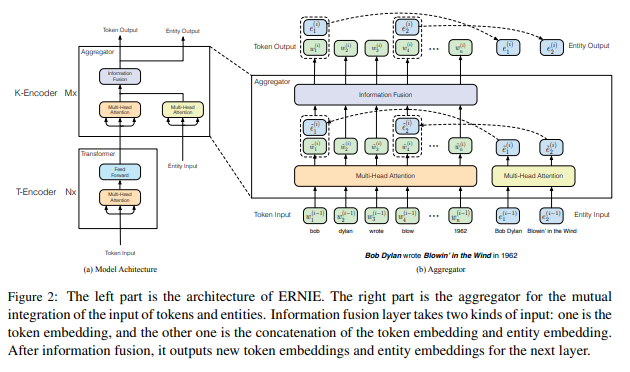
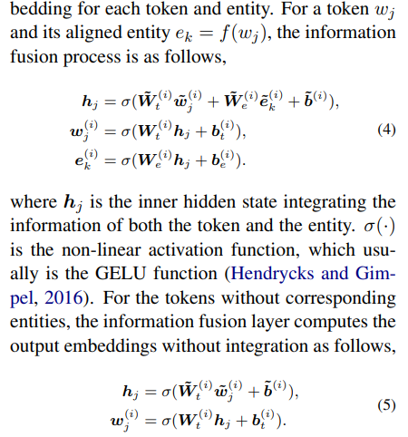

# ERNIE: Enhanced Language Representation with Informative Entities
- Paper: https://arxiv.org/abs/1905.07129, [ACL](https://aclanthology.org/P19-1139/)
- Code: https://github.com/thunlp/ERNIE
- Organization: Department of Computer Science and Technology, Tsinghua University, Beijing, China
- Author: Zhang et el
- Year: 2019

## どんなもの?
- the existing pre-trained language models rarely consider incorporating **knowledge graphs (KGs)**, which can provide rich structured knowledge facts for better language understanding.
- In this paper, we utilize both large-scale textual corpora and KGs to train an enhanced language representation model (ERNIE), which can take full advantage of lexical, syntactic, and knowledge information simultaneously.
- The experimental results have demonstrated that ERNIE achieves **significant improvements on various knowledge-driven tasks**, and meanwhile is **comparable with the state-of-the-art model BERT on other common NLP tasks**.
- There are three important directions remain for future research:
  - (1) inject knowledge into feature-based pre-training models such as ELMo (Peters et al., 2018)
  - (2) **introduce diverse structured knowledge** into language representation models such as ConceptNet (Speer and Havasi, 2012) which is different from the world knowledge database Wikidata
  - (3) **annotate more real-world corpora** heuristically for building larger pre-training data.

### Knowledge Graph and language model
#### Although pre-trained language representation models have achieved promising results and worked as a routine component in many NLP tasks, they neglect to incorporate **knowledge information** for language understanding.
- 
- As shown in Figure 1, without knowing "Blowin’ in the Wind" and "Chronicles: Volume One" are song and book respectively, it is difficult to recognize the two occupations of Bob Dylan, i.e., songwriter and writer, on the **entity typing task**.
- Furthermore, it is nearly impossible to extract the fine-grained relations, such as "composer" and "author" on the **relation classification task**.
- For the existing pre-trained language representation models, these two sentences are syntactically ambiguous, like “UNK wrote UNK in UNK”.
- Hence, considering rich knowledge information can lead to better language understanding and accordingly benefits various knowledge-driven applications, e.g. entity typing and relation classification.

### 外部知識の言語モデルへの導入課題
#### Structured Knowledge Encoding:
- regarding to the given text, **how to effectively extract and encode its related informative facts in KGs for language representation models** is an important problem
#### Heterogeneous Information Fusion:
- the pre-training procedure for language representation is quite different from the knowledge representation procedure, leading to two individual vector spaces.
- **How to design a special pre-training objective** to fuse lexical, syntactic, and knowledge information is another challenge.

### アーキテクチャ

- As shown in Figure 2, the whole model architecture of ERNIE consists of **two stacked modules**
#### the underlying textual encoder (T-Encoder)
- responsible to capture basic lexical and syntactic information from the input tokens
- **T-Encoder(·) is identical to its implementation in BERT**
#### the upper knowledgeable encoder (K-Encoder)
- responsible to integrate extra token-oriented knowledge information into textual information from the underlying layer, so that we can represent heterogeneous information of tokens and entities into a united feature space.
- To be specific, we represent {e1, . . . , em} with their entity embeddings {e1, . . . , em}, **which are pre-trained by the effective knowledge embedding model TransE (Bordes et al., 2013)**.
##### K-Encoder details
- As shown in Figure 2, the knowledgeable encoder K-Encoder consists of **stacked aggregators**, which are designed for encoding both tokens and entities as well as fusing their heterogeneous features. 
- 
  - 最初のMulti-head attentionいる?
  - 割り当て関数 f は何?

## 先行研究と比べてどこがすごい?
### 事前学習の目的関数に外部知識(知識グラフ)を導入している
- Though both feature-based and fine-tuning language representation models have achieved great success, they ignore the incorporation of knowledge information
- As demonstrated in recent work, **injecting extra knowledge information can significantly enhance original models**, such as:
  - reading comprehension (Mihaylov and Frank, 2018; Zhong et al., 2018), 
  - machine translation (Zaremoodi et al., 2018),
  - natural language inference (Chen et al., 2018),
  - knowledge acquisition (Han et al., 2018a),
  - and dialog systems (Madotto et al., 2018).
- Hence, we argue that extra knowledge information can effectively benefit existing pre-training models.
- In fact, some work has attempted to joint representation learning of words and entities for effectively leveraging external KGs and achieved promising results (Wang et al., 2014; Toutanova et al., 2015; Han et al., 2016; Yamada et al., 2016; Cao et al., 2017, 2018).
  - これらと本研究の違いについて説明してほしかった.
  - 事前学習の目的関数に外部知識が組み込まれているかどうか, の違いかな.
- Sun et al. (2019) propose the **knowledge masking strategy for masked language model** to enhance language representation by knowledge.
- In this paper, we further utilize both corpora and KGs to train an enhanced language representation model based on BERT.

## 技術や手法の肝は?
### 知識グラフのグラフ構造としてknowledge embedding algorithmsを採用したよ
- For extracting and encoding knowledge information, we firstly **recognize named entity mentions in text and then align these mentions to their corresponding entities in KGs**.
- Instead of directly using the graph-based facts in KGs, we encode the graph structure of KGs with **knowledge embedding algorithms** like TransE (Bordes et al., 2013), and then take the informative entity embeddings as input for ERNIE.
- Based on the alignments between text and KGs, ERNIE integrates entity representations in the knowledge module into the underlying layers of the semantic module.
### 新しい目的関数を設計し, 知識グラフへの固有表現割り当て問題として言語モデルの事前学習に取り込んだよ
- Similar to BERT, we adopt the **masked language model** and the **next sentence prediction** as the pre-training objectives.
- Besides, for the better fusion of textual and knowledge features, we design a new pre-training objective by **randomly masking some of the named entity alignments in the input text** and **asking the model to select appropriate entities from KGs to complete the alignments**.
  - Unlike the existing pre-trained language representation models only utilizing local context to predict tokens, our objectives require models to aggregate both context and knowledge facts for predicting both tokens and entities, and lead to a knowledgeable language representation model.

## どうやって有効だと検証した?
- We conduct experiments on two knowledgedriven NLP tasks, i.e., entity typing and relation classification

## 結果は?
- none

## 次に読むべき論文は?
- Inspired by Dai and Le (2015), more pre-trained language representation models for fine-tuning have been proposed.
  - fine-tuningの原点?
- TransE (Bordes et al., 2013)

## 不明な単語
- none

## 感想
### 2022/6/10
- あんまり集中できなかった.
- 3.3章(Knowledgeable Encoder)まで読んだ.
- アーキテクチャは得にフィーチャーされている感じはしなかった.
- たぶん, 目的関数がこの論文の肝だと思う.
