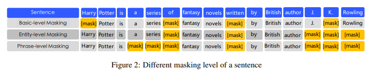
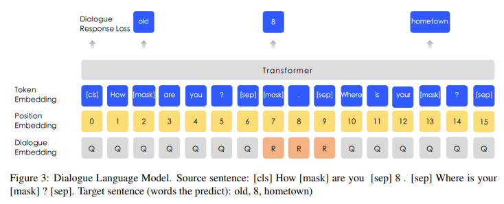

# ERNIE: Enhanced Representation through Knowledge Integration
- Paper: https://arxiv.org/abs/1904.09223
- Code: 404
- Organization: Baidu
- Author: Sun et el
- Year: 2019

## どんなもの?
- ERNIE (Tsinghua)とほぼ同時期. こっちのほうがちょい早い(4月と5月).
- ERNIE is designed to learn language representation enhanced by **knowledge masking strategies**, which includes entity-level masking and phrase-level masking.
  - **Entity-level** strategy masks entities which are usually composed of multiple words.
  - **Phrase-level** strategy masks the whole phrase which is composed of several words standing together as a conceptual unit
- ERNIE was chosen to have **the same model size as BERT-base** for comparison purposes.
  - ERNIE uses 12 encoder layers, 768 hidden units and 12 attention heads.
- **Instead of adding the knowledge embedding directly**, ERNIE implicitly learned the information about knowledge and longer semantic dependency, such as the relationship between entities, the property of a entity and the type of a event, to guide word embedding learning. 
- Experimental results show that ERNIE outperforms other baseline methods, achieving new state-of-the-art results on **five Chinese natural language processing tasks** including:
  - natural language inference,
  - semantic similarity,
  - named entity recognition,
  - sentiment analysis and
  - question answering.
- We also demonstrate that ERNIE has more **powerful knowledge inference capacity on a cloze test**.

### 事前知識の活用
- The vast majority of these studies model the representations by predicting the missing word only through the contexts.
- These works **do not consider the prior knowledge** in the sentence.
- For example, In the sentence ” Harry Potter is a series of fantasy novels written by J. K. Rowling”.
  - Harry Potter is a novel name and J. K. Rowling is the writer.
  - It is easy for the model to predict the missing word of the entity "Harry Potter" by word collocations inside this entity without the help of long contexts.
  - The model cannot predict "Harry Potter" according to the relationship between "Harry Potter" and "J. K. Rowling".
  - It is intuitive that if the model learns more about prior knowledge, the model can obtain more reliable language representation.

## 先行研究と比べてどこがすごい?
- none

## 技術や手法の肝は?
### Knowledge Integration

- Instead of adding the knowledge embedding directly, we proposed a multi-stage knowledge masking strategy to integrate phrase and entity level knowledge into the Language representation.
#### Basic-level Masking
- The first learning stage is to use basic level masking,The first learning stage is to use basic level masking, It treat a sentence as a sequence of basic Language unit,
  - for English, the basic language unit is **word**, and
  - for Chinese, the basic language unit is **Chinese Character**.
- Based on basic level mask, we can obtain a basic word representation. Because it is trained on a random mask of basic semantic units, high level semantic knowledge is hard to be fully modeled.
#### Phrase-level Masking
- The second stage is to employ phrase-level masking. Phrase is a small group of words or characters together acting as a conceptual unit.
- For English, we use **lexical analysis and chunking tools to get the boundary of phrases** in the sentences, and use some **language dependent segmentation tools to get the word/phrase information** in other language such as Chinese.
- In phrase-level mask stage, we also use basic language units as training input, unlike random basic units mask, this time we randomly select a few phrases in the sentence, mask and predict all the basic units in the same phrase.
- At this stage, **phrase information is encoded into the word embedding**.
  - 個々のトークンを別々に予測するので, フレーズを学習できるのだろうか? [Mask]トークン間の関係を学習できない問題(XLNet)は回避できる?.
#### Entity-level Masking
- The third stage is entity-level masking. Name entities contain persons, locations, organizations, products, etc., which can be denoted with a proper name.
- Usually entities contain important information in the sentences.
- As in the phrase masking stage, **we first analyze the named entities in a sentence**, and then mask and predict all slots in the entities.
  - どうやって固有表現を獲得?
- After three stage learninga word representation enhanced by richer semantic information is obtained.

### Heterogeneous Corpus Pre-training
- Following (Cer et al., 2018), we draw the mixed corpus Chinese Wikepedia, Baidu Baike, Baidu news and Baidu Tieba. The number of sentences are 21M, 51M, 47M, 54M. respectively.
- Baidu Baike contains **encyclopedia(百科事典)** articles written in formal languages, which is used as a strong basis for language modeling.
- Baidu news provides the latest information about **movie names, actor names, football team names**, etc.
- Baidu Tieba is an **open discussion forum like Reddits**, where each post can be regarded as a dialogue thread.
- We perform **traditional-to-simplified conversion** on the Chinese characters, and **upper-to-lower conversion** on English letters.
- We use a shared **vocabulary of 17,964 unicode characters** for our model.

### DLM (Dialogue Language Model) task
- 
- Dialogue data is important for semantic representation, since the corresponding query semantics of the same replies are often similar.
- ERNIE models the Query-Response dialogue structure on the DLM (Dialogue Language Model) task.
- As shown in figure 3, our method introduces **dialogue embedding** to identify the roles in the dialogue, which is different from that of universal sentence encoder (Cer et al., 2018).
- ERNIE’s Dialogue embedding plays the same roles as token type embedding in BERT, except that ERNIE can also represent **multi-turn conversations** (e.g. QRQ, QRR, QQR, where Q and R stands for ”Query” and ”Response” respectively).
-  Like MLM in BERT, masks are applied to enforce the model to predict missing words conditioned on both query and response.
- What’s more, we generate **fake samples by replacing the query or the response with a randomly selected sentence**. The model is designed to judge whether the multi-turn conversation is real or fake.
- The DLM task helps ERNIE to learn the **implicit relationship in dialogues**, which also enhances the model’s ability to learn semantic representation.
- The model architecture of DLM task is compatible with that of the MLM task, thus it is pre-trained alternatively with the MLM task.

## どうやって有効だと検証した?
- none

## 結果は?
- none

## 次に読むべき論文は?
- A very popular model architecture for estimating neural network language model (NNLM) was proposed in (Bengio et al., 2003), where a feed forward neural network with a linear projection layer and a non-linear hidden layer was used to learn the word vector representation.
- Skip-thought (Kiros et al., 2015) proposed a approach for unsupervised learning of a generic, distributed sentence encoder.
- Cove (McCann et al., 2017) show that adding these context vectors improves performance over using only unsupervised word and character vectors on a wide variety of common NLP tasks.
- XLM (Lample and Conneau, 2019) adds language embedding to the pre-training process which achieved better results in cross-lingual tasks.
- Following (Cer et al., 2018), we draw the mixed corpus Chinese Wikepedia, Baidu Baike, Baidu news and Baidu Tieba.

## 不明な単語
- none

## 感想
### 2022/6/13
- 読みやすかった
- 4.2まで読んだ
- ERNIE (Tsinghua)と違って, 事前知識を外部から持ってくるのではなく, 事前知識を取り込む枠組みKnowledge Integrationを事前学習に導入している. [Mask]トークン間の関係を学習できない問題を回避できるのかどうかが疑問. はたしてKnowledge Integrationの効果はあるのか. アブレーションスタディが楽しみ.
- 言語モデルへの事前知識活用に関する先行研究との比較がないぞ!
  - 外部知識活用ではなく, b事前知識さえも事前学習により自前で学習しようとする他の枠組みはないのか?
