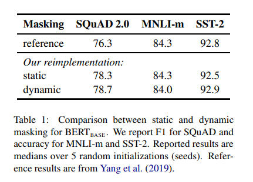
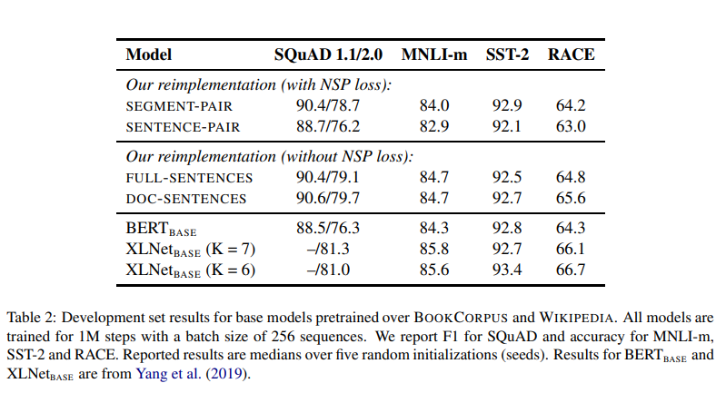

# RoBERTa: A Robustly Optimized BERT Pretraining Approach
- Paper: https://arxiv.org/abs/1907.11692
- Code: https://github.com/pytorch/fairseq
- Organization: facebook
- Author: Liu et el
- Year: 2019

## どんなもの?
- BERTのハイパーパラメータ, サンプルサイズの違いを検証.
- 調整次第で, 既存のBERTのパフォーマンスを上回ることが可能であることを示した.
- 検証結果を組み合わせてたモデル, RoBERTa(Robustly optimized BERT approach)がSOTAを達成した.
- サンプルサイズの影響を評価するために, データセットCC-NEWSを構築した.

### BERT training
- BERT is optimized with Adam (Kingma and Ba,2015) using the following parameters:
  - β1 = 0.9,
  - β2 = 0.999,
  - ǫ = 1e-6
- L2 weight decay of 0.01.
- The learning rate is warmed up over the first 10,000 steps to a peak value of 1e-4, and then linearly decayed.
- dropout of 0.1 on all layers and attention weights
- GELU activation function (Hendrycks and Gimpel, 2016)
- Models are pretrained for S = 1,000,000 updates
  - minibatches containing B = 256 sequences of maximum length T = 512 tokens.

### RoBERTa training
- Unlike Devlin et al. (2019), we do not randomly inject short sequences
  - we do not train with a reduced sequence length for the first 90% of updates.
  - We train only with full-length sequences

### Training data
- BOOKCORPUS plus English weikipedia, 16GB
- CC-NEWS, 76GB after filtering
  - collected from CommonCrawl News dataset (Nagel, 2016)
- OPENWEBTEXT(Gokaslan and Cohen, 2019), 38GB 
  - re-creation for the WebText corpus (Radford et el, 2019)
  - Reddit with at least three upvotes
- STORIES(Tring and Le, 2018), 31GB

## 先行研究と比べてどこがすごい?
- MLMに取って代わるタスクが提案されているなかで, MLMの有効性を示した.
  - perturbed autoregressive language modeling (Yang et el 2019)

## 技術や手法の肝は?
- training the model logner, with bigger batches, over more data
- removing the next sentence prediction
- training on longer senquences
- dynamically changing the masking pattern applied to the training data

## どうやって有効だと検証した?
- GLUE, RACE, SQuADで実証実験を行った.

## 結果は?
- static vs dynamic masking
  - 
  - slightly better
  - よくなっている? 有意な差があるとは思えない.
- Next sentence prediction
  - 
  - removing the NSP loss matches or slightly improves downstream task performance, in contrast to Devlin et al. (2019).

## 次に読むべき論文は?
-  XLNet (Yang et al., 2019)

## 不明な単語
- none

## 感想
- NSPのsegmentsという単位の認識が違っているっぽい.
  - 2つの"文"だと思っていたが, どうやらそうではないような感じ
- 評価結果の差が小さく見えるので, 標準誤差を提示してほしい.
- 4.2まで読んだ@2022-05-14
