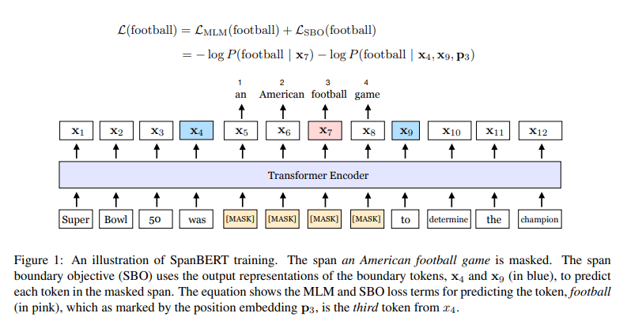

# SpanBERT: Improving Pre-training by Representing and Predicting Spans
- Paper: https://arxiv.org/abs/1907.10529
- Code: https://github.com/facebookresearch/SpanBERT
- Organization:
  - Computer Science Department, Princeton University, Princeton, NJ
  - Allen Institute of Artificial Intelligence, Seattle
  - Facebook AI Research, Seattle
- Author: Joshi et el
- Year: Jul, 2019

## どんなもの?
- 
- We present SpanBERT, a pre-training method that is designed to better represent and predict **spans of text**.
- Our approach extends BERT by
  - (1) masking **contiguous random spans, rather than random tokens**
  - (2) training the span boundary representations to predict the entire content of the masked span, **without relying on the individual token representations within it**
- SpanBERT consistently outperforms BERT and our better-tuned baselines, **with substantial gains on span selection tasks such as**
  - question answering
  - coreference resolution.
- In particular, with the same training data and model size as BERT large, our single model obtains 94.6% and 88.7% F1 on SQuAD 1.1 and 2.0 respectively.
- We also achieve a new state of the art on the OntoNotes coreference resolution task (79.6% F1), strong performance on the TACRED relation extraction benchmark, and even gains on GLUE.
- To implement SpanBERT, **we build on a well tuned replica of BERT**, which itself substantially outperforms the original BERT.
- we find that pre-training on single segments, **instead of two half-length segments with the next sentence prediction (NSP) objective**, considerably improves performance on most downstream tasks.

## 先行研究と比べてどこがすごい?
- none

## 技術や手法の肝は?
### span-based masking scheme
- Span-based masking forces the model to predict entire spans solely using the context in which they appear. 
- masking spans of full words using a geometric distribution based masking scheme
- 
  - We always sample a sequence of complete words (instead of subword tokens) and the starting point must be the beginning of one word.
  - マスク対象は単語単位で"ランダム"に選択している. 工夫の余地あり. 固有表現とかかませたら面白そう.
- **As in BERT**, we also mask 15% of the tokens in total: replacing 80% of the masked tokens with [MASK], 10% with random tokens and 10% with the original tokens.
  - However, we perform this replacement **at the span level and not for each token individually**; i.e. all the tokens in a span are replaced with [MASK] or sampled tokens.

### span-boundary objective (SBO)
- the span-boundary objective encourages the model to store this span-level information **at the boundary tokens**, which can be easily accessed during the fine-tuning stage.
- Span selection models (Lee et al., 2016, 2017; He et al., 2018) typically create a fixed-length representation of a span **using its boundary tokens (start and end)**.
  - To support such models, we would ideally like the representations for the end of the span to summarize as much of the internal span content as possible.
- 
  - where position embeddings p1, p2, . . . mark **relative positions** of the masked tokens with respect to the left boundary token xs−1.
- the representation function f(·):
  - 
  - 2-layer feed-forward network
- We then use the vector representation yi to predict the token xi and compute the cross-entropy loss
- 
  - "without relying on the individual token representations within it"と書いてあったが...予測対象のembeddingは使うのか? 
  - 使わないほうが, "the span-boundary objective encourages the model to store this span-level information **at the boundary tokens**"の効果を強められそう.

## どうやって有効だと検証した?
- We evaluate on a comprehensive suite of tasks, including seven question answering tasks:
  - seven exractive question answering tasks
  - coreference resolution
    - Coreference resolution is the task of **clustering** mentions in text which refer to the same real-world entities.
  - nine tasks in the GLUE benchmark (Wang et al., 2019)
  - relation extraction.

## 結果は?
### exractive question answering
- 
- 
### coreference resolution
- 

## 次に読むべき論文は?
- We reimplemented BERT’s model and pretraining method in fairseq (Ott et al., 2019).
- Instead, we always take sequences of up to 512 tokens until it reaches a document boundary. We refer readers to Liu et al. (2019b) for further discussion on these modifications and their effects.

## 不明な単語
- geometric distribution

## 感想
### 2022/6/16
- 読みやすかった
- 5.1の途中まで読んだ
  - fine-tiningの方法が肝っぽいが, 読み飛ばしたので後で読む(4.1章)
- 気になった文:
  - 3.3:: We conjecture that single-sequence training is superior to bi-sequence training with NSP because (a) the model benefits from longer full-length contexts, or (b) conditioning on, often unrelated, context from another document adds noise to the masked language model.
    - NSPがいらない子である理由,推測.
  - 4.1:: We expect that the span selection tasks, question answering and coreference resolution, will particularly benefit from our span-based pre-training.
    - BARTで言及されていた, 言語モデルの適用先が限られている, というのはこのことか. 
