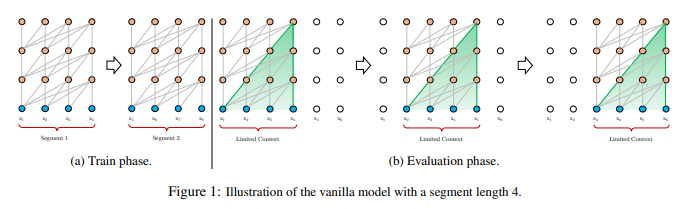
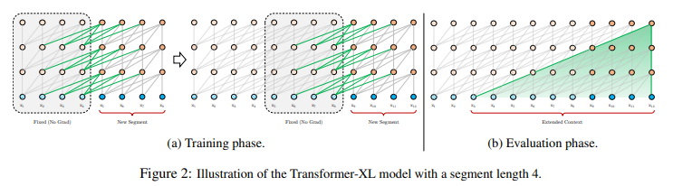

# Transformer-XL: Attentive Language Models Beyond a Fixed-Length Context
- Paper: https://arxiv.org/abs/1901.02860
- Code: https://github.com/kimiyoung/transformer-xl
- Organization: Carnegie Mellon University, Google Brain
- Author: Dai et el
- Year: 2019

## どんなもの?
- Transformerの入力系列長が固定されていることによって引き起こされえる問題(context fragmentation problem)を指摘.
- 固定入力系列長より長い長期依存関係を学習できる新たなアーキテクチャ(Transformer-XL, meaning extra long)を提案.
- 5つのデータセットで実証実験を行い, SOTAを達成した.
- 推論速度を向上した.
  - In our experiments on enwiki8, Transformer-XL is up to 1,800+ times faster than the vanilla model during evaluation (see Section 4).
- 一貫性のある数千tokenからなる長い記事を生成できることを確認した.

### Context fragmentation problem
- In addition, the fixed-length segments are created by selecting a consecutive chunk of symbols without respecting the sentence or any other semantic boundary.
- Hence, the model lacks necessary contextual information needed to well predict the first few symbols, leading to inefficient optimization and inferior performance.

### Evaluation procedure is extremely expensive
- 
  - 逐次計算による推論プロセス

### Segment-Level Recurrence with State Reuse
- 
  - this additional input allows the network to exploit information in the history, leading to an ability of modeling longer-term dependency and avoiding context fragmentation.
  - 積み重なった上位の層に, 長期の依存関係が保存される.
  - Consequently, the largest possible dependency length grows linearly w.r.t. the number of layers as well
as the segment length, i.e., O(N × L), as visualized by the shaded area in Fig. 2b. 

## 先行研究と比べてどこがすごい?
- Transformerの入力系列長の問題を取り上げた最初の論文? 再帰性をTransformerに導入した.
  - 文間をまたぐような長期依存関係を取り入れる取り組みは, 主にRNNsで研究されている
  - To capture the long-range context in language modeling, a line of work directly feeds a representation of the wider context into the network as an additional input.
  - Existing works range from ones where
    - context representations are manually defined (Mikolov and Zweig, 2012; Ji et al., 2015; Wang and Cho, 2015)
    - rely on document-level topics learned from data (Dieng et al., 2016; Wang et al., 2017).

## 技術や手法の肝は?
- introduce notion of Recurrence in self-attention
- relative positional encoding

## どうやって有効だと検証した?
- 5つのdatasetで実証実験を行った.
  - word-lebel and character-lavel

## 結果は?
- improve bpc/perplexity to
  - 0.99 on enwiki8, 1.08 on text8,
  - 18.3 on WikiText-103,
  - 21.8 on One Billion Word,
  - 54.5 on Penn Treebank.

## 次に読むべき論文は?
- AI-Rfou et el(2018): Character-level language modeling with deeper self-attention

## 不明な単語
- none

## 感想
- XLNetよりかは読みやすかった
- AI-Rfou et el(2018)が頻繁に引用されており, 強く影響されているんだろうなという感じ.
- Segment-Level Recurrence with State Reuseの, 前の情報が上位の層に保存されていく仕組みは面白かった.
- 考慮できる依存関係の長さがセグメントの長さと階層数に比例する点は, Transformer-XLを理解する上で重要だと思う.
- ただ勾配を停止する, キャッシュする, このあたりはよく分からなかった.
- 推論速度が向上したのがなぜか分からなかった. 逐次計算は解消されるの?
- 3.2まで読んだ@2022-05-18
