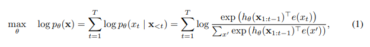
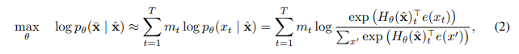
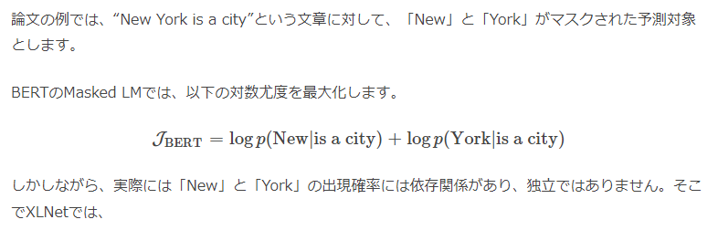
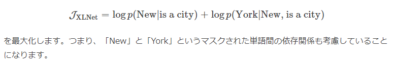

# XLNet: Generalized Autoregressive Pretraining for Language Understanding
- Paper: https://arxiv.org/abs/1906.08237
- Code: https://github.com/zihangdai/xlnet
- Organization: Carnegie Mellon University, Google AI Brain Team
- Author: Yang et el
- Year: 2019

## どんなもの?
- Autoregressive(AR)言語モデルの問題点: AR言語モデルは, 単方向にtokenの条件付き確率分布を推定するモデルであり, 双方向の文脈を考慮することができず, 精度がでない?
- Autoencoder(AE)言語モデルの問題点: さらに, BERTは予測対象のトークンがマスクされていないトークンから互いに独立していると仮定しているが, これは自然言語には高次の長距離依存性が蔓延しているため, 単純化しすぎである.
- MLMの問題点: 
  1. マスクされた単語間の依存関係が考慮されない
  2. BERTのMLMで使用される特殊トークン[Mask]は, 事前学習のときにしか存在せず, fine-tuningではでてこない(pretrain-finetune discrepancy問題)
- BERTの強力な特徴である“双方向の言語モデル”という特徴を残しながら, マスクを使った言語モデルの学習をしない方法を考えた.

## 先行研究と比べてどこがすごい?
- none

## 技術や手法の肝は?
- none

## どうやって有効だと検証した?
- none

## 結果は?
- none

## 次に読むべき論文は?
- Transformer-XL

## 不明な単語
- none

## 感想
- すごい読みづらかった
- Independence Assumptionがしっくりこない
  - 最終的にはmaskのembeddingのみに依存してsofxmaxを計算するが...maskのembeddingは, そのほかのtokenのvalueの重み付き和で計算されるので, 独立しているとは言えないのでは?
  - 参考: [楽しみながら理解するAI・機械学習入門](https://data-analytics.fun/2020/05/06/understanding-xlnet/)
    - 
    - 
    - 
    - 
- pretrain-finetune discrepancy問題って実際, モデルのパフォーマンスにどの程度影響するのだろうか
- 2.2まで読んだ@2022-05-17
