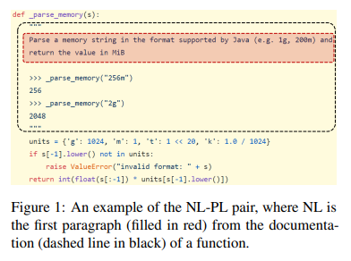
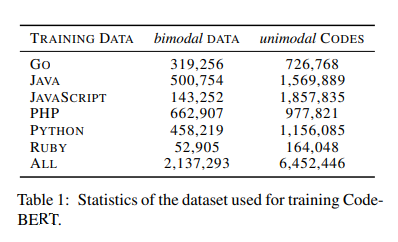
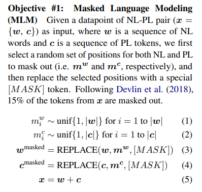
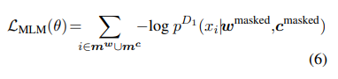
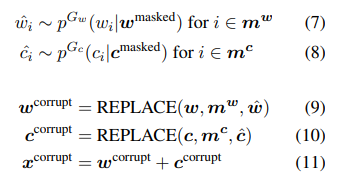
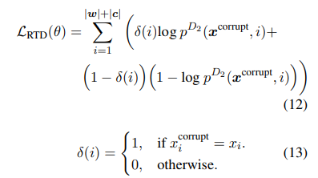
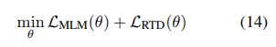

# CodeBERT: A Pre-Trained Model for Programming and Natural Languages
- Paper: https://arxiv.org/abs/2002.08155
- Code: https://github.com/microsoft/CodeBERT
- Organization: 
  - Research Center for Social Computing and Information Retrieval, Harbin Institute of Technology, China
  - Microsoft Research Asia, Beijing, China
  - Microsoft Search Technology Center Asia, Beijing, China
- Author: Feng et el
- Year: Feb, 2020

## どんなもの?
- We present CodeBERT, a bimodal pre-trained model for programming language (PL) and natural language (NL).
- CodeBERT learns **general-purpose representations** that support downstream NL-PL applications such as
  - natural language code search
  - code documentation generation, etc.
- CodeBERT is the **first large NL-PL pretrained model for multiple programming languages**.
- We develop CodeBERT with **Transformer-based neural architecture**, and train it with a **hybrid objective function** that incorporates the pre-training task of **replaced token detection**, which is to detect plausible alternatives sampled from generators.
  - hybrid objective function including **standard masked language modeling (Devlin et al., 2018)** and **replaced token detection (Clark et al., 2020)**, where unimodal codes help to learn better generators for producing better alternative tokens for the latter objective.
- This enables us to utilize **both “bimodal” data of NL-PL pairs and “unimodal” data**, where the former provides input tokens for model training while the latter helps to learn better generators.
- We evaluate CodeBERT on two NL-PL applications by fine-tuning model parameters.
  - Results show that CodeBERT achieves state-of-the-art performance on both natural language code search and code documentation generation.
- To further investigate what type of knowledge is learned in CodeBERT, we construct a dataset for NL-PL probing, and test CodeBERT in a zero-shot scenario, i.e. without fine-tuning the parameters of CodeBERT.

### Architecture
- We develop CodeBERT by using exactly the same model architecture as RoBERTa-base. The total number of model parameters is 125M.

### Input/Output representation
#### Input
- In the pre-training phase, we set the input as the concatenation of two segments with a special separator token, namely
  - [CLS], w1, w2, ..wn, [SEP], c1, c2, ..., cm, [EOS].
- Following the standard way of processing text in Transformer, we regard a natural language text as a sequence of words, and split it as **WordPiece (Wu et al., 2016)**. We regard a piece of code as a sequence of tokens.
#### Output
- The output of CodeBERT includes:
  - (1) contextual vector representation of each token, for both natural language and code, and
  - (2) the representation of [CLS], which works as the aggregated sequence representation.
    - NSPしてないのに, "aggregated sequence representation"といえるかな?

### Pre-Training Data
- 
- We use datapoints from Github repositories, where each **bimodal datapoint is an individual function with paired documentation**, and each **unimodal code is a function without paired documentation**.
- Specifically, we use a recent large dataset provided by Husain et al. (2019), which includes 2.1M bimodal datapoints and 6.4M unimodal codes across six programming languages (Python, Java, JavaScript, PHP, Ruby, and Go).
  - 
  - 意図的にunimodal codeを多くしたのか, documentが書かれていないcodeが多いのか.
- The data comes from **publicly available opensource non-fork GitHub repositories** and are **filtered with a set of constraints and rules**.

### Pre-training obective
#### Masked language modeling
- We apply masked language modeling on bimodal data of NL-PL pairs.
- 
- 
#### Replaced Token Detection
- The second objective is replaced token detection (RTD), which further uses a large amount of unimodal data, such as codes without paired natural language texts.
- 
  - マスクされた文で条件付けした確率モデルから, マスクされたトークンをサンプリング. 
- The discriminator is trained to determine whether a word is the original one or not, which is a **binary classification problem**.
- It is worth noting that the RTD objective is applied to every position in the input, and **it differs from GAN (generative adversarial network)** in that if a generator happens to produce the correct token, the label of that token is “real” instead of “fake” (Clark et al., 2020).
- 
  - マイナスがついていない!
- 
- There are many different ways to implement the generators. In this work, we implement **two efficient n-gram language models (Jurafsky, 2000) with bidirectional contexts**, one for NL and one for PL, and **learn them from corresponding unimodel datapoints**, respectively.
  - 学習済みのモデルを使っている感じかな?
- The approach is easily generalized to learn bimodal generators or use more complicated generators like Transformerbased neural architecture learned in a joint manner. We leave these to future work.

## 先行研究と比べてどこがすごい?
- not only bimodal data of NL-PL pairs, but larger amounts of unimodal data such as codes without paired documentations
- pre-trained over six programming languages
- new learning objective based on replaced token detection
  - A concurrent work (Kanade et al., 2019) uses masked language modeling and next sentence prediction as the objective to train a BERT model on Python source codes, where a sentence is a logical code line as defined by the Python standard.

## 技術や手法の肝は?
- bimodal data(NL-PL)とunimodal data(NL,PL)を組み合わせ学習しているところ.

## どうやって有効だと検証した?
- We evaluate CodeBERT on two downstream NL-PL tasks, including natural language code search and code documentation generation.

## 結果は?
- none

## 次に読むべき論文は?
- A concurrent work (Kanade et al., 2019) uses masked language modeling and next sentence prediction as the objective to train a BERT model on Python source codes
- efficient n-gram language models (Jurafsky, 2000)

## 不明な単語
- probing
  - ニューラルモデルの内部メカニズムがどれほど人間の言語に関する知識を獲得できているかを調べる研究
  - https://www.anlp.jp/proceedings/annual_meeting/2021/pdf_dir/P4-7.pdf

## 感想
### 2022/6/21
- 読みやすかった
- 3.5章まで読んだ
  - やっぱり実験結果まではいかない.
- kaggleのAI4Codeコンペのために読んだ.
- 自然言語とプログラミング言語を組み合わせて事前学習を行っている点が肝だと思うが, 単にconcatするだけじゃなくてなんか他に面白いことできないだろうか.
