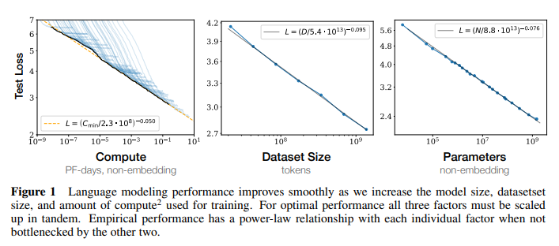
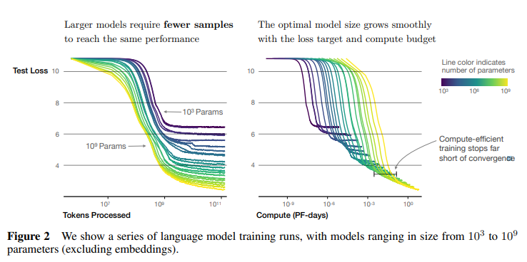
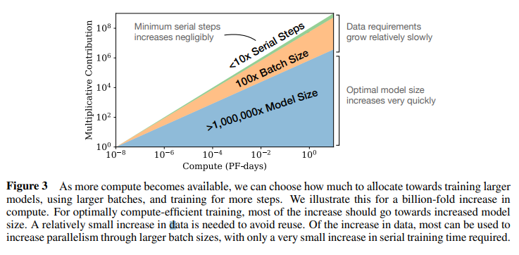

# Scaling Laws for Neural Language Models
- Paper: https://arxiv.org/abs/2001.08361
- Code: 
- Organization: OpanAI
- Author: kaplan et al
- Year: Jan, 2020

## どんなもの?

- GPT-3より前(Jan < May)
- We study empirical **scaling laws** for language model performance on the **cross-entropy loss**.
  - The loss scales as a power-law with model size, dataset size, and the amount of compute used for training, with some trends spanning more than **seven orders of magnitude**.
- Other architectural details such as network width or depth have **minimal effects** within a wide range.
- Simple equations govern the dependence of overfitting on model/dataset size and the dependence of training speed on model size.

### Performance depends strongly on scale, weakly on model shape
- Model performance depends most strongly on **scale**, which consists of three factors:
  - the number of model parameters N (excluding embeddings),
  - the size of the dataset D, and
  - the amount of compute C used for training.
- Within reasonable limits, performance depends very weakly on other architectural hyperparameters such as depth vs. width. (Section 3)
  - だから同じアーキテクチャが使われ続けているのか!

### Smooth power laws
- Performance has a power-law relationship with each of the three scale factors N, D, C when not bottlenecked by the other two, with trends spanning more than six orders of magnitude (see Figure 1).
- We observe **no signs of deviation from these trends on the upper end**, though performance must flatten out eventually before reaching zero loss. (Section 3)
  - そういえばこのlossってtraining loss? test?
    - testっぽい

### Universality of overfitting
- Performance improves predictably as long as we scale up N and D in tandem, but enters a **regime of diminishing returns** if either N or D is held **fixed** while the other **increases**.
- The performance penalty depends predictably on the ratio N^0.74/D, meaning that every time we increase the model size 8x, we only need to increase the data by roughly 5x to avoid a penalty. (Section 4)
  - つまり、モデルサイズを8倍にするたびに、データを5倍程度に増やせば、ペナルティを回避できる...
  - どういうこと?

### Transfer improves with test performance
- When we evaluate models on text with a different distribution than they were trained on, the results are strongly correlated to those on the training validation set with a roughly constant offset in the loss
  - in other words, transfer to a different distribution incurs a constant penalty but otherwise improves roughly in line with performance on the training set. (Section 3.2.2)
  - ドメイン適応の話
  - どういうこと?

### Sample efficiency
- Large models are more **sample-efficient** than small models, reaching the same level of performance with fewer optimization steps (Figure 2) and using fewer data points (Figure 4).
  - でも大きいモデルには大きいデータセットが必要でしょ?
- 
  - Lossの減少傾向は, 同じサンプル数を見ていても, モデルサイズが大きい方が強い. 
  - 計算効率の良い学習は収束には程遠い.
    - 収束するまでに時間がかかるというネガティブな意味? まだ収束していない, まだLossは下がるというポジティブな意味?

### Convergence is inefficient:
- When working within a fixed compute budget C but without any other restrictions on the model size N or available data D, we attain optimal performance by training very large models and **stopping significantly short of convergence** (see Figure 3).
- 
    - 最適に計算効率の良い学習を行うには、増加分のほとんどをモデルサイズの増加に充てる必要がある...
    - つまり, 計算回数の増加分はモデルサイズによるものでなくては, 計算効率の良い学習を行うことができない, 小さいモデルでepoch数を増やしても効率の良い学習を行うことはできないよっていうことかな?
    - モデルサイズ至上主義感
- Maximally compute-efficient training would therefore be far more sample efficient than one might expect based on training small models to convergence, with data requirements growing very slowly as D ~ C^0.27 with training compute. (Section 6)
  - でも大きいモデルには大きいデータセットが必要でしょ? <- そうではないということ?
  - sample efficientってなに?

### Optimal batch size
- The ideal batch size for training these models is roughly a power of the loss only, and continues to be determinable by measuring the gradient noise scale [MKAT18]; it is roughly 1-2 million tokens at convergence for the largest models we can train. (Section 5.1)
  - "a power of the loss only" どういうこと?

## 先行研究と比べてどこがすごい?
- none

## 技術や手法の肝は?
- none

## どうやって有効だと検証した?
- none

## 結果は?
- none

## 次に読むべき論文は?
- none

## 不明な単語
- PFS
  - petaflops/s(pfs)
  - pfs-day
    - 1秒間に10^15回のニューラルネット演算を1日行う
  - pf-day
    -  PF-day = 10^15 × 24 × 3600 = 8.64 × 10^19 floating point operations.

## 感想
### 2022/7/6
- 全体的に難しい! 本文中の英語表現もむずいが, グラフを読み解くのがむずい.
