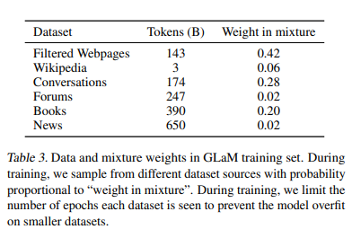
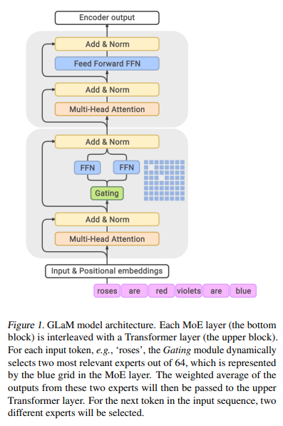
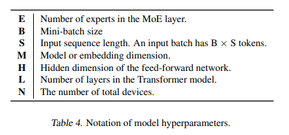
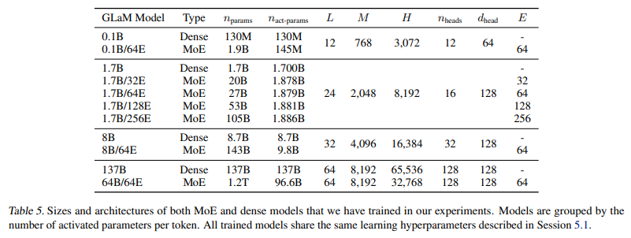
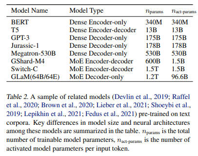

# GLaM: Efficient Scaling of Language Models with Mixture-of-Experts
- Paper: https://arxiv.org/abs/2112.06905
- Code: 
- Organization: Google
- Author: Du et el
- Year: Dec, 2021

## どんなもの?
- Scaling language models with more data, compute and parameters has driven significant progress in natural language processing.
  - For example, thanks to scaling, GPT-3 was able to achieve strong results on in-context learning tasks.
- However, **training these large dense models requires significant amounts of computing resources**.
- In this paper, we propose and develop a family of language models named **GLaM (Generalist Language Model)**, which uses a **sparsely activated mixture-of-experts architecture** to scale the model capacity while also incurring substantially less training cost compared to dense variants.
- The largest GLaM has **1.2 trillion parameters**, which is approximately **7x larger than GPT-3**. It consumes only **1/3 of the energy used to train GPT-3** and **requires half of the computation flops for inference**, while still achieving better overall zero-shot and one-shot performance across 29 NLP tasks.

### Training Dataset
- 
- To train our model, **we build** a high-quality dataset of **1.6 trillion tokens** that are representative of a wide range of natural language use cases.
  - Web pages constitute the vast quantity of data in our unlabeled dataset, however, **their quality ranges from professional writing to low-quality comment and forum pages**.
  - Similarly to Brown et al. (2020), we develop our own **text quality classifier** to produce a highquality web corpus out of an original larger corpus.
  - We then apply this classifier by using a Pareto distribution to sample webpages according to their score
    - This allows some lower-quality webpages to be included to **prevent systematic biases** in the classifier (Brown et al., 2020).
    - どういうこと?

### Architecture
- 
- Each MoE layer consists of a collection of independent feed-forward networks as the ‘experts’.
- A gating function then uses a softmax activation function to model a probability distribution over these experts.
  - This distribution indicates how well each expert is able to process the incoming input.
- Even though each MoE layer has many more parameters, **the experts are sparsely activated**.
  - This means that for a given input token, **only a limited subset of experts is used**, giving the model more capacity while limiting computation.
    - limiting computationなのか? よくわからんかった.
    - もしかして, 通常のTransformerのFFNよりも, MoEのFFNはサイズが小さいのかな? オリジナルのFFNをsubsetに分割しているというイメージ? これだとスパースという言葉のイメージとあっている.
    - "Even though each MoE layer has many more parameters"って書いてあるから, 一個一個のFFNのサイズはオリジナルよりも小さいがトータルで見たら大きい,　という感じかな?
- In our architecture, **the subset size is two**. During training, each MoE layer’s learnable gating network is trained to use its input to activate the best two experts for each token of an input sequence.
- During inference, **the learned gating network dynamically picks two best experts for each token**.
- For an MoE layer with E experts, this essentially provides a collection of O(E^2) different combinations of feed-forward networks instead of one in the classic Transformer architecture, **leading to much more computational flexibility**.
  - computational flexibilityとは?
- The final learned representation of a token will be the weighted combination of the outputs from the selected experts.
- 
- 

## 先行研究と比べてどこがすごい?
- タスク非依存なDecoder only large sparse LMである.
  - 
  - There has also been work on scaling sparsely activated MoE architectures to larger models (Hestness et al., 2017; Shazeer et al., 2018b; Huang et al., 2019; Lepikhin et al., 2021). There has been work on even larger 1 trillion parameter sparsely activated models,
  - however, these use a sequence to sequence architecture (Fedus et al., 2021). Various routing strategies (Gross et al., 2017; Lewis et al., 2021; Dua et al., 2021) have been investigated such that transfer learning can be achieved with **task dependencies.**

## 技術や手法の肝は?
- none

## どうやって有効だと検証した?
- none

## 結果は?
- none

## 次に読むべき論文は?
- While being effective and performant, scaling further is becoming prohibitively expensive and consumes significant amounts of energy (Patterson et al., 2021).
- MoE layer (Shazeer et al., 2017; Lepikhin et al., 2021; Fedus et al., 2021) where each token in the input batch only activates a subnetwork of 95B (8% of 1.2T) parameters.
- There has also been work on scaling sparsely activated MoE architectures to larger models (Hestness et al., 2017; Shazeer et al., 2018b; Huang et al., 2019; Lepikhin et al., 2021).
- Similarly to Brown et al. (2020), we develop our own **text quality classifier** to produce a highquality web corpus out of an original larger corpus.
### modifications to the original Transformer architecture
- We replace the standard positional embedding with per-layer relative positional bias from Dai et al. (2019).
- In the non-MoE Transformer feed-forward sub-layers, we replace the first linear projection and the activation function with the **Gated Linear Unit** (Dauphin et al., 2017; Shazeer, 2020), which computes the component-wise product of two linear transformation of the input, followed by a **Gaussian Error Linear Unit** (Hendrycks & Gimpel, 2016) activation function.
- We use RMSNorm as in (Zhang & Sennrich, 2019; Shazeer et al., 2018b) instead of standard LayerNorm (Ba et al., 2016).

## 不明な単語
- none

## 感想
## 2022/6/28
- 4章まで読んだ
  - 4章最後のtrainingインフラの話はよくわからんかった.
- MoEのイメージはつかめたが詳細はわからず, 関連研究を読もう.
- 気になった文:
  - 1:: Our analysis shows that even for these large models, data quality should not be sacrificed for quantity if the goal is to produce a high-quality language understanding model.
    - データの質は大事.
