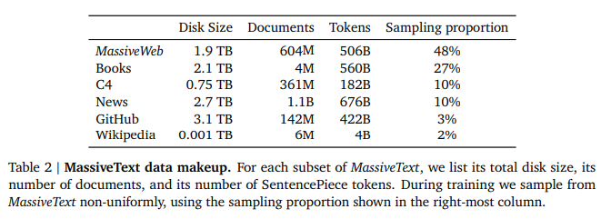

# Scaling Language Models: Methods, Analysis & Insights from Training Gopher
- Paper: https://arxiv.org/abs/2112.11446
- Code: 
- Organization: DeepMind
- Author: Rae et al
- Year: Dec, 2021

## どんなもの?
- In this paper, we present an analysis of Transformer-based language model performance across a wide range of model scales — from models with tens of millions of parameters up to a 280 billion parameter model called **Gopher**.
- We employ **open-vocabulary tokenization** via a mixture of byte-pair encoding (BPE) with a backoff to UTF-8 bytes in the style of Radford et al. (2018).
  - そういえばOOVをbyteレベルでうまく対処する方法があったな...
  - BPEが名前にbyteが入っているにも関わらずbyteレベルの処理をしていないことをいじっていたような...
  - 未知語を特別なtokenを用いて対処するclosed-vocabularyと対比した言い方.
- Whilst there are other objectives towards modelling a sequence, such as modelling masked tokens given bi-directional context (Devlin et al., 2019; Mikolov et al., 2013) and modelling all permutations of the sequence (Yang et al., 2019) **we focus on autoregressive modelling due to its strong performance and simplicity**.
- These models are evaluated on **152 diverse tasks**, achieving state-of-the-art performance across the majority. Gains from scale are largest in areas such as:
  - reading comprehension,
  - fact-checking, and
  - the identification of toxic language,
- but **logical and mathematical reasoning see less benefit**.

### Models
- In this paper we present results on six Transformer language models ranging from 44 million to 280 billion parameters, with the architectural details displayed in Table 1. We refer to the largest as Gopher and the entire set of models as the Gopher family.
- We use the **autoregressive Transformer architecture detailed in Radford et al. (2019)** with two modifications:
  - we use RMSNorm (Zhang and Sennrich, 2019) instead of LayerNorm (Ba et al., 2016), and
  - we use the relative positional encoding scheme from Dai et al. (2019) rather than absolute positional encodings.
    - Relative encodings permit us to evaluate on **longer sequences than we trained on**, which improves the modelling of articles and books as shown in Section D.6.
- We tokenize the text using **SentencePiece (Kudo and Richardson, 2018)** with a vocabulary of 32,000 and use a **byte-level backoff to support open-vocabulary modelling**.

### Training
- We train all models for **300 billion tokens** with a **2048 token context window**, using the Adam (Kingma and Ba, 2014) optimiser. We warm-up the learning rate from **10−7** to the maximum learning rate over the first **1500 steps**, and then decay it **10× using a cosine schedule**.
- As we increase model size, we decrease the maximum learning rate and increase the number of tokens in each batch, as shown in Table 1. Furthermore, we increase Gopher’s **batch size from three to six million tokens per batch during training**. We clip gradients based on the global gradient norm using a clipping value of 1. However, for the 7.1B model and for Gopher we reduce this to 0.25 for improved stability.
  - バッチサイズがやばい...
- We incorporate the bfloat16 numerical format to reduce memory and increase training throughput. **Models smaller than 7.1B are trained with mixed precision float32 parameters and bfloat16 activations (Micikevicius et al., 2018)**, while **7.1B and 280B use bfloat16 activations and parameters**.
  - ここでいうactivationsは, FPの中間計算結果?
    - たぶんそう!活性化値を保存しておけばBP計算できる!活性化前の値を保持しておく必要はおそらくない!

### Infrastructure
- We built our training and evaluation codebase with JAX (Bradbury et al., 2018) and **Haiku** (Hennigan et al., 2020). In particular, we use JAX’s pmap transformation to efficiently express both data and model parallelism. We trained and evaluated all models on **TPUv3** chips (Jouppi et al., 2020).
  - Haikuって何?
- The half-precision parameters and single-precision Adam state for Gopher occupy 2.5 TiB, which far exceeds the 16 GiB of memory available on each TPUv3 core. To address these memory concerns, we use optimiser state partitioning (Rajbhandari et al., 2020), model parallelism (Shoeybi et al., 2019), and rematerialisation (Griewank and Walther, 2000) to partition the model state and reduce the activations so that they fit in TPU memory.
  - 16 GiBに収まるようにした? でも"model parallelism"って書いてあるな...
- We find that **both data and model parallelism are low-overhead on TPUv3s** due to their **fast cross-chip communication** and **only incur a 10% overhead** when training Gopher. Therefore, we find that **pipelining (Huang et al., 2019) is not necessary on TPUs until the training scale exceeds the 1024-chip “pod”**, which greatly simplifies training mid-sized models.
- However, **pipelining is an efficient parallelism method on commodity networks due to its low communication volume**, so is well suited to connecting multiple TPU pods. In summary, we train Gopher by using model and data parallelism within TPU pods and pipelining across them.

### Training dataset
- 
  - 例えばGopherのバッチサイズは6Mなので全体の0.255%, 393[itr/epoch].
  - この量のサンプルサイズをわずか393回で回すのは, やっぱりバッチサイズは大きいんだと感じる.
- We train the Gopher family of models on MassiveText, a collection of large English-language text datasets from multiple sources: web pages, books, news articles, and code.
- Our data pipeline (Section A.1.1) includes text quality filtering, removal of repetitious text, deduplication of similar documents, and removal of documents with significant test-set overlap. We find that successive stages of this pipeline improve language model downstream performance (Section A.3.2), **emphasising the importance of dataset quality.**
- Overall, MassiveText contains 2.35 billion documents, or about 10.5 TB of text. **Since we train Gopher on 300B tokens (12.8% of the tokens in the dataset)**, we sub-sample from MassiveText with sampling proportions specified per subset (books, news, etc.). **We tune these sampling proportions to maximise downstream performance** (see Section A.3.1 for details). The largest sampling subset is our curated web-text corpus MassiveWeb, which we find to improve downstream performance relative to existing web-text datasets such as C4 (Raffel et al., 2020b) in Figure A5.
  - samplingしているが, 学習データの影響を調査しようとしている?

## 先行研究と比べてどこがすごい?
- none

## 技術や手法の肝は?
- none

## どうやって有効だと検証した?
- none

## 結果は?
- none

## 次に読むべき論文は?
- 8.3 billion parameter Megatron (Shoeybi et al., 2019) displaying progressively superior zero-shot language model performance
- Other recent LLMs include two models (FLAN and T0) fine-tuned on instructions for an array of down-stream tasks (Sanh et al., 2021; Wei et al., 2021) which improves performance to unseen tasks
- pipelining (Huang et al., 2019) 

## 不明な単語
- Imitation Game (Turing, 1950)

## 感想
### 2022/6/29
- 共著者多すぎ!
- model cardって流行ってるん?
- 1章の最初の部分難しかった.
- 気になった文:
  - 1:: Shannon’s Mathematical Theory of Communication (Shannon, 1948) linked the statistical modelling of natural language with compression, showing that measuring the cross entropy of a language model is equivalent to measuring its compression rate.
    - compression rateってなんだろう.
  - 1:: However this training objective is only an approximation to any specific goal or application, since we predict everything in the sequence rather than only the aspects we care about. Yet if we treat the resulting models with appropriate caution, we believe they will be a powerful tool to capture some of the richness of human intelligence.
    - ここでいう"sequence"にはどこまでの意味が含まれているんだろうか.
