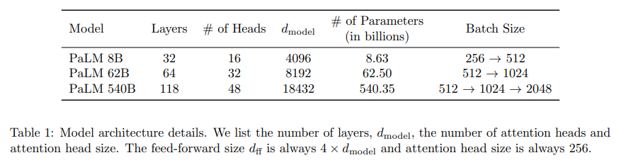
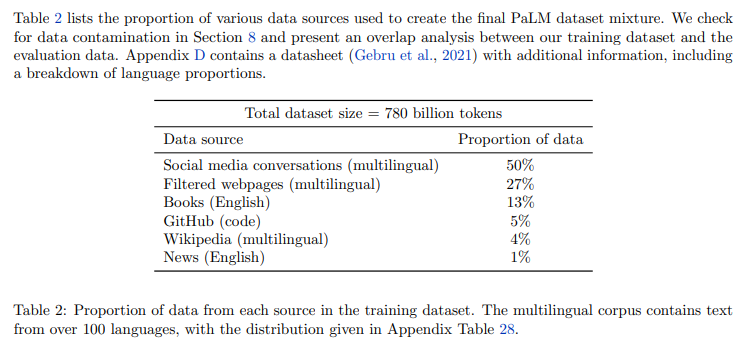
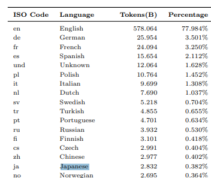

# PaLM: Scaling Language Modeling with Pathways
- Paper: https://arxiv.org/abs/2204.02311
- Code: 
- Organization: Google Rereach
- Author: Chowdhery et el
- Year: Apr, 2022

## どんなもの?
- Large language models have been shown to achieve remarkable performance across a variety of natural language tasks using **few-shot learning**, which drastically reduces the number of task-specific training examples needed to adapt the model to a particular application.
- To further our understanding of the **impact of scale on few-shot learning**, we trained a **540-billion parameter**, densely activated, Transformer language model, which we call **Pathways Language Model (PaLM)**.
  - a 540B parameter dense Transformer language model trained on 780B tokens of high-quality, diverse text
- We trained PaLM on **6144 TPU v4 chips using Pathways**, a new ML system which **enables highly efficient training across multiple TPU Pods**
- On a number of these tasks, PaLM 540B achieves breakthrough performance, **outperforming the finetuned stateof-the-art on a suite of multi-step reasoning tasks**, and **outperforming average human performance** on the recently released **BIG-bench** benchmark.
  - BIG-bench containing **150+** challenging new language tasks
  - **PaLM 5-shot** achieves higher performance than the average performance score of humans who were asked to complete the same tasks.
- A significant number of BIG-bench tasks showed **discontinuous improvements** from model scale, meaning that performance steeply increased as we scaled to our largest model.
- PaLM also has strong capabilities in **multilingual tasks** and **source code generation**, which we demonstrate on a wide array of benchmarks.
### モデルの性能はまだ頭打ちになっていない可能性がある. つまり, よりモデルをスケーリングすれば性能はもっとよくなるかもしれない.
- We additionally provide a comprehensive analysis on **bias and toxicity**, and study the extent of **training data memorization** with respect to model scale.
- From these results, we can draw a number of conclusions.
  - First, the results presented here suggest that the improvements from scale for few-shot language understanding have not yet **plateaued**.
#### モデルの予測性能にモデル自身が出力した根拠?が大きく寄与している? 推論プロセスが見直されてタスク依存のモデルのフレームワークも変わってくるかも!
  - Second, the breakthrough performance on reasoning tasks (Section 6.3) has critical implications.
    - It is obvious that **a model being able to generate natural language to explain its predictions is beneficial** to the end user of a system, in order to better understand why a model made a certain prediction.
    - However, these results go far beyond that, demonstrating that **prompting the model to generate explicit inference chains can drastically increase the quality of the predictions themselves**.
    - In other words, **the model’s generation (rather than just understanding) capabilities can be immensely beneficial even for tasks that are modeled as categorical prediction or regression**, which typically do not require significant language generation.
### 今回はとりあえずwell-estabilishdなアーキテクチャを選択したが, 今後はアーキテクチャを探索してPathwaysと組み合わせたい
- Finally, although we achieved our goal of pushing the boundaries of scale for few-shot language modeling, there are still many open questions about the ideal network architecture and training scheme for future generations of models.
  - PaLM is only the first step in our vision towards establishing **Pathways as the future of ML scaling at Google and beyond**.
  - To that end, we chose to demonstrate this scaling capability on a **well-established recipe: a dense, decoder-only, full-attention Transformer model, which is trained to perform autoregressive language modeling**.
  - However, our wider goal is to explore a diverse array of novel architectural choices and training schemes, and combine the most promising systems with the scaling capabilities of Pathways.

### PLM -> fine-tuningの問題点.
- the downside is that **they require a significant number of task-specific training examples** to finetune the model.

### GPT-3 variants
- The improvements in these models have primarily come from one or more of the following approaches:
  - (1) scaling the size of the models in both depth and width;
  - (2) increasing the number of tokens that the model was trained on;
  - (3) training on cleaner datasets from more diverse sources; and
  - (4) increasing model capacity without increasing the computational cost through sparsely activated modules.
- In this work, **we continue the scaling line of language modeling improvements** and train a 540 billion parameter, densely activated, autoregressive Transformer on 780 billion tokens of high-quality text.
- This was achieved through the use of **Pathways** (Barham et al., 2022),

### Architecture
- PaLM uses a standard Transformer model architecture (Vaswani et al., 2017) in a decoder-only setup (i.e., each timestep can only attend to itself and past timesteps), with the following modifications:
  - SwiGLU Activation
    - We use SwiGLU activations (Swish(xW) · xV ) for the MLP intermediate activations because they have been shown to **significantly increase quality compared to standard ReLU, GeLU, or Swish activations** (Shazeer, 2020).
  - Parallel Layers
    - We use a “parallel” formulation in each Transformer block (Wang & Komatsuzaki, 2021), rather than the standard “serialized” formulation.
    - The parallel formulation **results in roughly 15% faster training speed at large scales**, since the MLP and Attention input matrix multiplications can be fused.
    - これでなぜ学習スピードが早くなるのかよくわからなかった.
  - Multi-Query Attention
    - The standard Transformer formulation uses k attention heads, where the input vector for each timestep is linearly projected into “query”, “key”, and “value” tensors of shape [k, h], where h is the attention head size.
    - Here, the key/value projections are **shared for each head**, i.e. “key” and “value” are projected to [1, h], but “query” is still projected to shape [k, h].
    - We have found that **this has a neutral effect on model quality and training speed** (Shazeer, 2019), but results in a **significant cost savings at autoregressive decoding time**.
  - RoPE Embeddings
    - We use RoPE embeddings (Su et al., 2021) rather than absolute or relative position embeddings, since **RoPE embeddings have been shown to have better performance on longsequence lengths**.
  - Shared Input-Output Embeddings
    - We share the input and output embedding matrices, which is done frequently (but not universally) in past work.
  - No Biases
    - No biases were used in any of the dense kernels or layer norms. We found this to result in **increased training stability for large models**.
  - Vocabulary
    - We use a **SentencePiece (Kudo & Richardson, 2018a) vocabulary with 256k tokens**, which was chosen to support the large number of languages in the training corpus without excess tokenization.
    - The vocabulary was generated from the training data, which we found improves training efficiency.
    - The vocabulary is completely lossless and reversible, which means that **whitespace is completely preserved** in the vocabulary (especially important for code) and **out-of-vocabulary Unicode characters are split into UTF-8 bytes**, with a vocabulary token for each byte.
      - OOVはUTF-8バイト列で表現される...!

### Model Scale Hyperparameters
- 
- In this work, we compare three different model scales:
  - 540B parameters,
  - 62B parameters, and
  - 8B parameters.
- The number of FLOPs per token is approximately equal to the number of parameters, since these models are standard dense Transformers.
- The three models were **trained identically (except batch size) using the same data and vocabulary**.

### Training data
- 
- 
- The PaLM pretraining dataset consists of a high-quality corpus of **780 billion tokens** that represent a wide range of natural language use cases.
- The dataset is a mixture of:
  - filtered webpages,
    - Webpages were assigned a **“quality score”** using a classifier that was trained to assign high scores to pages that are similar to known high-quality webpage collections. The webpages included in our training were then sampled proportional to that score, so higher quality webpages were included more frequently, but lower quality webpages were not eliminated entirely.
  - books,
  - Wikipedia,
  - news articles,
  - source code, and
    - obtained from open source repositories on **GitHub**
    - 24 common programming languages, including Java, HTML, Javascript, Python, PHP, C#, XML, C++, and C, which results in 196GB of source code.
  - social media conversations.
- This dataset is **based on the datasets used to train LaMDA (Thoppilan et al., 2022) and GLaM (Du et al., 2021)**.
- We train all three models on exactly **one epoch** of the data (shuffled identically for all models) and choose the mixing proportions to avoid repeating data in any subcomponent.
  - "the mixing proportions to avoid repeating data in any subcomponent"ってどう意味だ.

### Training Infrastructure
- Our training and evaluation codebase is based on **JAX** (Bradbury et al., 2018) and T5X (Roberts et al., 2022) and all models are trained on TPU v4 Pods (Jouppi et al., 2020).
- PaLM 540B is trained over two TPU v4 Pods connected over **data center network (DCN) using a combination of model and data parallelism** (Xu et al., 2021).
- We use **3072 TPU v4 chips in each Pod** attached to **768 hosts**.
#### Pipelining
- Pipelining typically splits the training batch into “micro-batches,” but it has important drawbacks.
  - First, it incurs a step **time overhead** of the pipelining “bubble,” where many devices are completely idle while filling and emptying the pipeline at the beginning and end of forward and backward passes.
  - Second, it demands **higher memory bandwidth** due to reloading weights from memory for each micro-batch within the mini-batch.
- We were able to efficiently scale **pipeline-free** training of PaLM 540B to **6144 chips**(two TPU pods) using the following strategy.

## 先行研究と比べてどこがすごい?
### Efficient scaling
- We demonstrate the first large-scale use of Pathways (Barham et al., 2022) – a new ML system **which enables training a single model across thousands or tens of thousands of accelerator chips in a highly efficient manner**. With Pathways, we trained a 540B parameter language model on 6144 TPU v4 chips at efficiency levels that could not be reached before for models of this scale.
- **Most previous large language models were either trained on a single TPU system** (Du et al., 2021; Thoppilanet al., 2022) or **used pipeline parallelism** (Huang et al., 2019) to scale across GPU clusters (Smith et al.,1) or **multiple TPU v3 pods** (Rae et al., 2021a), with a maximum scale of 4096 TPU v3 chips.
- In Section 4, we describe how we were able to scale pipeline-free training of PaLM 540B to **6144 chips across two TPU v4 Pods** while achieving very high efficiency of 46.2% in model FLOPs utilization (observed throughput relative to theoretical max throughput) and 57.8% in hardware FLOPs utilization.

## 技術や手法の肝は?

## どうやって有効だと検証した?
- none

## 結果は?
- none

## 次に読むべき論文は?
- The most powerful of these post-GPT-3 models are
  - GLaM (Du et al., 2021),
    - trained on a single TPU system without leveraging either pipeline parallelism or DCN
  - Gopher (Rae et al., 2021a),
    - Gopher (Rae et al., 2021a) describes safety bene]fits and safety risks associated with large language models, including PaLM.
    - trained on four DCN-connected TPU v3 Pods (each with 1024 TPU v3 chips) using pipelining between pods.
  - Chinchilla (Hoffmann et al., 2022),
  - Megatron–Turing NLG (Smith et al., 2022), and
    - trained on **2240 A100 GPUs** using a combination of model, data, and pipeline parallelism
      - A100 GPUが2240機という解釈でいいのか...?
      - 80[GB] * 2240 = 179200[GB] = 179.2[TB]
      - 36[GB](bert-baseの学習に必要なメモリ) * 540[GB] / 0.11[GB](bert-base) = 176727[GB] = 176.7[TB] 
  - LaMDA (Thoppilan et al., 2022),
    - trained on a single TPU system without leveraging either pipeline parallelism or DCN
- Pathways (Barham et al., 2022)
  - a new ML system which enables highly efficient training of very large neural networks across thousands of accelerator chips, including those spanning multiple Tensor Processing Units (TPU) v4 Pods.
  - 難しい!
- chain-of-thought prompting (Wei et al., 2022b),
- RoPE embeddings (Su et al., 2021)
- SentencePiece (**Kudo** & Richardson, 2018a)
- model and data parallelism (Xu et al., 2021).

## 不明な単語
- BIG-bench
- toxicity

## 感想
### 2022/6/19
- まあまあ集中して読めたと思う
- 1章まで読んだ.
- 図表がきれい.
- 1:: "The key takeaways from this work are as follows"にはいろいろとすごいことが書いてあるので, あとで見直すのがいい.
### 2022/6/20
- 4章まで読んだ.
- 学習データには日本語も含まれている(0.382%).
- いろんなテクニックが組み込まれている. OOVはUTF-8バイト列で表現されるとか, webpagesの集め方とか, モデル/データ並列とか.
- アーキテクチャに目立った工夫点はないっぽい.
- Megatron–Turing NLGの学習インフラがびっくり. 2240 A100 GPUs...
- Training Infrastructureの部分は読みづらい.
- 分散並列学習のPipeliningという技術がネックとされているが, どんな技術なんだ.
