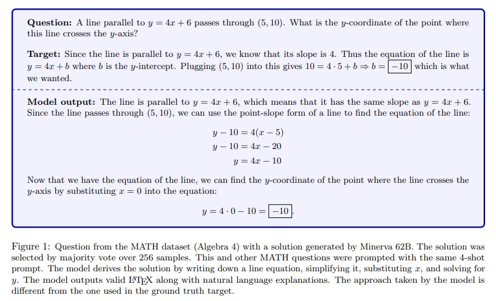
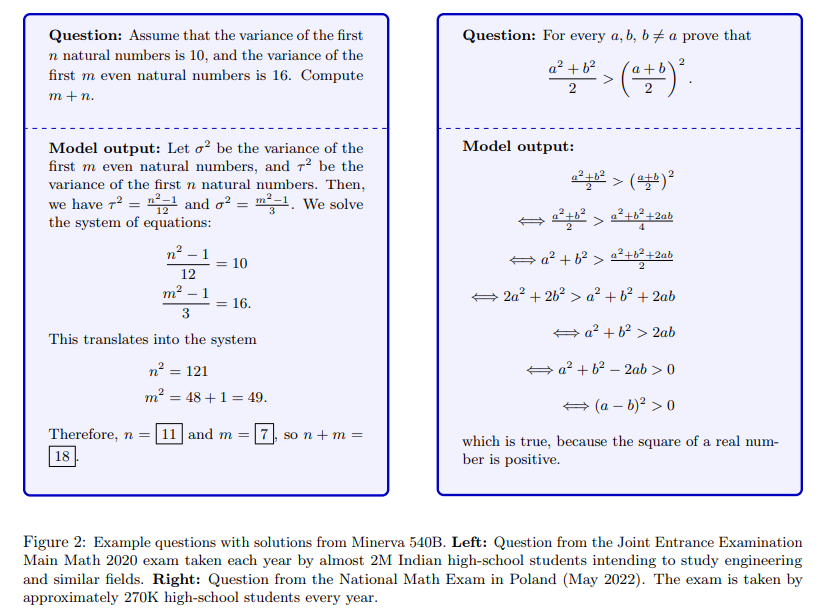
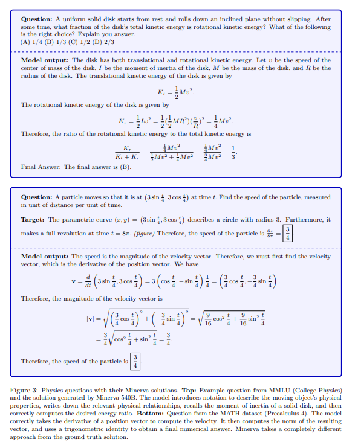
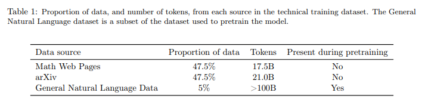
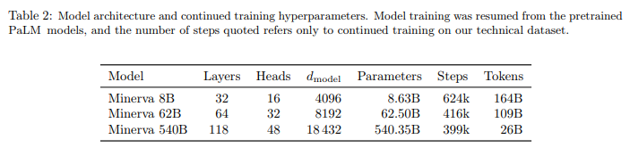

# Solving Quantitative Reasoning Problems with Language Models
- Paper: https://arxiv.org/pdf/2206.14858.pdf
- Code: 
- Organization: Google Research
- Author: Lewkowycz et al
- Year: Jun, 2022

## どんなもの?
- In particular, large language models have achieved excellent performance across a variety of natural language tasks including common-sense reasoning, question answering, and summarization (Raffel et al., 2019; Brown et al., 2020; Rae et al., 2021; Smith et al., 2022; Chowdhery et al., 2022).
- However, these models have struggled with tasks that require **quantitative reasoning**, such as
  - solving mathematics
  - science, and
  - engineering problems (Hendrycks et al., 2021; Cobbe et al., 2021).
- Previous research has shown that **large language models achieve impressive performance** on math and programming questions after training on domain specific datasets (Chen et al., 2021; Austin et al., 2021; Drori et al., 2021). In this work, we apply this approach to quantitative reasoning problems, in which the model is required to **provide a complete and self-contained solution**, **without relying on external tools**.
- We present **Minerva**, a language model that achieves strong performance on many quantitative reasoning tasks. Our model is able to process scientific and mathematical questions formulated in natural language, and generate step-by-step solutions using correct **LATEX** notation.
- Minerva is based on the **PaLM general language models Chowdhery et al. (2022)** that are further trained on a **high-quality dataset containing scientific and mathematical data**.
- We achieve state-of-the-art performance on
  - MATH Hendrycks et al. (2021),
  - GSM8k Cobbe et al. (2021) and a 
  - STEM subset of the MMLU Hendrycks et al. (2020) dataset
- all of which include math and science questions formulated in natural language. Notably, our models achieve robust performance **in a few-shot setting without being explicitly trained on these evaluation datasets**.
- The main novelty of this paper is a **large training dataset** that **juxtaposes natural language with the correct use of formal mathematical language, such as equations and diagrams**.
  - The data is **collected from the arXiv preprint server** and **from web pages** that we carefully process to minimise the loss of mathematical content.
- To further increase the coverage of quantitative reasoning benchmarks, **we build a dataset** of **over 200 undergraduate-level questions in science and mathematics** from MIT’s OpenCourseWare (OCW).
  - This provides a measure of our model’s quantitative reasoning abilities in a **chain-of-thought context** beyond a pure mathematical setting.

### Examples
- 
  - 回答が正解ラベルと異なるアプローチを取っている.
- 
  - 理数系高校生向けの試験. 式の展開もできる.
- 
  - 公式を覚えていて正しいところで使っている.

### Mathmatical Training dataset

- Our models were trained on a dataset of **38.5B** tokens from **webpages filtered for mathematical content** and from **papers submitted to the arXiv preprint server**. In addition, the dataset includes general natural language data, which is the same dataset that was **used for pretraining PaLM**.
- Our mathematical webpage dataset was constructed by collecting pages that contain **mathematical expressions** in **MathJax format**. The pages underwent a cleaning process that removes most HTML tags but preserves mathematical notation, including LATEX symbols and formatting.
- The result is that mathematical formulae like e^πi + 1 = 0 or E = mc^2 are **presented in full** to the model during training.
  - This procedure makes it possible for the model to perform well on tasks that require calculation and symbolic manipulation.

### Models and Training Procedure

- Our approach is to start with the PaLM pretrained decoder-only transformer language models Chowdhery et al. (2022), and further train (finetune) them on our mathematical dataset using an **autoregressive objective**.
- The largest model, with **540B** parameters, was finetuned on **26B** tokens.
- While this model is highly **undertrained** compared to the 8B and 62B models, it still achieves superior performance.

### Evaluation Datasets
- We mainly focus on **few shot evaluation**, though see Appendix E.3 for a discussion of **finetuned evaluation**.
- For evaluation, we **truncate the inputs from the left to 1024 tokens** and **we use the model to generate up to 512 tokens**.
  - "we use the model to generate up to 512 tokens", どういうこと?
- When sampling once per problem, we sample **greedily**. When sampling multiple times per problem we use nucleus sampling (Holtzman et al., 2019) with temperature T = 0.6, p = 0.95.
- MATH: a dataset of 12K **middle school and high school mathematics problems** Hendrycks et al. (2021). Problem statements are written in LATEX. We prompt the model with a fixed 4-shot prompt (listed in Appendix D.2). This prompt includes four random examples from the training dataset whose ground truth targets are not too long.
- GSM8k: **middle school math word problems** Cobbe et al. (2021). Models are evaluated using the chain-of-thought prompt from Wei et al. Wei et al. (2022). Previous models evaluated on GSM8k made use of an external calculator. In this work, our model does not have access to any external tools.
- MMLU-STEM: subset of the MMLU dataset (Hendrycks et al., 2020) focused on science, technology, engineering, and mathematics (STEM). For the original version, we use the **5-shot prompt** from the development set for each task. We also consider chain-of-thought prompting for this task, where we prompt the model with examples that include step-by-step solutions. We use a multiple-choice version of the MATH prompt for topics that involve mathematical reasoning, and add step-by-step solutions to the standard 5-shot prompts for the rest of the topics.
  - "chain-of-thought prompting", "multiple-choice version of the MATH prompt", "step-by-step solutions", どういうこと? prompting方法がなんかちがう...?

## 先行研究と比べてどこがすごい?
### without access to external tool
- The GSM8k work Cobbe et al. (2021) showed that training verifiers to rerank model outputs can lead to improved performance. The original version of GSM8k included special syntax for algebraic calculations, which were processed by a calculator.

## 技術や手法の肝は?
### majority voting
- The standard method for evaluating language models on generative tasks is to greedily sample one solution per problem.
- Recent works (Chen et al., 2021; Li et al., 2022; Thoppilan et al., 2022; Wang et al., 2022) have shown that it is advantageous to sample multiple solutions per problem, and then filter those down to a final answer.
- We find that **majority voting** (Wang et al., 2022) significantly improves performance over **greedy decoding**.

## どうやって有効だと検証した?
- none

## 結果は?
- none

## 次に読むべき論文は?
- none

## 不明な単語
- LATEX notations
- chain-of-thought
-  The work Drori et al. (2021) includes an evaluation of **davinci-002**, OpenAI’s latest publicly available languag model, on a subset of 90 problems from the MATH dataset.
- When sampling multiple times per problem we use nucleus sampling (Holtzman et al., 2019) with temperature T = 0.6, p = 0.95.

## 感想
- none
