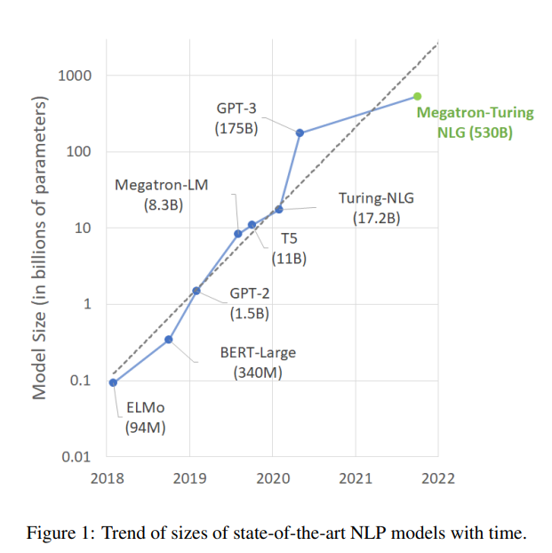
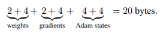
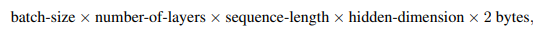

# Using DeepSpeed and Megatron to Train Megatron-Turing NLG 530B, A Large-Scale Generative Language Model
- Paper: https://arxiv.org/abs/2201.11990
- Code: 
- Organization: 
  - Microsoft
  - NVIDIA
- Author: smith et el
- Year: Jan 2022

## どんなもの?
- Because of their success, the size of these models has increased rapidly, requiring high-performance hardware, software, and algorithmic techniques to enable training such large models.
  - 
- As the result of a joint effort between Microsoft and NVIDIA, we present details on the training of the largest **monolithic transformer based language model**, Megatron-Turing NLG 530B (MT-NLG), with **530 billion parameters**.
- In this paper, we first focus on the infrastructure as well as the **3D parallelism methodology** used to train this model using **DeepSpeed** and **Megatron**.
- Next, we detail the training process, the design of our training corpus, and our **data curation techniques**, which we believe is a key ingredient to the success of the model.
- Finally, we discuss various evaluation results, as well as other interesting observations and new properties exhibited by MT-NLG.
- We demonstrate that MT-NLG **achieves superior zero-, one-, and few-shot learning accuracies** on several NLP benchmarks and **establishes new state-of-the-art results**.

### Training such large models is challenging for two reasons.
- First, it is no longer possible to fit the parameters of these models in the memory of even the largest GPU. - 
- Second, the large number of compute operations required can result in unrealistically long training times if special attention is not paid to concurrently optimizing the algorithms, software, and hardware stack.
- This calls for efficient parallelism techniques scalable on both memory and compute, in order to achieve the full potential of thousands of GPUs.
  - ちなみにこの文をDeeplで訳すと"そのため、何千ものGPUの能力をフルに発揮させるためには、メモリと計算機の両方でスケーラブルな効率的な並列化技術が必要となります。"となるが, カタカナに訳す(full -> フル)のってすごくない?

### Large Model Training Infrastructure
#### Challenges
- Memory Efficiency
  - The memory requirements to train a 530 billion parameter model are far beyond what is available on a single GPU device.
  - **Mixed precision training** [41] typically stores weights and gradients in **half precision formats** (i.e., 2 bytes per parameter) for forward and backward propagations.
  - It also keeps **full-precision** (4 bytes) copies in **32 bit float format** for numerical stability in the optimizer.
  - Assuming training with the Adam optimizer [27], training consumess **20 bytes of memory per parameter**:
    - 
    - Adam statesの4+4ってどういうこと?
      - たしかパラメータがどの程度更新されたかという情報が記憶されていて, その情報をもとに学習率を補正していたような.
      - その記憶量が4+4かな?
  - Training a 530 billion parameter model thus requires over **10 terabytes of aggregate memory** for the model weights, gradients, and optimizer states.
    - SGDだとしても12[bytes/parameter]なので, 530[GB] * 12 = 6.4[TB]
  - **Activations can also consume significant memory** and **scale with the training batch size, sequence length, and model dimensions**. Checkpointing and recomputing the activations of each transformer block is a common strategy for training large language models to reduce the memory required for activations.
  - However, the activations at the boundary between layers still needs to be stored and the aggregate activation memory is:
    - 
  - which is approximately **16.9 terabytes** following our model and training configuration (Section 3.2).
  - Fortunately, activation memory requirements can be mitigated by virtue of **gradient accumulation**.
    - Gradient accumulation is a strategy in which the full training batch is split into micro-batches that are processed in sequence and their resulting gradients are accumulated before updating the model weights.
    - After computing the gradient for a micro-batch, the associated activations can be freed. As a result, the **training batch size can scale without increasing the peak resident activation memory**.
    - For example, training with 1920 microbatches instead of a single micro-batch of size 1920 reduces the peak activation memory from **16.9 terabytes to 8.8 gigabytes** without changing the effective batch size.
- Compute Efficiency

## 先行研究と比べてどこがすごい?
- none

## 技術や手法の肝は?
- none

## どうやって有効だと検証した?
- none

## 結果は?
- none

## 次に読むべき論文は?
- mixture-of-experts [61]
  - It is worth noting that **sparse models structures** encompassing a higher total number of parameters, such as mixture-of-experts [61], have been trained. However, it is unclear whether models built following this approach would have comparable parameter efficiency and generalization capability.
- NVIDIA Megatron-LM [63, 43]
- Microsoft DeepSpeed [57, 65]
- We refer to Rajbhandari et al. [56] for an analytical study of memory consumption during training.

## 不明な単語
- in-context learning
  - 類似語: meta-learning
    - https://zenn.dev/dhirooka/articles/dc3d31f15cccb6
  - GPT-3 [9], an autoregressive language model with 175 billion parameters, performs competitively on language tasks using **in-context learning** without fine-tuning or gradient updates. Such in-context learning allows models to perform new language tasks with only simple instructions and a few optional examples.
  - 関連語: prompt-tuning
    - The effectiveness of this method was further enhanced by recent model adaptation work such as prompt tuning [33], which efficiently adapts large language models to individual tasks with robust task performance.
- gradient accumulation
  - reduce memory requirements.
  - how?

## 感想
### 2022/6/22
- ちょいちょい難しい表現がでてくるが, 読みやすい方だと思う.
- アーキテクチャの話というよりも, 超巨大モデルをどのように学習させていくか, そのためのテクニックが肝かな.
- 2.1.1のMemory Efficiencyが面白い. ちょうど気になっていた部分だったので.
- 530GBってPaLMの540GBとほぼ同じくらいだね. PaLMが後発(JanとApr).
- meta-learningでtask間の関係性を考慮できると面白そうだね.
