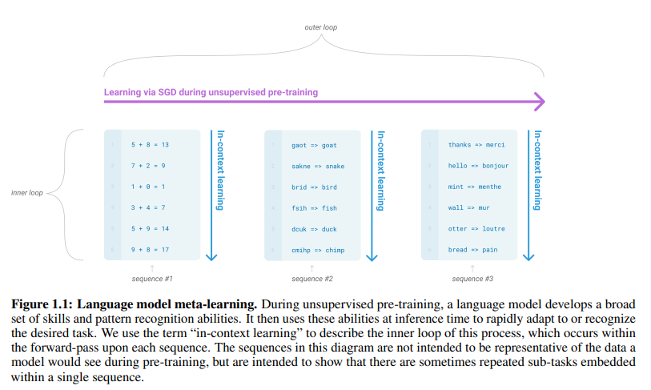
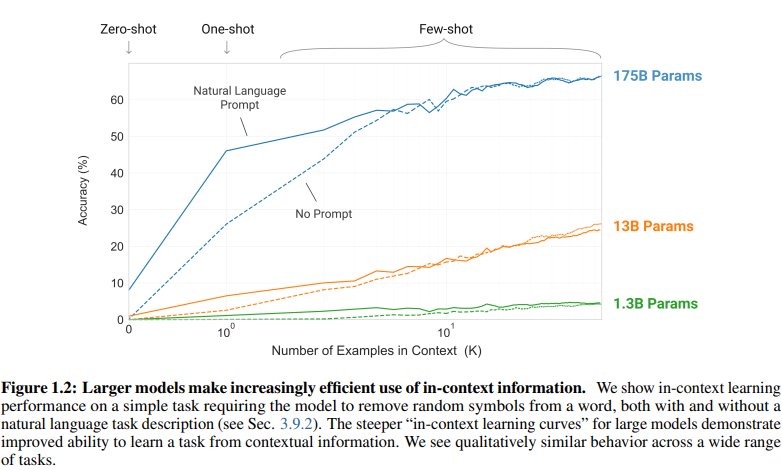

# Language Models are Few-Shot Learners
- Paper: https://arxiv.org/abs/2005.14165
- Code: https://github.com/openai/gpt-3
- Organization: OpenAI
- Author: Brown et el
- Year: 2020

## どんなもの?
- 人間は一般に、わずかな例文や簡単な指示から新しい言語タスクを実行することができるが、現在の自然言語処理システムでは、そのようなことはまだほとんどできない。
- 言語モデルをスケールアップすることで、タスクにとらわれない few-show の性能が大幅に向上し、時には先行する最先端の微調整アプローチと競合することさえあることを示す.
- GPT-3, an autoregressive language model with 175 billion parameters, 10x more than any previous non-sparse language model, and test its performance in the few-shot setting. 
- For all tasks, GPT-3 is applied without any gradient updates or fine-tuning, with tasks and few-shot demonstrations specified purely via text interaction with the model.

### なんだかんだいってtask-specificなdataset使っているけど, この"制限"はないほうが望ましいよね
1. from a practical perspective, the need for a large dataset of labeled examples for every new task limits the applicability of language models.
2. the potential to exploit spurious correlations in training data fundamentally grows with the expressiveness of the model and the narrowness of the training distribution.
   - pretraineing -> fine-tuningの枠組みにおいて, 後段のfine-tuningのdatasetが小さい(多様性)ため, モデルが汎化しない問題.
3. humans do not require large supervised datasets to learn most language tasks
   - To be broadly useful, we would someday like our NLP systems to have this same fluidity and generality.

### Language model meta-learning
- 
- task-specific dataset freeを実現する1つのアプローチ.
- While it has shown some initial promise, this approach still achieves results far **inferior to fine-tuning**.

### モデルをスケールアップすればいけるっしょ
- In recent years the capacity of transformer language models has increased substantially,
  - from 100 million parameters [RNSS18]
  - to 300 million parameters [DCLT18]
  - to 1.5 billion parameters [RWC+19]
  - to 8 billion parameters [SPP+19]
  - 11 billion parameters [RSR+19]
  - and finally 17 billion parameters [Tur20].
- Each increase has brought improvements in text synthesis and/or downstream NLP tasks, and there is evidence suggesting that log loss, which correlates well with many downstream tasks, follows a smooth trend of improvement with scale [KMH+20].
- Since in-context learning involves absorbing many skills and tasks within the parameters of the model, it is plausible that **in-context learning abilities might show similarly strong gains with scale**.

### GPT-3の評価方法
1. “few-shot learning”, or in-context learning where we allow as many demonstrations as will fit into the model’s context window (typically 10 to 100)
2. “one-shot learning”, where we allow only one demonstration
3. “zero-shot” learning, where no demonstrations are allowed and only an instruction in natural language is given to the model.
4. GPT-3 could also in principle be evaluated in the traditional fine-tuning setting, but we leave this to future work.

### Larger models make efficient use of in-context information
- 
- Word Scrambling and Manipulation Tasks
- We emphasize that these “learning” curves involve **no gradient updates or fine-tuning**, just increasing numbers of demonstrations given as conditioning.

### GPT-3の得意/不得意領域
#### 得意
- GPT-3 also displays one-shot and few-shot proficiency at tasks designed to test rapid adaption or on-the-fly reasoning, which include:
  - unscrambling words
  - performing arithmetic
  - using novel words in a sentence after seeing them defined only once.
- We also show that in the few-shot setting, GPT-3 can generate synthetic news articles which **human evaluators have difficulty distinguishing from human-generated articles**.
#### 不得意
- At the same time, we also find some tasks on which few-shot performance struggles, even at the scale of GPT-3. - This includes:
  - **natural language inference** tasks like the ANLI dataset
  - some **reading comprehension** datasets like RACE or QuAC.

## 先行研究と比べてどこがすごい?
- none

## 技術や手法の肝は?
- none

## どうやって有効だと検証した?
- none

## 結果は?
- none

## 次に読むべき論文は?
- none

## 不明な単語
- none

## 感想
- 久しぶりに読んだからか, あまり進まなかった
- 1章まで読んだ
- Radfordが筆頭著者じゃない!
- GPT-2のzero-shot learnerを継承発展させている感じ
- ニュースとかだと人間が区別できないレベルの文章を生成できるところがフューチャーされているけど, 今まで読んだ感じ, そこまでじゃない
  - むしろフューチャーしているのは task-specific dataset free, zero-shot の meta-learning
