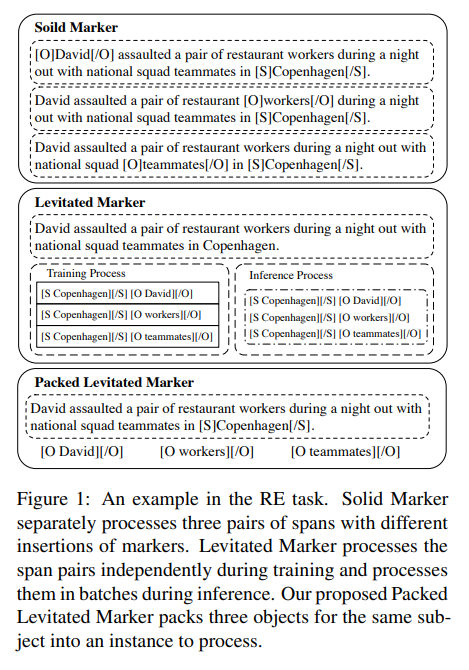
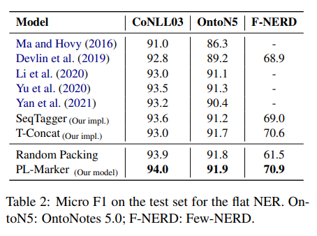

# Packed Levitated Marker for Entity and Relation Extraction
- Paper: https://arxiv.org/abs/2109.06067v4
- Code: https://github.com/thunlp/pl-marker
- Organization: Dept. of Comp. Sci. & Tech., Institute for AI, Tsinghua University, Beijing, China

## どんなもの?
- REはspan pair classification, NERはspan classificationとも呼ばれている
- REにおいて, 広く使用されている3つのspan representation extraction手法
  - 
  - T-Concat
    - startとendのtokenをconcat
  - solid marker
  - Levitated Marker
- NERにおいてはIOB2形式でタグ付を行い, tokenレベルで分類問題を解くのが一般的である.
  - 上記の方法は異なるタグ付け方式をあたえるもので, したがってモデルの出力形式もことなるものになる.
  - entity candidatesを網羅的に生成し, それぞれのcondidateについて学習/推論していく感じか?

## 先行研究と比べてどこがすごい?
- none

## 技術や手法の肝は?
- none

## どうやって有効だと検証した?
- NERに関して, flat/nested NERデータセットで実証実験を行った.
- flat:
  - CoNLL 2003
  - OntoN5
  - F-NERD
- nested:
  - ACE05
  - ACE04
  - SciERC

## 結果は?
- 
- CoNLL 2003において, Micro F1=94.0であり, 他のSOTAsを上回った.

## 次に読むべき論文は?
- none

## 不明な単語
- none

## 感想
- REで使用されているマーカー方式を, NERに当てはめている.
  - その際, 学習/推論がどのようになるかがよくわからなかった.
- IOB2タグ形式以外の選択肢もあるんだなって感じ.
  - 確かにNested-NERではIOB2だと無理があるよね
- CoNLL2003のBERT+CRFでF1=93.6ってまじ?
