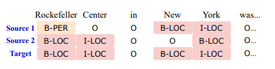

# Title
- Paper: BERTifying the Hidden Markov Model for Multi-Source Weakly Supervised Named Entity Recognition
- Code: https://github.com/Yinghao-Li/CHMM-ALT
- Organization: Georgia Institute of Technology, Atlanta, USA

## どんなもの?
- 人手によるNERラベリングは高価である一方, ノレッジベースなどの複数のノレッジリソースを活用することで, 安価に弱い教師あり学習データを構築することができる.
- 上記のような複数のリソースに基づく弱い教師情報から正確なNERモデルを学習するための手法を提案した.
  - 

## 先行研究と比べてどこがすごい?
- 複数のリソースを活用できる点
  - Distant supervision: ノレッジベースからラベルを生成する方法
- 文脈情報を考慮できる点
  - 従来のHMMはtokenのembedding情報を無視している
- ニューラルネットにHMMを取り入れる研究もある(Neuralizing)

## 技術や手法の肝は?
- 複数の異なる弱い教師情報を統合するために, 隠れマルコフモデル(hidden Markov model, HMM)を拡張した条件付き隠れマルコフモデル(conditional hidden Markov model, CHMM)を取り入れている
- 繰り返し計算のスキームでCHMMとBERT-NERを学習している
  - CHMMの役割は弱い教師情報からクリーンなラベルを出力すること

## どうやって有効だと検証した?
- NERのベンチマークで実証実験を行った
  - CoNLL 2003
  - Laptop Review
  - NCBI-Disease
  - BC5CDR

## 結果は?
- ベースラインとf1 scoreを比較したところ, 平均して4.83%高かった.

## 議論はある?
- none

## 次に読むべき論文は?
- [Linked HMM](https://ojs.aaai.org//index.php/AAAI/article/view/6009)

## 不明な単語
- semantic role labeling
- event extraction
- relationship extraction
- domain-specific dictionaries
- emission matrix in HMM

## 感想
- 要はノイジーな弱い教師情報から, 真のラベルを推定するためにHMMを使用している
- タイムステップごとに異なる状態遷移行列を求めている点が面白かった
  - しかも状態遷移行列はBERTのembeddingから求めているので, 文脈情報に基づいて状態遷移行列を決定していることになっている
  - embeddingから状態遷移行列への変換は自由度が高すぎてうまく汎化できないような気がする
  - そもそもembeddingの自由度が高い, VAEみたいに何かしらの制約を加えたモデルがありそう
