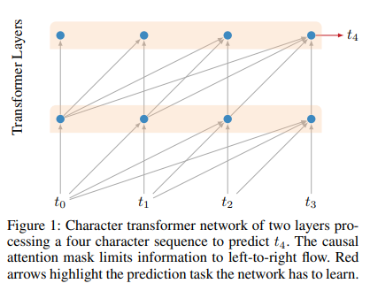
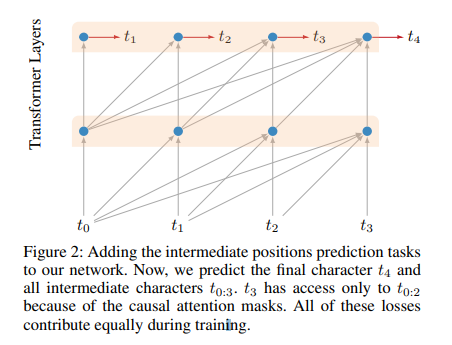
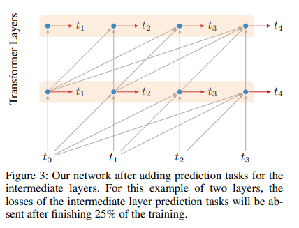
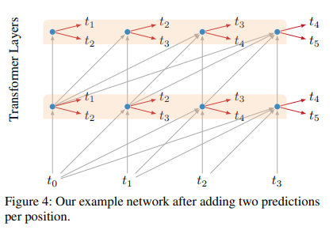

# Character-Level Language Modeling with Deeper Self-Attention
- Paper: https://arxiv.org/abs/1808.04444
- Code: none
- Organization: Google AI Launguage
- Author: AI-Rfou et el
- Year: 2018

## どんなもの?
- BERT(2018, Oct)よりも前(2018, Aug)に発表.
- character-lavel language modelにtransoformerを初めて?導入した.
- RNNsよりシンプルで効果的な長期依存関係のモデリングが可能であることを示した.

### Challengings of character-lavel language modeling
- must learn large vocabulary of words from scratch
- dependencies over long distances of hundreds or thousands of time steps.
- character sequences are longer than word sequences and thus require significantly more steps of computation

### Truncated backpropagation through time, TBTT
- To capture context longer than the batch sequence length, training batches are provided in sequential order,
- and the hidden states from the previous batch are passed forward to the current batch.
- This procedure is known as “truncated backpropagation through time” (TBTT)
- While this technique gets good results, it adds complexity to the training procedure
- and recent work suggests that models trained in this manner don’t actually make “strong” use of long-term context.
  - For example Khandelwal et al. (2018) find that a word-based LSTM language model only effectively uses around 200 tokens of context (even if more is provided),
  - and that word order only has an effect within approximately the last 50 tokens. 

## 先行研究と比べてどこがすごい?
- RNNsよりシンプルで効果的な長期依存関係のモデリングが可能である.

## 技術や手法の肝は?
- deep network of transformer self-attention layers with causal(backward-looking) attention
  - 
  - non-recurrent
  - transformer’s success here is due to its ability to “quickly” propagate information over arbitrary distances
    - RNNs need to learn to pass relevant information forward step by step.
- three auxiliary losses
  - requiring the model to predict upcoming characters
    - (i) at intermediate sequence positions
      -  
      -  Note, predicting over all sequence positions is standard practice in RNNbased approaches.
      -  However in our case, since no information is passed forward across batches, this is forcing the model to predict given smaller contexts—sometimes just one or two characters.
      -  It is not obvious whether these secondary training tasks should help on the primary task of predicting with full context.
      -  However, we find that adding this auxiliary loss speeds up training and gives better results
Ablation Experiments below).
    - (ii) from intermediate hidden representations
      - 
    - (iii) at target positions multiple steps in the future.
      - 
  - These losses speed up convergence, and make it possible to train
  - We hypothesize that these losses not only speed up convergence but also serve as an **additional regularizer**. 

## どうやって有効だと検証した?
- 実証実験を行った.
  - text8
    - wkipedia articles with superfluous content removed(tables, links etc)
    - 27 unique characters
    - lowercased
    - size of the corpus is 100M characters
  - enwiki8
    - 100M bytes of unprocessed wikipedia text

## 結果は?
- none

## 次に読むべき論文は?
- none

## 不明な単語
- none

## 感想
- Positional encodingで工夫しているが, 動機が不明.
- Experimental Setupまで読んだ@2022-05-25
