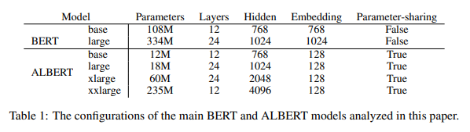
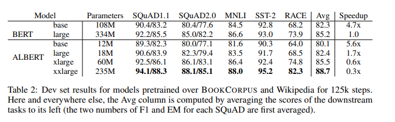
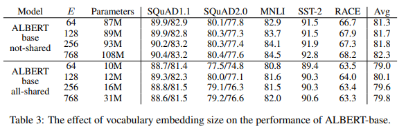

# ALBERT: A Lite BERT for Self-supervised Learning of Language Representations
- Paper: https://arxiv.org/abs/1909.11942
- Code: https://github.com/google-research/ALBERT
- Organization: google
- Author: Lan et el
- Year: 2020

## どんなもの?
- 巨大な言語モデルを使えば後段のタスクの精度が上がるが, パラメータ数が多くGPUのメモリの制約, また学習時間が長いという問題がある.
- パラメータを削減するための２つのテクニックをBERTに導入したALBERT(A Lite BERT)を提案, オリジナルのパフォーマンスは多少減少したが, メモリ制約,　学習長時間問題を改善した.
  - 

## 先行研究と比べてどこがすごい?
- メモリ制約を回避する方法として①model parallelization②clever memory managementがあるが, これは学習長時間問題を回避できない.
  - 分散学習において, 通信のオーバーヘッドはモデルのパラメータ数に比例し, 学習スピードは大幅に低下する.
  - 提案モデルは, メモリ制約と学習時間長時間問題の２つを改善するものである.

## 技術や手法の肝は?
- factorized embedding parameterization
  - decomposing the large vocabulary embedding matrix into small matrices.
  - ex)
    - original: 32000 * 768 = 24M
    - decomposition: 32000 * 128 + 128 * 768 = 4M
  - also act as a form of regularization
- cross-layer parameter sharing
  - There are multiple ways to share parameters, e.g.
    - only sharing feed-forward network (FFN) parameters across layers
    - only sharing attention parameters
  - The default decision for ALBERT is to share all parameters across layers.
- sentence-order prediction(SOP)に半教師損失関数を導入.
  - そもそもSOPはNext sentence predictionの改良版らしい.
  - SOPはQuestion Answering等のmutli-sentence encodingタスクのパフォーマンス向上を目的として導入されたものであるが, その後の研究で, 要らないものとして報告されている.
  - タスクが簡単すぎる?
    - negative sampleを別の文書からもってきている
    - つまりtopicが異なる
  - ここでは, 連続する２文の順番を入れ替えて, それをnegative sampleとする.
    - earyなtopic predictionの要素を取り除き, coherence predictionの要素だけを残す.

## どうやって有効だと検証した?
- GLUE, RACE, SQuADベンチマークで実証実験を行った.

## 結果は?
- 
- 

## 次に読むべき論文は?
- SOP, Sentence order prediction (Yang et al., 2019; Liu et al., 2019)
- XLNet (Yang et al., 2019)
- RoBERTa (Liu et al., 2019)

## 不明な単語
- reading comprehension(RACE)
- GELU, nonlinearities activation?

## 感想
- 思ったより読むのに時間がかかる
  - deeplの使用回数多い
- Figure 1が何を表しているのかわからない
  - layerを経るごとにちょっとずつembeddingが変化している => 学習安定?
- 3.2まで読んだ@2022-05-13
