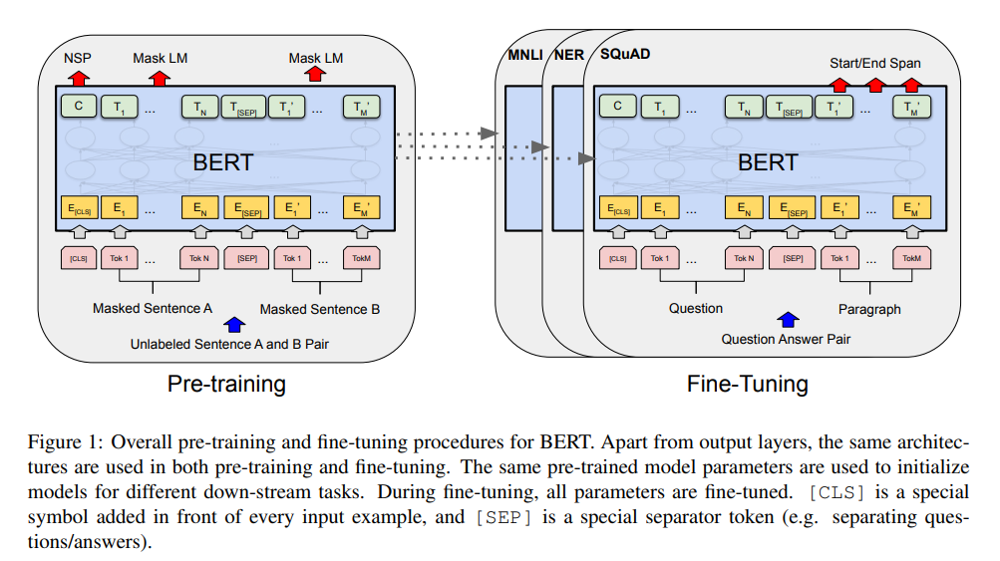
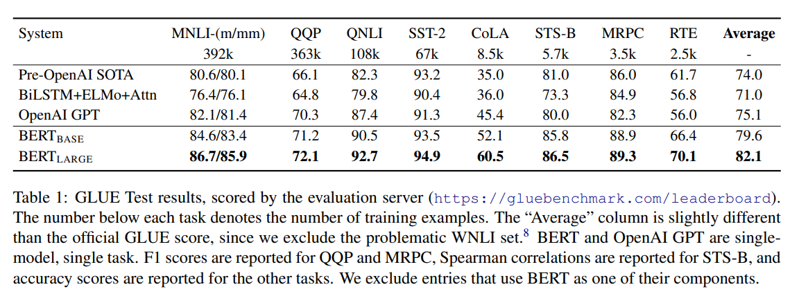
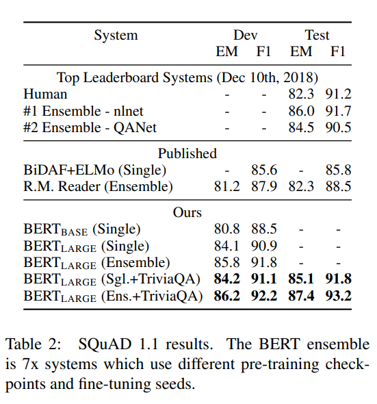
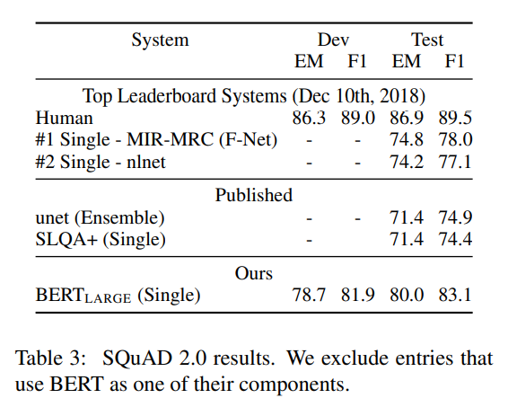
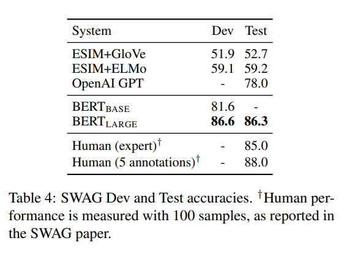
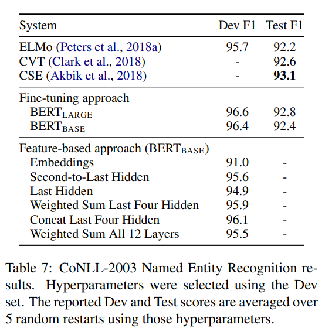

# BERT: Pre-training of Deep Bidirectional Transformers for Language Understanding
- Paper: https://arxiv.org/abs/1810.04805
- Code: https://github.com/google-research/bert
- Organization: google
- Author: devlin et el
- Year: 2019

## どんなもの?
- BERT(Bidirectional Encoder Representations from Transformers)を提案.
  - 
- 11のタスクでSOTAを達成.
  - GLUE score 80.5%(7.7% improvement)
  - MultiNLI accuracy 86.7%(4.6% improvement)
  - SQuAD v1.1 QA Test F1 score 93.2(1.5 point improvement)
  - SQuAD v2 Test F1 score 83.1(5.1 point improvement)

### Strategies for applying pre-trained language representations
- feature-based
  - ELMo
    - LSTM, predict a word using context from right-to-left, left-to-right
- fine-tuning
  - OpenAI, GPT

### Pre-training BERT
#### Masked LM
- 双方向言語モデルのリーク問題
  - 残念ながら、標準的な条件付き言語モデルは左から右、または右から左にしか学習できない. 
  - 双方向の条件付けを行えば、それぞれの単語が間接的に「自分自身を見る」ことができ、多層的な文脈の中でモデルが自ずと目標語を予測できるようになるからである。
- 予測対象の単語を特殊なトークン[MASK]に置き換えることで, 問題を解消.
#### Next sentence prediction
- ２つの文が連続しているかどうかを判定する.
  - CLSトークンを使用.
- 文ベクトルを獲得できるだけでなく, このタスクを通じて, すべてのパラメータを文間の関係性をもとに学習できる.
#### Pre-training data
- BooksCorpus(800M words)
- English Wikipedia(2,500M words)

## 先行研究と比べてどこがすごい?
- SOTAな一元的なフレームワークである点
  - アーキテクチャがタスクに依存していないため, 様々なタスクに適用することができる.

## 技術や手法の肝は?
- 双方向(bidirectional)である点
  - 単方向(unidirectional)なLMで, トークン・レベルのタスクにファインチューニング・ベースのアプローチを適用した場合, 非常に有害である可能性がある.
  - 前後どちらか片方の文脈しか考慮できないため
- Masked LMを提案, 双方向な言語モデルの学習時に発生するリーク問題を解消.
- Nest Sentence Predictionを提案, 文間の関係性を考慮したパラメータを獲得できる.

## どうやって有効だと検証した?
- pre-trainedモデルを使用した後段のタスクで実証実験を行った.

## 結果は?
- 
- 
- 
- 
- 

## 次に読むべき論文は?
- none

## 不明な単語
- natural language inference
- parphrasing

## 感想
- 4.1まで読んだ@2022-05-12
