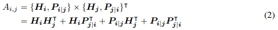
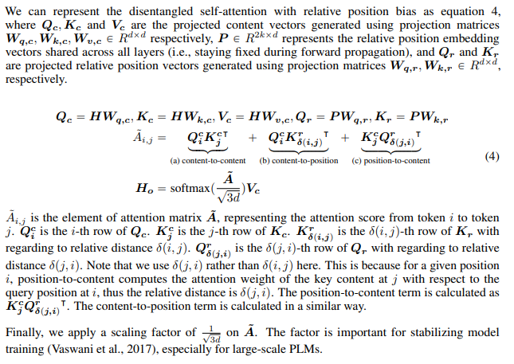
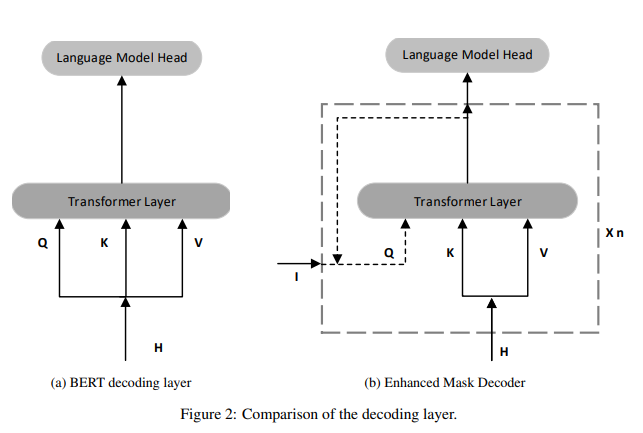
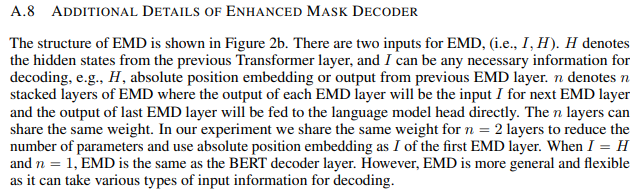

# DeBERTa: Decoding-enhanced BERT with Disentangled Attention
- Paper: https://arxiv.org/abs/2006.03654
- Code: 
- Organization: Microsoft Dynamics 365 AI
- Author: He et el
- Year: 2020

## どんなもの?
- DeBERTa (Decoding-enhanced BERT with disentangled attention)
- using two novel techniques:
  1. **the disentangled attention mechanism**, where each word is represented using two vectors that encode its content and position, respectively, and the attention weights among words are computed using disentangled matrices on their contents and relative positions, respectively.
  2. **an enhanced mask decoder** is used to incorporate absolute positions in the decoding layer to predict the masked tokens in model pre-training
- In addition, **a new virtual adversarial training method** is used for fine-tuning to improve models’ generalization.
- Compared to RoBERTa-Large, a DeBERTa model trained on **half of the training data** performs **consistently better on a wide range of NLP tasks**, achieving improvements on:
  - MNLI by +0.9% (90.2% vs. 91.1%)
  - SQuAD v2.0 by +2.3% (88.4% vs. 90.7%)
  - RACE by +3.6% (83.2% vs. 86.8%).
- In the NLG tasks, DeBERTa reduces the perplexity from 21.6 to 19.5 on the Wikitext-103 dataset.
- We further scale up DeBERTa by pre-training a larger model that consists of **48 Transformer layers** with **1.5 billion parameters**.
- The significant performance boost makes the single DeBERTa model **surpass the human performance on the SuperGLUE benchmark** (Wang et al., 2019a) for the first time in terms of macro-average score (89.9 versus 89.8), and the ensemble DeBERTa model sits atop the SuperGLUE leaderboard as of January 6, 2021, **outperforming the human baseline by a decent margin** (90.3 versus 89.8). 

### Disentangled attention
- Unlike BERT where each word in the input layer is represented using a vector which is the sum of its word (content) embedding and position embedding,
- each word in DeBERTa is represented using two vectors that encode its content and position, respectively, and the attention weights among words are computed using disentangled matrices based on their contents and relative positions, respectively.
- This is motivated by the observation that the attention weight of a word pair depends on not only their contents but their **relative positions**.
  - For example, the dependency between the words “deep” and “learning” is much stronger when they occur next to each other than when they occur in different sentences.
- 
  - That is, the attention weight of a word pair can be computed as **a sum of four attention scores** using disentangled matrices on their contents and positions as **content-to-content, content-to-position, position-to-content, and position-to-position**.
  - Since we use relative position embedding, **the position-to-position term does not provide much additional information and is removed** from equation 2 in our implementation.
- 
  - Attention weights が3つの要素の和によって計算されているところがポイント.
  - オリジナルは(a)のみ, 先行研究は(a)+(b)のみ.

### Enhanced mask decoder
- Like BERT, DeBERTa is pre-trained using masked language modeling (MLM).
- MLM is a fill-in-the-blank task, where a model is taught to use the words surrounding a mask token to predict what the masked word should be.
- DeBERTa uses the content and **position information** of the context words for MLM.
- The disentangled attention mechanism already considers the contents and relative positions of the context words, but not the **absolute positions** of these words, which in many cases are crucial for the prediction.
  - 文中の単語の絶対位置を考慮することで, モデルに構文的な情報を取り込むことができ, それが言語モデルないしMLMにおいて有効である. 以下そのわかりやすい説明.
  - Consider the sentence “a new store opened beside the new mall” with the italicized words “store” and “mall” masked for prediction.
  - Although the local contexts of the two words are similar, they play different syntactic roles in the sentence. (Here, the subject of the sentence is “store” not “mall,” for example.)
    - Using only the local context (e.g., relative positions and surrounding words) is insufficient for the model to distinguish "store" and "mall" in this sentence, since both follow the word "new" with the same relative positions.
  - These syntactical nuances depend, to a large degree, upon the words’ absolute positions in the sentence, and so it is important to account for a word’s absolute position in the language modeling process.
    - For example, the subject of the sentence is “store” not “mall”.
- **DeBERTa incorporates absolute word position embeddings right before the softmax layer** where the model decodes the masked words based on the aggregated contextual embeddings of word contents and positions.
- There are two methods of incorporating absolute positions.
- The BERT model incorporates absolute positions in the input layer.
- 
- 
  - In DeBERTa, we incorporate them right after all the Transformer layers but before the softmax layer for masked token prediction, as shown in Figure 2.
  - In this way, DeBERTa captures the relative positions in all the Transformer layers and only uses absolute positions as complementary information when decoding the masked words.
  - Thus, we call DeBERTa’s decoding component an Enhanced Mask Decoder (EMD).
  - In the empirical study, we compare these two methods of incorporating absolute positions and observe that EMD works much better.
  - We conjecture that the **early incorporation of absolute positions used by BERT might undesirably hamper the model from learning sufficient information of relative positions**.
  - In addition, EMD also enables us to introduce other useful information, in addition to positions, for pre-training. We leave it to future work.

### Masked language model
- BERTと同じ方法っぽい.
- Specifically, given a sequence X = {xi}, we corrupt it into X˜ by **masking 15% of its tokens at random** and then train a language model parameterized by θ to reconstruct X by predicting the masked tokens x˜ conditioned on X˜

## 先行研究と比べてどこがすごい?
### 明示的に単語の位置情報を導入するアーキテクチャ(disentangled attention mechanism)により, 欠損していた相対位置情報を満たしたよ(not only content-to-position, also position-to-content)
- The standard self-attention mechanism lacks a natural way to encode word position information.
- The positional bias can be implemented using absolute position embedding (Vaswani et al., 2017; Radford et al., 2019; Devlin et al., 2019) or relative position embedding (Huang et al., 2018; Yang et al., 2019).
- It has been shown that relative position representations are more effective for natural language understanding and generation tasks (Dai et al., 2019; Shaw et al., 2018).
- The proposed disentangled attention mechanism differs from all existing approaches in that we represent each input word using **two separate vectors** that encode a word’s content and position, and attention weights among words are computed using disentangled matrices on their contents and relative positions, respectively.
- Existing approaches to relative position encoding use a separate embedding matrix to compute the relative position bias in computing attention weights (Shaw et al., 2018; Huang et al., 2018).
  -  This is equivalent to computing the attention weights **using only the content-to-content and content-to-position terms** in equation 2
  -  We argue that the **position-to-content term is also important** since the attention weight of a word pair depends not only on their contents but on their relative positions, which **can only be fully modeled using both the content-to-position and position-to-content terms**.
### 絶対位置情報をsoftmaxの直前に導入したよ. これにより, MLMで直接的に活用できるし, 相対位置情報モデリングから独立し邪魔にならないよ.
- We conjecture that the **early incorporation of absolute positions used by BERT might undesirably hamper the model from learning sufficient information of relative positions**.
- In addition, EMD also enables us to introduce other useful information, in addition to positions, for pre-training. We leave it to future work.

## 技術や手法の肝は?
### Disentangled attention
- 相対位置情報を取り入れるメカニズム
### Enhanced mask decoder
- 絶対位置情報を取り入れるメカニズム

## どうやって有効だと検証した?
- none

## 結果は?
- none

## 次に読むべき論文は?
- UniLM (Dong et al., 2019)
- ELECTRA (Clark et al., 2020)
- T5 (Raffel et al., 2020)
- ALUM (Liu et al., 2020)
- StructBERT (Wang et al., 2019c)
- ERINE (Sun et al., 2019)

## 不明な単語
- none

## 感想
### 2022/6/9
- 読みやすかった
  - 具体例がわかりやすい!
- 3.2まで読んだ
- Enhanced mask decoderがよくわからなかった. Iはなんでもいいってことかな?
  - A.8:: I can be any necessary information for decoding, e.g., H, absolute position embedding or output from previous EMD layer.
    - absolute position embeddingってBERTのpositional encoding以外にも手法があるんだろうか.
  - A.8:: When I = H and n = 1, EMD is the same as the BERT decoder layer. However, EMD is more general and flexible as it can take various types of input information for decoding.
