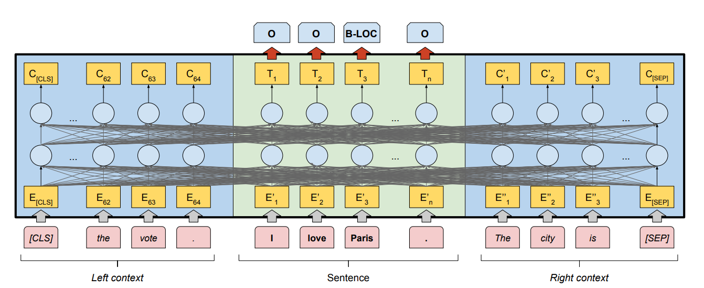
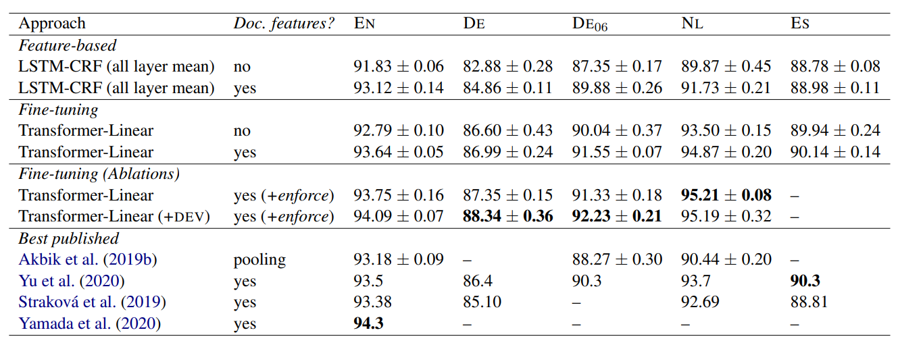
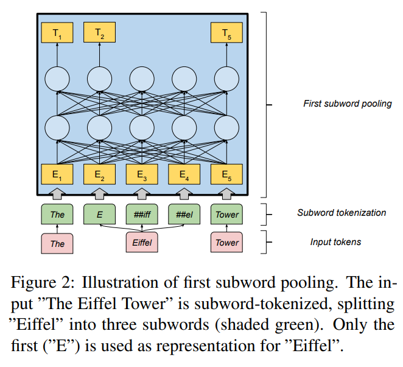

# FLERT: Document-Level Features for Named Entity Recognition
- Paper: https://arxiv.org/abs/2011.06993
- Code: https://github.com/flairNLP/flair
- Organization: schweter.eu

## どんなもの?
- 既存のNERモデルにおいて, 入力は文レベルであり, 文書レベルの情報を考慮できていない.
  - 
- NERにおけるtransformerの２つのスタンダードな使われ方を取り上げ, 文書レベルの情報を考慮することでモデルのパフォーマンスにどう影響するか検証した.
- 本研究で提案したNERモデルを"FLERT"とし, "FLAIR"フレームワークの拡張として統合した.

### ２つのスタンダード
- fine-tuning
- feature-based
  - transfomerをfeature extracterとして使う
  - transformer -> feature -> LSTM+CRF

### 採用したtransfomer architecture
- multilingual XLM-RoBERTa(XLM-R)
  - xlm-roberta-large

### clasic word embedding
- transfomerのembeddingに結合する
  - GLoVE
  - FastText

## 先行研究と比べてどこがすごい?
- 純粋に文書レベルの情報を加味することを評価している(他の要素を排除)

## 技術や手法の肝は?
- 文の前後に数tokenを入力している
  - 実装が容易かつ計算コストが小さい
  - それでいて前後の文脈を捉えることができる

## どうやって有効だと検証した?
- NERのベンチマークであるCoNLL(4 languages)で実証実験を行った

## 結果は?

- German, Dutchにおいて, SOTAを達成した.
- EnglishとSpanishではSOTAを達成していない.
- 文書レベルの情報により, 特にPER, ORGの精度が向上している.

## 次に読むべき論文は?
- none

## 不明な単語
- subword pooling
  - subtoken modelingとtoken-level predictionをつなぎ合わせるために使用?
  - 
  - BERTの論文でも同じ議論があった!(先頭のsubtokenのみ使用する)

## 感想
- 意外とfeature-basedのアプローチが善戦している!
- fine-tuningと文書レベルの情報がとくに効いているっぽい!
