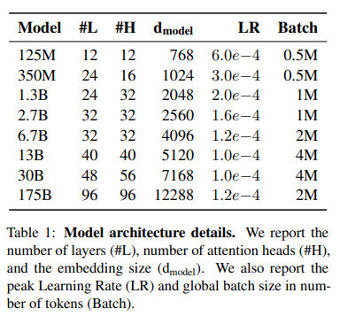
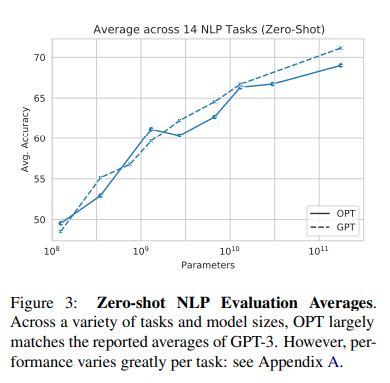
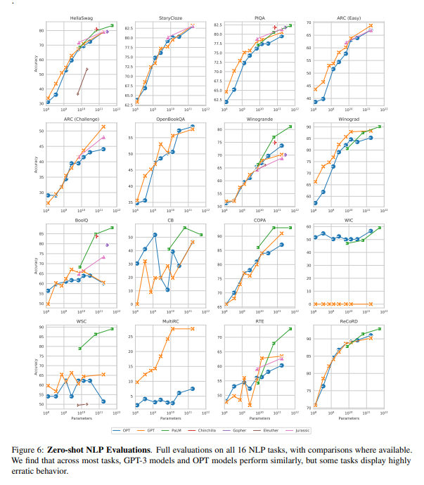
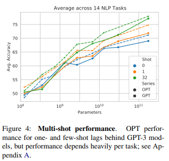
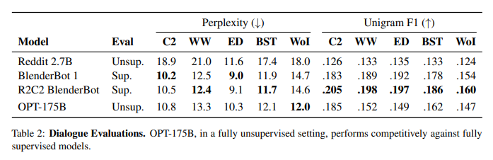
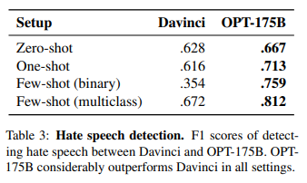

# OPT: Open Pre-trained Transformer Language Models
- Paper: https://arxiv.org/pdf/2205.01068v3.pdf
- Code: https://github.com/facebookresearch/metaseq
- Organization: facebook
- Author: Zhang et el
- Year: 2022

## どんなもの?
- 巨大なLMは, 一部ののぞき, APIを介した使用に限られている.
- LMの研究を後押しする目的で, 125M ~ 175Bサイズの巨大なLM一式(OPT, Open Pretrained Transformers)を公開.
  - 

### training settings
- For weight initialization, we follow the same settings provided in the Megatron-LM codebase
  - using a normal distribution with zero mean and standard deviation of 0.006.
  - Standard deviation for output layers are scaled by a 1.0/ √ 2L term where L is the total number of layers.
  - All bias terms are initialized as 0, and all models are trained with ReLU activation and a sequence length of 2048.
- We use an AdamW optimizer (Loshchilov and Hutter, 2017)
  - with (β1, β2) set to (0.9, 0.95), and weight decay of 0.1.
- We follow a linear learning rate schedule
  - warming up from 0 to the maximum learning rate over the first 2000 steps in OPT-175B
  - or over 375M tokens in our smaller baselines
  - and decaying down to 10% of the maximum LR over 300B tokens.
- We use a dropout of 0.1 throughout
  - but we do not apply any dropout to embeddings.
- We clip gradient norms at 1.0
  - except for some midflight changes that reduce this threshold down from 1.0 to 0.3

### Pretraining Corpus
- The pre-training corpus contains a concatenation of datasets
  - RoBERTa (Liu et al., 2019b)
  - the Pile (Gao et al., 2021a)
  - PushShift.io Reddit (Baumgartner et al., 2020; Roller et al., 2021).
- We tokenize all corpora using the GPT-2 byte level BPE tokenizer (Sennrich et al., 2016; Radford et al., 2019; Brown et al., 2020).
  - Our final corpus contains roughly 180B tokens.

## 先行研究と比べてどこがすごい?
- none

## 技術や手法の肝は?
- none

## どうやって有効だと検証した?
- 16のNLPタスクで実証実験を行った.

## 結果は?
- 16 standard NLP tasks
  - Zero-shot
    - 
    - 
    - 各タスクの詳細は不明.
  - One-shot and Few-shot
    - 
- Dialogue
  - 
- Hate Speed Detection
  - 
- Stereotype awareness
- toxic content generation

## 次に読むべき論文は?
- In the interest of transparency, and to reduce risk of training instabilities, our models and hyperparameters largely follow Brown et al. (2020)

## 不明な単語
- A100 GPU
- mid-flight
- Fully Sharded Data Parallel (Artetxeet al., 2021) 
- Megatron-LM Tensor Parallelism (Shoeybi et al., 2019).

## 感想
- 読みづらかった
- 知らないモデルと知らないタスクであふれている...
- GPT-3 likeな巨大モデルを事前学習し公開する, という目的の元, とにかくGPT-3とパフォーマンスを比較している.
- 事前学習の設定が事細かに書かれており, 参考になりそう.
