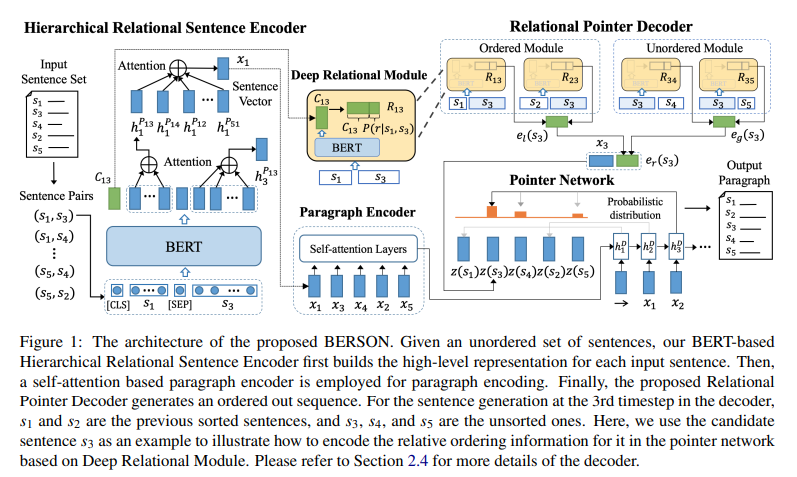
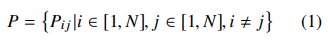
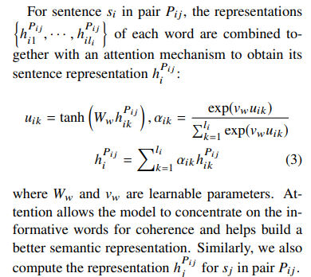
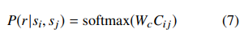
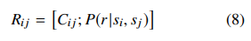
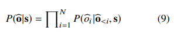

# BERT-enhanced Relational Sentence Ordering Network
- Paper: https://aclanthology.org/2020.emnlp-main.511/
- Code: 
- Organization: 
  - College of Information Science and Electronic Engineering, Zhejiang University, China
  - Computer Science Department, Binghamton University, Binghamton, NY, USA
- Author: Cui et el
- Year: Nov, 2020

## どんなもの?
- In this paper, we introduce a novel BERTenhanced Relational Sentence Ordering Network (referred to as BERSON) by leveraging BERT for capturing a better dependency relationship among sentences **to enhance the coherence modeling for the entire paragraph**.
- Extensive evaluations are conducted on six public datasets.
- The experimental results demonstrate the effectiveness and promise of BERSON, showing a significant improvement over the state-of-the-art by a wide margin.

### Sentence ordering task
- The Sentence Ordering task (Barzilay and Lapata, 2008) aims to reconstruct a coherent paragraph from an unordered set of sentences and has shown to be beneficial to improve the coherence in many NLP tasks including:
  - multi-document summarization (Barzilay and Elhadad, 2002; Nallapati et al., 2017),
  - conversational analysis (Zeng et al., 2018), and
  - text generation (Konstas and Lapata, 2013; Holtzman et al., 2018). 
- In recent years, several approaches based on **ranking** or **sorting** frameworks have been developed to deal with this task.
  - RankTxNet (Kumar et al., 2020) computes a score for each sentence and sorts these scores with ranking based loss functions.
  - Pairwise Model (Chen et al., 2016) adopts a pairwise ranking algorithm to learn the relative order of each sentence pair.
  - B-TSort (Prabhumoye et al., 2020) predicts the **constraint between two sentences** and uses the topological sort technique to find the ordering
    - "constraint between two sentences"だけちょっとピンと来ない
#### Pointer Network
- On the other hand, to better capture the **global coherence**, **pointer network (Vinyals et al., 2015) has been gradually used for the decoder of the ordering model.**
  - It is able to capture the paragraphlevel contextual information for generating an ordered sequence with the highest coherence probability (Gong et al., 2016; Logeswaran et al., 2018; Cui et al., 2018; Yin et al., 2019).
  - Further, HAN (Wang and Wan, 2019) and TGCM (Oh et al., 2019) introduce the attention mechanism (Vaswani et al., 2017), and FUDecoder (Yin et al., 2020) proposes pairwise ordering prediction modules to enhance the traditional pointer network.
- Despite having achieved great successes, **pairwise ranking and pointer network-based ordering approaches have a few problems**.
  - The former focuses on learning the local relationship between sentence pairs, but **may have trouble in capturing the global interactions among all the sentences**.
  - The latter overlooks the importance of learning relative order between sentence pairs through the encoder-decoder, and **lacks enough local interactions among sentences**
- To address the above limitations, in this paper, we propose a novel BERT-enhanced Relational Sentence Ordering Network (referred to as BERSON) by integrating BERT (Devlin et al., 2019) with the pointer network to **fully exploit the pairwise relationships between sentences for a better coherence modeling**.

### Architecture

#### Hierarchical Relational Sentence Encoder
- すべての文ペアP_ijを準備する
  - 
- P_ijをBERTにぶちこみ, 最終層のembeddingに重み付き平均を適用して文ベクトルを得る.
  - 重みは学習パラメータ
    - **これってどのように機能するんだろうか?**, どのようなベクトルに高いスコアを割り当てる? 何も制約がなく自由だからよくわからん.
  - ソフトマックスっぽく重みを計算
    - tanhは(-1, 1)の値をとるが, 通常のattentionって負の値とってたっけ?**重みとして負の値をとるとどのような意味になる?**
      - この直後にexpに入力するから, ただ単に重みが小さくなるだけか...
  - 
- これをP_ij(j=1...N, i!=j), P_ki(k=1,...,N, k!=i)に対して行う
  - num of pairs is 2N - 2
  - つまり, 文iに対して2N - 2個の文ベクトルが得られる
- 2N - 2個の文ベクトルの重み付き平均をとり, それを最終的な文iのベクトルとする.
  - 重みは学習パラメータ
- BERTの２文入力機構を利用して, 文iとそれ以外の文j(j!=1)のペアを入力して, 2N - 2個の文ベクトルを獲得し, それをまぜまぜして最終的な文のベクトルを獲得している, って感じかな.
  - この時点で文iのベクトルには, 文i以外の文脈が組み込まれている
#### Paragraph Encoder
- 文ベクトルxi(i=1,...,N)にself-attentionを適用.
  - この前にもまぜまぜしていたが...
- パラグラフベクトルというものを, 単純に文ベクトルxiの平均をとり獲得する.
  - このパラグラフベクトルがdecoderへの入力となる.
#### Relational Pointer Decoder
- Deepl Relational Module
  - BERTのcls embeddingを使って, 文iと文jがどちらが先に出現したか, 先行性を学習する.
    - 
    - 
  - Different from the previous method of using the learned sentence vectors to calculate the pairwise relationship between sentences (Yin et al., 2020), DRM employs the whole sequence of the sentence pair as the input to BERT. It allows us to directly relate words from different sentences together, which is more straightforward to exploit the intrinsic relations and coherence between sentences.
  - Further, instead of relying on the modules trained from scratch to control the pairwise ordering predictions (Yin et al., 2020), DRM adopts BERT as the main building block to obtain a pairwise relationship representation for the sentencen pair. Intuitively, being pre-trained on the large corpus in BERT, this representation encodes more reliable and accurate relative ordering information, and thus is more effective to help determine the pairwise ordering predictions in the decoder.
- Integrating DRM with Pointer Network
  - 
  - We employ an LSTMbased pointer network as the basis of our decoder,

## 先行研究と比べてどこがすごい?
- 局所的かつ大域的な相互作用両方を考慮することができるアーキテクチャである.

## 技術や手法の肝は?
- none

## どうやって有効だと検証した?
- none

## 結果は?
- none

## 次に読むべき論文は?
- none

## 不明な単語
- none

## 感想
### 2022/6/25
- 2.4.2の途中まで読んだ
  - 複雑で挫折した
- アーキテクチャが複雑ですね
- 計算量が多そうですね
- 学習パラメータのサイズ書いてほしいな
- decoderのところで, step_iの予測にstep_i-1とstep_i+1との整合性が考慮されていることろがいい.
- local coherenceのDeep Relational Moduleと, global coherenceのParagraph Encoder, 両方がうまく機能している?
- 気になった文:
  - 2.4.1:: "To address the above limitations, in this paper, we propose a novel BERT-enhanced Relational Sentence Ordering Network (referred to as BERSON) by integrating BERT (Devlin et al., 2019) with the pointer network to fully exploit the pairwise relationships between sentences for a better coherence modeling."
    - NSPはBERTではなく, 改良版を使った方がよい.
      - 問題が簡単すぎているということが報告されている. 文間の類似性を考慮できていない可能性がある.
