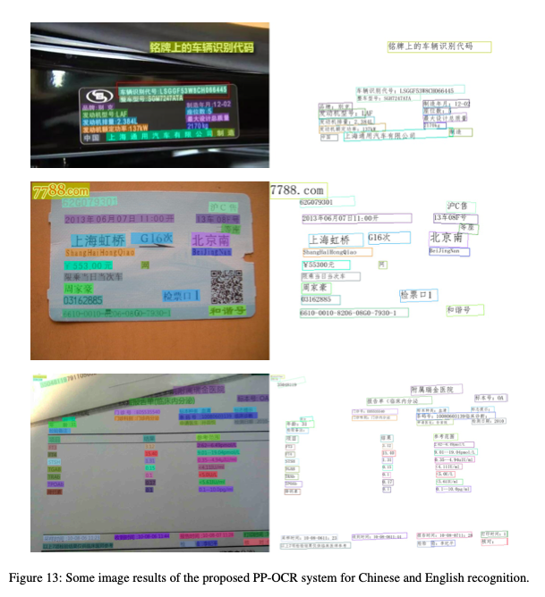
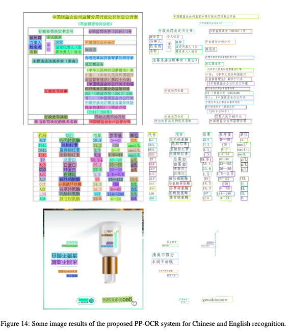
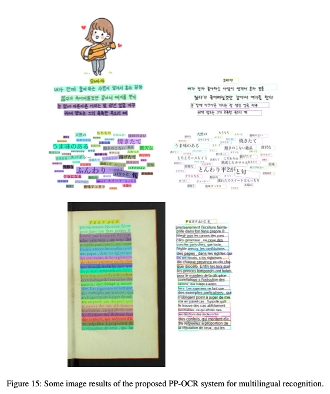
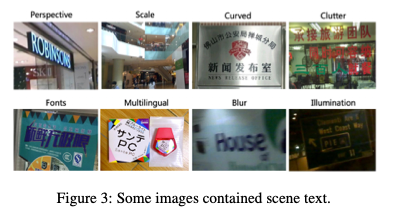
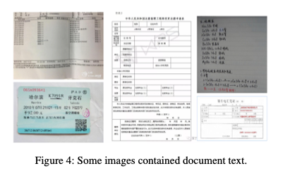
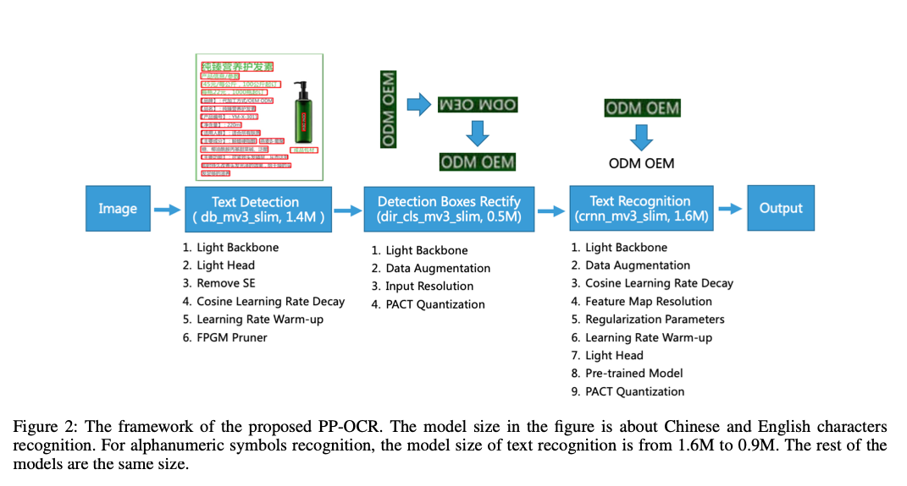
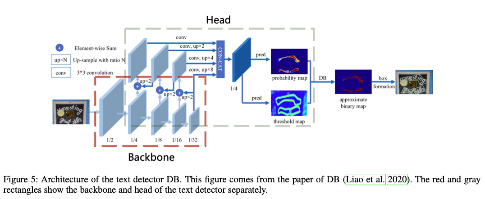
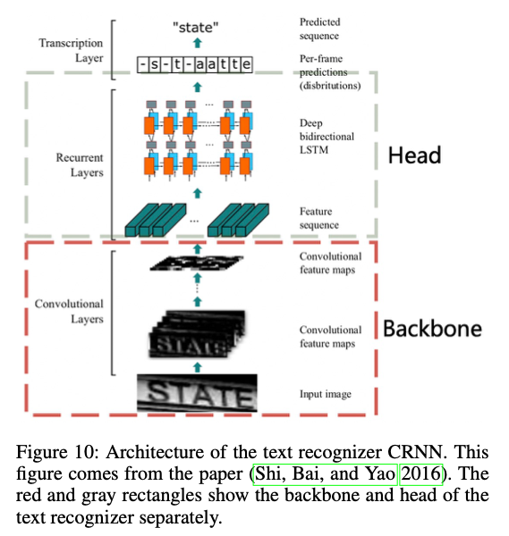

# PP-OCR: A Practical Ultra Lightweight OCR System
- Paper: https://arxiv.org/abs/2009.09941
- Code: https://github.com/PaddlePaddle/PaddleOCR
- Organization: Baidu Inc.
- Author: du et el
- Year: 2020

## どんなもの?
- 
- 
- 
- 軽量(3.5M for 6622 chinese character)なOCRシステム(PP-OCR)を提案.
- 学習データセットを構築.
- 事前学習済みのtext detector(97K images), direction classifier(600K images), text recognizer(17.9M)をopen sourceでリリース.
- Chinese, English以外にもFrench, Korean, Japanese and Germanに対応.

### Various Text appererence
- two types:
  - 
  - scene text
  - 
  - document text

### Computational Efficiency 
- In practical, the images that need to be processed are usually massive, which makes high computational efficiency an important criterion for designing an OCR system.
- CPU
- embedded devices

### PP-OCR framework

1. Text Detection
   - 
   - use Differentiable Binarization (DB) (Liao et al. 2020) as text detector.
   - simple segmentation network.
   - In order to further improve its effectiveness and efficiency, the following six strategies are used: 
     - Light backbone
     - light head
     - remove SE module
     - cosine learning rate decay
     - learning rate warm-up
     - FPGM pruner
   - Finally, the model size of the text detector is reduced to 1.4M.
2. Ditection Boxes Rectify
   - Training a text direction classifier is a simple image classification task.
   - We adopt the following four strategies to enhance the model ability and reduce the model size:
     - light backbone
     - data augmentation
     - input resolution
     - PACT quantization
   - Finally, the model size of the text direction classifier is 500KB.
3. Text Recognition
   - 
   - we use CRNN (Shi, Bai, and Yao 2016) as text recognizer, which is widely used and practical for text recognition.
   - to enhance the model ability and reduce the model size of a text recognizer, the following nine strategies are used:
     - light backbone
     - data augmentation
     - cosine learning rate decay
     - feature map resolution
     - regularization parameters
     - learning rate warmup
     - light head
     - pre-trained model
     - PACT quantization
   - Finally, the model size of the text recognizer is only 1.6M for Chinese and English recognition and 900KB for alphanumeric symbols recognition.

## 先行研究と比べてどこがすごい?
- none

## 技術や手法の肝は?
- none

## どうやって有効だと検証した?
- none

## 結果は?
- none

## 次に読むべき論文は?
- Architecture of the text recognizer CRNN. This figure comes from the paper (Shi, Bai, and Yao 2016). 
- Learning Rate Warm-up The paper (He et al. 2019a) shows that using learning rate warm-up operation can help to improve the accuracy in the image classification.

## 不明な単語
- OCR applications:
  - identity authentication
  - digital financial system
  - vehicle license plate recognition.
- PACT (PArameterized Clipping acTivation)
  - 活性化関数の前処理?
- FPN (Lin et al. 2017) architecture in object detection

## 感想
- 時間かかった, ３章に行く前に終了した
- 先行研究の記載がない
- Baiduは中国最大大手の検索サイトを開発, 運営している会社らしい. Googleは使えないっぽい.
- ３つのフレームワークに分けて, それぞれのタスクで色々改善案を実施している感じ. Kaggleっぽい.
