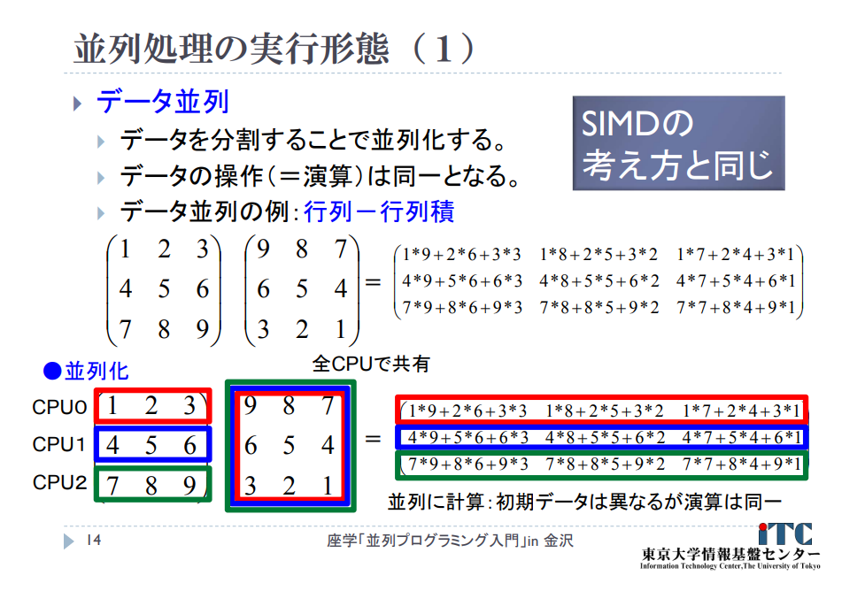
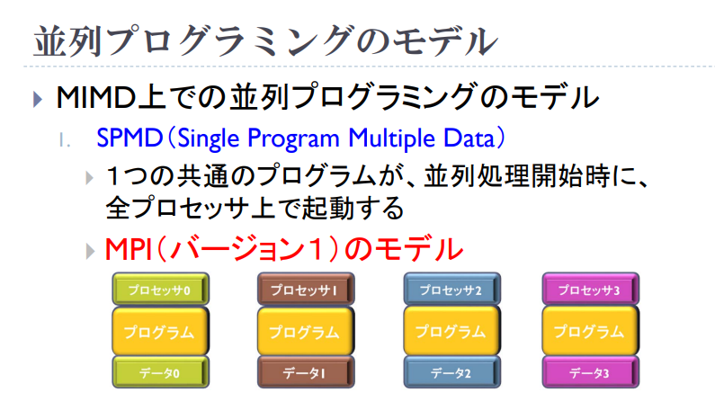
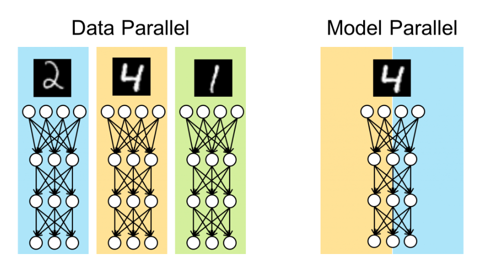

# Pathways: Asynchronous Distributed Dataflow for ML
- Paper: https://arxiv.org/abs/2203.12533
- Code: 
- Organization: Google
- Author: Barham
- Year: Mar, 2022

## どんなもの?
- We present the design of a new large scale orchestration layer for accelerators. Our system, PATHWAYS, is explicitly designed to enable exploration of new systems and ML research ideas, while retaining state of the art performance for current models
- PATHWAYS uses a client-server architecture that enables PATHWAYS’s runtime to execute programs on system-managed islands of compute on behalf of many clients.

- On the other hand, with eacSystem designers have adopted ingenious techniques to execute pipelined (Narayanan et al., 2021; Rasley et al., 2020; Narayanan et al., 2019; Huang et al., 2019) and homogeneous MoE (Lepikhin et al., 2020; Fedus et al., 2021) models on MPI-style systems, but as we argue in detail later, the MPI programming model is too restrictive both for users and for the underlying system.h new generation of accelerators, ML clusters are becoming increasingly heterogeneous (Jeon et al., 2019; Chaudhary et al., 2020; Weng et al., 2022). Providing exclusive access to large “islands” of homogeneous accelerators connected over high-bandwidth interconnects is expensive, and often wasteful as a single user program must try to keep all of the accelerators continuously busy.

- On the other hand, with each new generation of accelerators, ML clusters are becoming increasingly heterogeneous (Jeon et al., 2019; Chaudhary et al., 2020; Weng et al., 2022). Providing exclusive access to large “islands” of homogeneous accelerators connected over high-bandwidth interconnects is expensive, and often wasteful as a single user program must try to keep all of the accelerators continuously busy.
- Such constraints are further driving researchers towards “multiple program multiple data” (MPMD) computations that allow more flexibility by mapping sub-parts of the overall computation to a collection of more readily available smaller islands of accelerators.

## 先行研究と比べてどこがすごい?
- none

## 技術や手法の肝は?
- none

## どうやって有効だと検証した?
- none

## 結果は?
- none

## 次に読むべき論文は?
- none

## 不明な単語
### 並列計算のアーキテクチャ タイプ
- http://sm.seeeko.com/archives/15876780.html
#### SIMD(Single Instruction Multiple Data)
- SIMD は、1つ（Single）の命令（Instruction）で、複数（Multiple）のデータ（Data）に対して並列処理を行います.
#### MIMD(Multiple Instruction Multiple Data)
- MIMDは、現在の商用超並列コンピュータの多くが採用しているマルチプロセッサの処理方式です
- SIMDは、１つの命令でしたが、MIMDは複数の命令(Multiple Instruction)を並列に実行できます。

### MPI(Message Passing Interface)
- 分散メモリ環境における並列プログラミングの標準的な実装である
- クラスタのような分散メモリシステムにおいて，並列化インタフェースは大きく2つに分類される．一つは，**メッセージパッシング方式**であり他方がデータ並列方式である(SIMDとMIMD?)．MPIではメッセージパッシング方式が用いられている.
#### メッセージパッシング方式
- メッセージパッシング方式とは，プロセッサ間でメッセージを交信しながら並列処理を実現する方式である．並列処理では，複数のプロセッサが通信を行いながら同時に処理を進めていく．そこで問題になるのがプロセッサ間の通信であるが，メッセージパッシング方式ではプロセッサー間での通信をお互いのデータの送受信にて行う．
- メッセージパッシング方式は，分散メモリ環境において現在，最も主流の方式であり，かなり本格的な並列プログラミングが実現することができる．この方式をプログラムで実現するためのライブラリが，メッセージパッシングライブラリである. その最も代表的なライブラリとしてMPIとPVMがある．
- **MPIはインターフェースの規定であり，実装パッケージそのものではない**．MPI の実装ライブラリと してはフリー，ベンダ問わずに数多く存在する．その中でも代表的なフリーのライブラリとしては，LAM と MPICHがあげられる．
#### ブロッキング
- ブロッキングとは，操作が完了するまで手続きから戻ることがない場合のことを意味する．この 場合，各作業はその手続きが終了するまで待たされることになり効率が悪くなる場合がある．具 体的には，図 2.3 に示すように送信，受信が宣言されてから完了するまで処理は待機状態になる ため非常に無駄が多くなってしまうのである．ただし，各操作の完結が保証されているためノン ブロッキングに比べ簡単である．
#### ノンブロッキング
- ノンブロッキングとは，操作が完了する前に手続きから戻ることがあり得る場合のことを意味す る．ノンブロッキング通信を用いることによりより効率の良いプログラムを作成することができ る. 具体的には，図 2.4 に示すように，送信，受信が宣言されてからも処理を継続することがで きるためブロッキング通信に比べ通信待ちの時間が少なくなり処理時間の軽減を計ることがで きる．特に，非同期通信などを行う場合にはノンブロッキング通信は必要不可欠である．しか し，操作の完了が保証されていないため，ノンブロッキング通信を完了するための関数 (MPI Wait()) を呼び出す必要がある．

- 
  - http://www.eccse.kobe-u.ac.jp/assets/images/simulation_school/kobe-hpc-summer-basic-2018/KHPCSS-2018-08.pdf

### “single program multiple data” (SPMD)
- 
  - https://www.cc.u-tokyo.ac.jp/events/lectures/X01/shiryou-2.pdf

### “multiple program multiple data” (MPMD)

### データ並列性とモデル並列性
- 
  - https://tech.preferred.jp/ja/blog/model-parallelism-in-dnn/
- データ並列では、全プロセスに同じモデルのコピーして訓練することでバッチサイズをプロセス数倍し、学習を高速化させる
  - しかし、このような多数のGPUを用いて効率的に計算を行うのは多くの困難が伴います
  - そのうちの1つとして、データ並列型分散深層学習において、GPU同士の通信にかかる時間がボトルネックとなっていることが挙げられます。
  - データ並列型分散深層学習では、異なるデータでモデルのパラメータでの損失関数の勾配を求めたあと、プロセス間で勾配の平均を求め、求めた平均を得られた勾配とみなして、モデルに適用を行います。
    - この勾配の平均を求める操作として、多対多の通信を行う集団通信アルゴリズム：AllReduceが用いられています。
- 一方でモデル並列とは、1つのモデルを分割して複数のプロセスに配置し、全プロセスで協調して1つのモデルを訓練する手法
  - 通信用の関数は、それぞれbackwardにおいて「勾配を逆向きに通信」するように設計されています。例えば bcast の場合、forward計算ではmasterからslaveに対して入力変数がbroadcast通信されます。一方で、backward計算ではslaveからmasterに対して勾配をallreduceします。

## 感想
### 2022/6/20
- 難しい. 何が何だかわからない...
- とりあえず, 周辺知識を調べ中.
