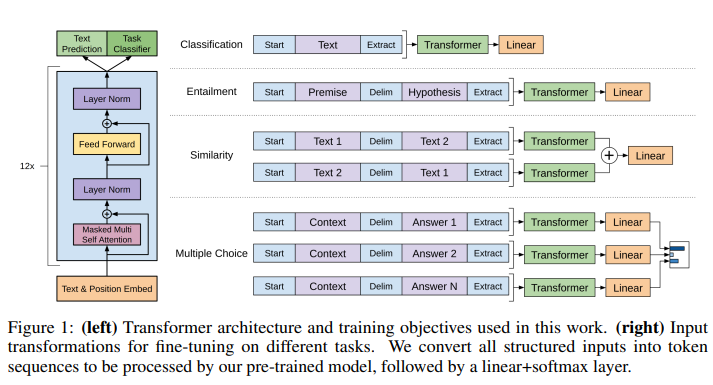
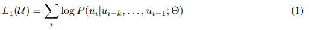
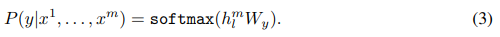
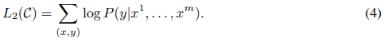
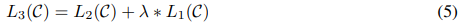

# Improving Language Understanding by Generative Pre-Training
- Paper: https://s3-us-west-2.amazonaws.com/openai-assets/research-covers/language-unsupervised/language_understanding_paper.pdf
- Code: 
- Organization: OpenAI
- Author: Radford et el
- Year: 2018

## どんなもの?
- GPT, Generative Pre-Training?
- ラベル付けされていない多様なテキストコーパスを用いて言語モデルの生成的な事前学習を行い, その後, 特定のタスクごとに微調整することで, これらのタスクで大きな利益が得られることを実証.
- 12のtaskのうち9でSOTAを達成. 例えば, commonsense reasoning（Stories Cloze Test）で8.9%, question answering（RACE）で5.7%, textual entailment（MultiNLI）で1.5%の改善を達成.

### Leveraging more than word-level information from unlabeled text, however, is challenging for two main reasons.
1. it is unclear what type of optimization objectives are most effective at learning text representations that are useful for transfer.
   - Recent research has looked at various objectives such as
     - language modeling [44]
     - machine translation [38]
     - discourse coherence [22] 
   - with each method outperforming the others on different tasks.
2. there is no consensus on the most effective way to transfer these learned representations to the target task.
   - Existing techniques
     - involve a combination of making task-specific changes to the model architecture [43, 44]
     - using intricate learning schemes [21] 
     - adding auxiliary learning objectives [50]
   - In this paper, we explore a semi-supervised approach for language understanding tasks using a combination of unsupervised pre-training and supervised fine-tuning.

### Unsupervised pre-training
- Subsequent research [15] demonstrated that pre-training acts as a regularization scheme, enabling better generalization in deep neural networks.

### Auxiliary training objectives
- Adding auxiliary unsupervised training objectives is an alternative form of semi-supervised learning.
- Early work by Collobert and Weston [10] used a wide variety of auxiliary NLP tasks such as
  - POS tagging
  - chunking
  - named entity recognition
  - language modeling
- to improve semantic role labeling.
- More recently, Rei [50] added an auxiliary language modeling objective to their target task objective and demonstrated performance gains on sequence labeling tasks.
- Our experiments also use an auxiliary objective, but as we show, **unsupervised pre-training already learns several linguistic aspects relevant to target tasks**.

### Framework

#### Unsupervised pre-training
- language modeling objective
  - 
  - where k is the size of the context window
  - conditional probability P is modeled using a neural network with parameters Θ.
  - These parameters are trained using stochastic gradient descent [51].
#### Supervised fine-tuning
- objective
  - 
  - 
  - We assume a labeled dataset C
    - where each instance consists of a sequence of input tokens, x 1 , . . . , xm
    - along with a label y
  - The inputs are passed through our pre-trained model to obtain the final transformer block’s activation h^m_l
    - which is then fed into an added linear output layer with parameters Wy to predict y 
- We additionally found that including language modeling as an auxiliary objective to the fine-tuning helped learning by
  - (a) improving generalization of the supervised model
  - (b) accelerating convergence.
- This is in line with prior work [50, 43], who also observed improved performance with such an auxiliary objective.
- Specifically, we optimize the following objective (with weight λ):
  - 

## 先行研究と比べてどこがすごい?
- not only transfer word-level information, also semantics
  - These approaches, however, mainly transfer word-level information, whereas we aim to capture higher-level semantics.
- not RNNs, Transformer
  - Dai et al. [13] and Howard and Ruder [21] follow this method to improve text classification.
  - However, although the pre-training phase helps capture some linguistic information, their usage of LSTM models restricts their prediction ability to a short range.
  - In contrast, our choice of transformer networks allows us to capture longerrange linguistic structure, as demonstrated in our experiments.

## 技術や手法の肝は?
- Task-specific input transformations
  - pre-trainedモデルのアーキテクチャを変えず, 入力の形式を変更することで, 様々なタスクへのfine-tuningが簡潔に可能である.

## どうやって有効だと検証した?
- We evaluate our approach on four types of language understanding tasks
  - natural language inference
  - question answering
  - semantic similarity
  - text classification.
- We also analyzed zero-shot behaviors of the pre-trained model on four different settings and demonstrate that it acquires useful linguistic knowledge for downstream tasks.

## 結果は?
- none

## 次に読むべき論文は?
- Transformer decoder [34]
  - This model applies a multi-headed self-attention operation over the input context tokens followed by position-wise feedforward layers to produce an output distribution over target tokens
- traversal-style approach [52]

## 不明な単語
- none

## 感想
- まあまあ読みやすかった.
- pretraining -> fine-tuningの優位性が, 今はスタンダードになっているが, この論文ではすごい強調されている. BERTよりも前に発表されている論文なので, transformerを使ったこの転移学習の流れの原点なのかもしれない.
  - Transformerの転移学習の優位な点は, 単語の埋め込みだけでなく, 文脈情報を転移可能であるところ.
  - 事前学習は巨大モデルの正則化効果があることが報告されている
- ここでもRNNsが長期依存関係をモデリングすることができないことが言及されている.
  - Transformerではそれができることが強みとしている
- task-specific input transformationsで, Transformerを複数回使用している点でちょい面倒そう. BERTはよりシンプルな形になっているんだなって感じ.
- 3.3まで読んだ.
